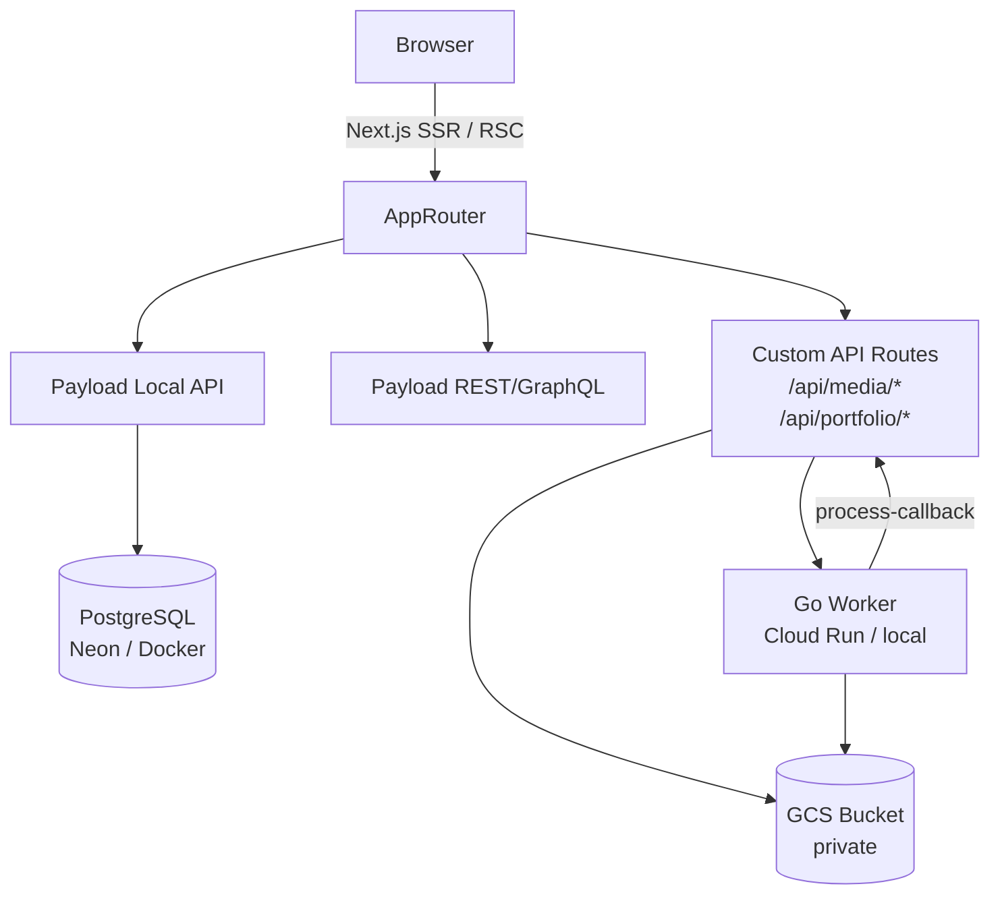
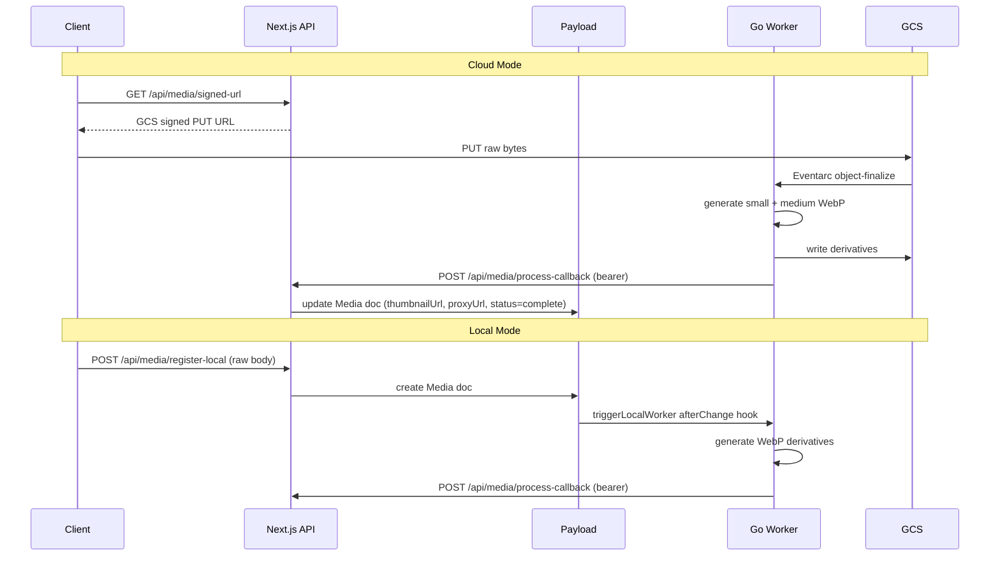
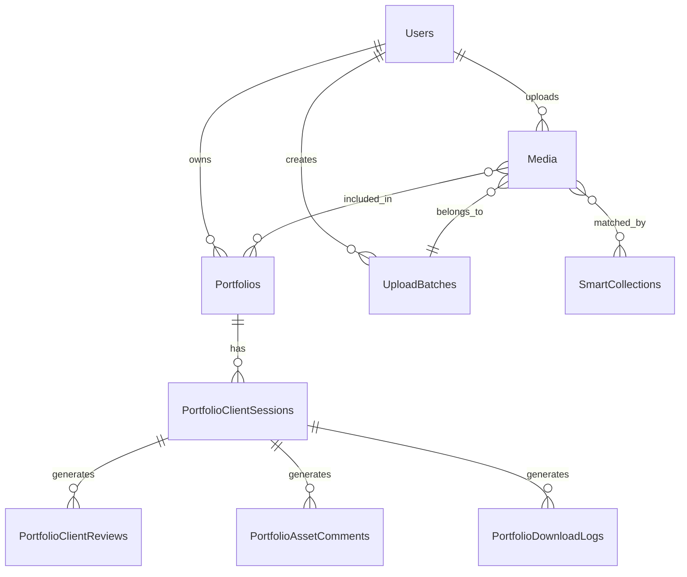
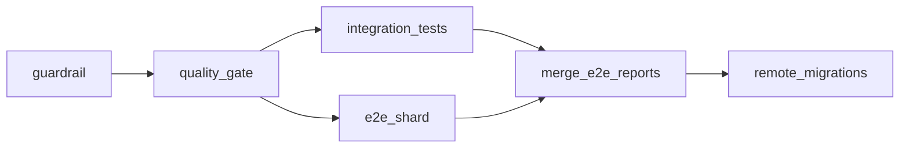
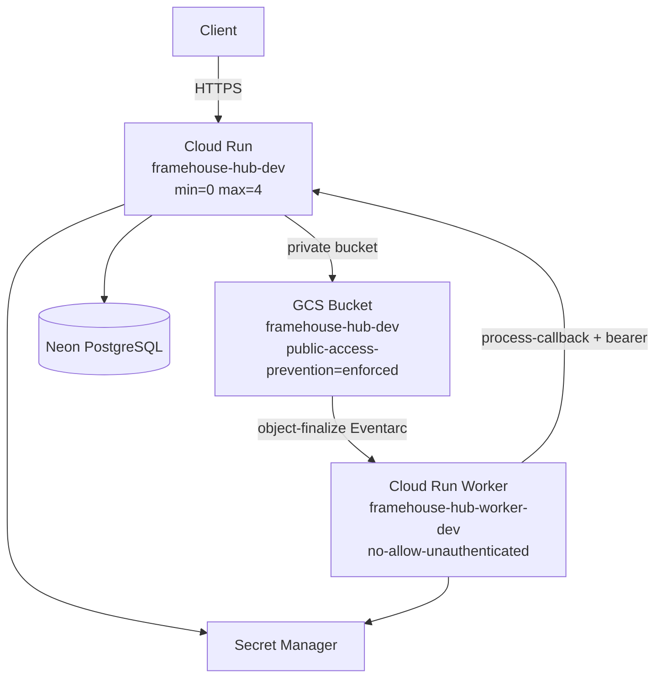

# Framehouse Hub

**Framehouse Hub** is an enterprise digital asset management and high-resolution gallery platform built for professional creatives. It supports multi-tenant media ingestion, automated derivative generation, portfolio review workflows, and a full content management system — all as a single unified Next.js application.

**Stack:** Next.js 15 (App Router) · Payload CMS v3 · PostgreSQL (Neon) · GCS · Go worker · Cloud Run · Eventarc

---

## Table of Contents

1. [Architecture](#architecture)
2. [Prerequisites](#prerequisites)
3. [Quick Start](#quick-start)
4. [Environment Variables](#environment-variables)
5. [Development](#development)
6. [Database & Migrations](#database--migrations)
7. [Media Pipeline](#media-pipeline)
8. [Collections & Data Model](#collections--data-model)
9. [API Reference](#api-reference)
10. [Access Control](#access-control)
11. [Testing](#testing)
12. [Git Workflow](#git-workflow)
13. [CI/CD](#cicd)
14. [GCP Infrastructure](#gcp-infrastructure)
15. [Deployment](#deployment)
16. [Design System](#design-system)
17. [Docs Index](#docs-index)

---

## Architecture

Payload CMS v3 runs **inside** the Next.js process — no separate CMS server. Three route groups share the same deployment:

```
src/app/
├── (app)/          → Public site: gallery, pricing, login, account
├── (dashboard)/    → Authenticated creative dashboard
└── (payload)/      → Payload admin UI at /admin + REST/GraphQL APIs
```



**Key architectural decisions:**

| Decision | Rationale |
|---|---|
| `push: false` on DB adapter | All schema changes via explicit migrations; no silent drift |
| `disableLocalStorage: true` + `filesRequiredOnCreate: false` | Payload owns docs, we own bytes; allows fileless creates for cloud flow |
| Unsigned URLs persisted in DB | `signCloudUrls` afterRead hook rewrites to v4 signed GETs at read time; signed URLs never persisted |
| GIN full-text index | `media_search_idx` over title/filename/camera/lens/shoot for sub-ms search |
| Dual-mode pipeline | Same Go worker handles both local disk and GCS; environment-switched at runtime |

---

## Prerequisites

| Tool | Version | Notes |
|---|---|---|
| Node.js | 22+ | |
| pnpm | 9+ | `npm i -g pnpm` |
| Go | 1.22+ | Only needed for local worker (`scripts/dev-with-worker.sh`) |
| Docker | any | Ephemeral Postgres for local dev |
| Git | any | Husky hooks run on commit/push |

---

## Quick Start

```bash
# 1. Clone
git clone <repository-url>
cd framehouse-hub

# 2. Install dependencies
pnpm install

# 3. Configure environment
cp .env.example .env
# Edit .env — see Environment Variables below

# 4. Start Next.js only (no Go worker)
pnpm dev
```

Open [http://localhost:3000](http://localhost:3000).  
Admin panel: [http://localhost:3000/admin](http://localhost:3000/admin)  
Default seed credentials: `sys.admin@framehouseworks.com` / `password123`

### Full stack with Go worker

```bash
# Spins up Docker Postgres, runs migrations, seeds, then starts Next + worker
./scripts/dev-with-worker.sh
```

### Blank-slate verification (mandatory before PR)

```bash
# Ephemeral Postgres on :5433 — migrate, seed, run tests, tear down
./scripts/verify-local.sh

# Keep DB open for manual inspection
./scripts/verify-local.sh --keep-open

# Clean up a --keep-open run
./scripts/cleanup-local.sh
```

> This script also runs automatically on `git push` via the Husky pre-push hook.

---

## Environment Variables

### Required

```env
DATABASE_URI=postgresql://postgres:<password>@localhost:5432/postgres
PAYLOAD_SECRET=<random-string-32-chars+>
NEXT_PUBLIC_SERVER_URL=http://localhost:3000
```

### Cloud media (local mode — omit for GCS)

```env
# Leave unset → local disk mode
GCS_BUCKET=
GCS_PROJECT_ID=
LOCAL_WORKER_URL=http://localhost:8080   # default
```

### Cloud media (GCS mode)

```env
GCS_BUCKET=framehouse-hub-dev
GCS_PROJECT_ID=<gcp-project-id>
PROCESSOR_CALLBACK_SECRET=<shared-secret>
```

### Optional

```env
DISABLE_WORKER=1          # Skip Go worker in CI/E2E
IS_BUILD_PHASE=true       # Bypass DB connection during build
RESEND_DEFAULT_FROM_NAME=
RESEND_DEFAULT_FROM_ADDRESS=
```

---

## Development

```bash
pnpm dev                  # Next.js dev server (port 3000)
pnpm build                # Production build
pnpm start                # Serve production build
pnpm lint                 # ESLint (next lint)
pnpm lint:fix             # ESLint + Prettier fix
pnpm generate:types       # Regenerate src/payload-types.ts
pnpm generate:importmap   # Regenerate Payload admin importmap
pnpm seed                 # Seed database (destructive)
```

**Path aliases:** `@/*` → `src/*` · `@payload-config` → `src/payload.config.ts`

---

## Database & Migrations

The Postgres adapter runs with **`push: false`** — schema is entirely migration-controlled.

```bash
# Generate a migration from current Payload config
pnpm payload migrate:create

# Apply pending migrations
pnpm payload migrate
```

**Rules:**
- Commit both `.ts` and `.json` files generated in `src/migrations/`
- CI runs `migrate:create --name check_drift` after migrating and fails on dirty working tree
- For Media-referencing FKs, use `ON DELETE SET NULL` with nullable columns (matches Payload's auto-generated schema)
- New searchable fields must be added to **both** `media_search_idx` migration AND `/api/media/search`

**Local DB (Docker):**

```bash
docker run -d --name framehouse-postgres -p 5432:5432 -e POSTGRES_PASSWORD=password postgres
```

Full guide: [`docs/devops/local-development.md`](docs/devops/local-development.md) · [`docs/backend/database.md`](docs/backend/database.md)

---

## Media Pipeline

The platform operates in two modes, switching on whether `GCS_BUCKET` is set.



**Storage path contract:**

```
tenants/{userId}/{domain}/{year}/{month}/{assetUUID}/original/{filename}
```

Built via `buildStoragePath` in `src/lib/storage-paths.ts`. Never hand-construct.

**Upload size limits** (enforced server-side via `enforceUploadSizeLimit`):

| Type | Limit |
|---|---|
| Image | 50 MB |
| Video | 2 GB |
| Audio | 500 MB |
| Document | 100 MB |

**Hook chain on Media (execution order):**

1. `beforeOperation`: `preventDuplicates`
2. `beforeChange`: `writeOriginalToEnclave` → `generateAccessionId` → `extractMetadata`
3. `afterRead`: `aliasUrl` → `signCloudUrls`
4. `afterChange`: `triggerLocalWorker`
5. `afterDelete`: `cleanupEnclave`

Full reference: [`docs/architecture/media-pipeline.md`](docs/architecture/media-pipeline.md)

---

## Collections & Data Model



**Collections:** `Users` · `Media` · `Portfolios` · `SmartCollections` · `UploadBatches` · `Sessions` · `Pages` · `Categories` · `Articles` · `Downloads` · `Tutorials` · `PortfolioClientSessions` · `PortfolioClientReviews` · `PortfolioAssetComments` · `PortfolioDownloadLogs` · `AdminActivityLogs` · `AdminDiagnosticSessions` · `Waitlist`

**Globals:** `Header` · `Footer` · `Pricing`

Full reference: [`docs/architecture/data-model.md`](docs/architecture/data-model.md) · [`docs/backend/collections.md`](docs/backend/collections.md)

---

## API Reference

All custom routes live under `src/app/api/`. Payload REST/GraphQL available at `/api/[collection]` and `/api/graphql`.

### Media Ingestion

| Method | Route | Description |
|---|---|---|
| `POST` | `/api/media/signed-url` | Get GCS signed PUT URL (cloud mode) |
| `POST` | `/api/media/register-local` | Upload raw bytes (local mode) |
| `POST` | `/api/media/register-gcs` | Register GCS doc after direct upload |
| `POST` | `/api/media/process-callback` | Worker callback — sets derivatives + status |
| `GET` | `/api/media/status-stream` | SSE stream of processing status |
| `GET` | `/api/media/search` | Full-text search via GIN index |
| `POST` | `/api/media/reprocess` | Re-trigger worker on existing asset |

### Portfolio & Client Review

| Method | Route | Description |
|---|---|---|
| `POST` | `/api/portfolio-client-sessions/unlock` | Validate passcode, issue JWT |
| `GET` | `/api/portfolio-client-sessions/[token]/reviews` | Fetch review state |
| `POST` | `/api/portfolio-client-sessions/[token]/reviews` | Submit selections/comments |

### Admin

| Method | Route | Description |
|---|---|---|
| `GET` | `/api/admin/diagnostics` | System health + infra status |
| `GET` | `/api/admin/creative-metrics` | Per-creative usage metrics |
| `GET` | `/api/health` | Service health check |

Full reference: [`docs/backend/api-reference.md`](docs/backend/api-reference.md)

---

## Access Control

Three roles: `admin` · `creative` · `viewer`

Access modules in `src/access/*`:

| Module | Who |
|---|---|
| `adminOnly` | Admins only |
| `creativeOrAdmin` | Creatives + admins |
| `ownerOrAdmin` | Document owner + admins |
| `adminOrSelf` | Self-modification + admins |
| `publicAccess` | Everyone |
| `adminOrPublishedStatus` | Admins, or published docs publicly |

Access is evaluated at three levels: **collection** → **field** → **document** (via `where` queries). Never inline access logic — always import from `src/access/*`.

Full reference: [`docs/backend/access-control.md`](docs/backend/access-control.md)

---

## Testing

```bash
pnpm test              # integration + E2E
pnpm test:int          # Vitest integration tests (real Postgres, no mocks)
pnpm test:e2e          # Playwright E2E

# Run a single E2E test
pnpm exec playwright test tests/e2e/admin.e2e.spec.ts -g "test name"
```

**Philosophy:** integration tests hit a real ephemeral Postgres — no DB mocks. E2E runs with `DISABLE_WORKER=1` (worker is synthesised via direct `process-callback` call).

Test locations:
- `tests/int/**/*.int.spec.ts` — integration tests
- `tests/e2e/*.spec.ts` — Playwright E2E

Full guide: [`docs/workflows/testing.md`](docs/workflows/testing.md)

---

## Git Workflow

**Branch strategy:** `feature/* → dev → main`  
CI enforces: PRs to `main` must come from `dev` only (guardrail job).

```bash
# Start a feature
git checkout dev && git pull
git checkout -b FRH-{ticket}-short-description

# Commit format
git commit -m "feat(media): add reprocess endpoint"
# Types: feat | fix | chore | docs | refactor | test | perf

# Open PR → dev
```

**Hooks (Husky):**
- `pre-commit`: lint-staged (ESLint + Prettier on staged files)
- `pre-push`: `lint` + `IS_BUILD_PHASE=true pnpm build` + `verify-local.sh`

Full guide: [`docs/workflows/git-workflow.md`](docs/workflows/git-workflow.md)

---

## CI/CD

Pipeline: `.github/workflows/pr-validation.yml`



| Job | What it does |
|---|---|
| `guardrail` | Blocks PRs to `main` not from `dev` |
| `quality_gate` | Type-check, lint, build, schema drift check |
| `integration_tests` | Vitest against ephemeral Neon branch |
| `e2e_shard` | Playwright sharded across 3 runners |
| `remote_migrations` | `payload migrate` on ephemeral Neon branch |

**Deploy to dev** triggers on merge to `dev` via `_deploy-app.yml` + `_deploy-worker.yml`.  
**Prod deploy** is gated (`if: false`) — separate epic.

Full reference: [`docs/devops/ci-cd.md`](docs/devops/ci-cd.md)

---

## GCP Infrastructure

**Region:** `us-central1` everywhere (Cloud Run, GCS, Eventarc, Artifact Registry).



**Cloud Run specs:**

| Setting | Value |
|---|---|
| `--min-instances` | 0 (zero idle cost) |
| `--max-instances` | 4 |
| `--memory` | 512Mi |
| `--cpu` | 1 |
| `--concurrency` | 4 |
| `--timeout` | 300s |

**Three distinct service agents** (do not conflate):

| Agent | IAM Role | Purpose |
|---|---|---|
| GCS service agent (`service-{PN}@gs-project-accounts.iam.gserviceaccount.com`) | `roles/pubsub.publisher` | Publish object-finalize events |
| Eventarc service agent (`service-{PN}@gcp-sa-eventarc.iam.gserviceaccount.com`) | `roles/storage.legacyBucketReader` on bucket | Validate Eventarc trigger |
| Cloud Run runtime SA (`{PN}-compute@developer.gserviceaccount.com`) | `roles/eventarc.eventReceiver` (project) + `roles/run.invoker` (worker) + `roles/iam.serviceAccountTokenCreator` (self-grant) | Invoke worker + sign URLs |

**Infrastructure scripts:**

```bash
scripts/infra/setup-gcs.sh          # Create bucket + CORS + IAM
scripts/infra/setup-eventarc.sh     # Create Eventarc trigger
scripts/infra/set-cleanup-policy.sh # Artifact Registry: keep 10, delete 30d
```

Full reference: [`docs/devops/gcp-infrastructure.md`](docs/devops/gcp-infrastructure.md)

---

## Deployment

### Dev (automatic)

Merging to `dev` triggers `deploy-dev.yml` → builds and deploys to Cloud Run dev.

### Manual deploy

```bash
# Trigger via GitHub Actions workflow_dispatch
gh workflow run deploy-dev.yml
```

### Migration order (always)

```bash
# 1. Run migrations first
pnpm payload migrate

# 2. Then deploy app
pnpm build && pnpm start
```

### Rollback

```bash
# Via gcloud (immediate)
gcloud run services update-traffic framehouse-hub-dev \
  --to-revisions=PREV_REVISION=100 --region=us-central1
```

Full runbook: [`docs/devops/deployment.md`](docs/devops/deployment.md)

---

## Design System

**"The Curated Gallery"** — premium, editorial visual language.

**Rules (non-negotiable):**
- No 1px borders — tonal layering only (`bg-card`, `bg-muted`, etc.)
- Minimum border-radius: 16px (`ROUND_SIXTEEN`)
- Font: Geist (sans) + Geist Mono (code)
- Animations: Framer Motion — never CSS transitions on layout shifts
- Dark/light: `dark:` Tailwind prefix, never hardcoded hex

Full reference: [`DESIGN.md`](DESIGN.md) · [`docs/frontend/design-system.md`](docs/frontend/design-system.md)

---

## Docs Index

| Area | Document |
|---|---|
| Architecture overview | [`docs/architecture/README.md`](docs/architecture/README.md) |
| Data model (ER diagram) | [`docs/architecture/data-model.md`](docs/architecture/data-model.md) |
| Media pipeline deep-dive | [`docs/architecture/media-pipeline.md`](docs/architecture/media-pipeline.md) |
| Collections reference | [`docs/backend/collections.md`](docs/backend/collections.md) |
| API reference | [`docs/backend/api-reference.md`](docs/backend/api-reference.md) |
| Access control | [`docs/backend/access-control.md`](docs/backend/access-control.md) |
| Database & migrations | [`docs/backend/database.md`](docs/backend/database.md) |
| Local development | [`docs/devops/local-development.md`](docs/devops/local-development.md) |
| GCP infrastructure | [`docs/devops/gcp-infrastructure.md`](docs/devops/gcp-infrastructure.md) |
| CI/CD pipelines | [`docs/devops/ci-cd.md`](docs/devops/ci-cd.md) |
| Deployment runbook | [`docs/devops/deployment.md`](docs/devops/deployment.md) |
| Frontend routing | [`docs/frontend/routing.md`](docs/frontend/routing.md) |
| State providers | [`docs/frontend/state-providers.md`](docs/frontend/state-providers.md) |
| Component library | [`docs/frontend/components.md`](docs/frontend/components.md) |
| Git workflow | [`docs/workflows/git-workflow.md`](docs/workflows/git-workflow.md) |
| Testing guide | [`docs/workflows/testing.md`](docs/workflows/testing.md) |
| Day 1 onboarding | [`docs/onboarding/getting-started.md`](docs/onboarding/getting-started.md) |
| Glossary | [`docs/onboarding/glossary.md`](docs/onboarding/glossary.md) |

---

> Questions or issues? Open a GitHub discussion or check the relevant `docs/` section above.
