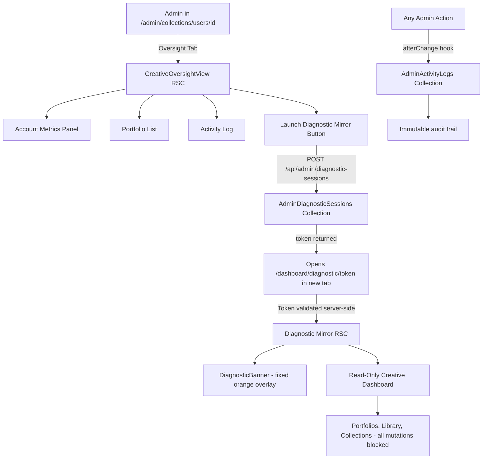

# FRH-Admin-Oversight: Creative Account Oversight & Diagnostic Dashboard

**Spec Version**: 1.0  
**Status**: Draft — Validated Against Codebase  
**Branch Convention**: `FRH-admin-oversight-dashboard`  
**Base Branch**: `dev`  
**Author**: Platform Engineering  
**Date**: 2026-06-02

---

## 1. Overview

A secure, unified oversight surface embedded in the Payload Admin panel (`/admin`) that allows Platform Administrators to inspect Creative accounts, diagnose configuration issues, and view their portfolio workspaces in a read-only mirror — without ever accessing the creative's credentials or breaking the platform's auth boundary.

### Problem Statement

In a multi-tenant environment, creatives encounter friction that requires admin intervention:
- A client loses access to a password-protected portfolio at a live event
- A layout block is misconfigured and renders incorrectly for a specific creative
- A media asset is stuck in `processing` status

Without this feature, admins must either ask creatives for their credentials (security violation) or debug blindly using only raw database inspection.

### Ticket Corrections vs. Codebase Reality

The following ticket items have been adjusted to reflect actual platform architecture:

| Ticket Item | Correction |
|---|---|
| "Creative Accounts collection" | Uses existing `users` collection filtered by `roles: creative`. No separate collection. |
| "Tenant profile tab" | Implemented as a custom **Oversight Tab** within the Payload admin `users` collection edit view. |
| "Subscription health metrics" | **Deferred.** No billing/subscription system exists in the current codebase. Tab shows media count, portfolio count, and storage used instead. |
| "Impersonate Session" (full session hijacking) | **Replaced with Diagnostic Mirror Mode.** Admin renders the creative's workspace using their own admin auth. No credential transfer or JWT delegation. |
| "Active Portfolios Sub-Collection (nested)" | Portfolio list rendered inside the Oversight Tab via Payload relationship query (owner filter). |
| "A client losing a portfolio password" | Admin already has full `ownerOrAdmin` write access to portfolio records, including the `password` field. UX surfaces this clearly in the Oversight Tab. |
| "Auto-categorization rule misbehaving" | SmartCollections (`filterQuery`) can be inspected and reset from the Oversight Tab. |
| Mobile impersonation view | Diagnostic Mirror is responsive. Payload Admin oversight tab is desktop-first (matching existing Payload admin UX). |

---

## 2. Architecture Overview



---

## 3. Data Model

### 3.1 New Collection: `AdminActivityLogs`

**Purpose**: Immutable, append-only audit trail of every administrative action touching a creative's account.

**Collection slug**: `admin-activity-logs`

**Access**:
- `create`: server-side only via collection hooks (enforced by checking `req.context.isHook`)
- `read`: `adminOnly`
- `update`: `() => false` — immutable
- `delete`: `() => false` — immutable

**Fields**:

```
adminUser        relationship → users      required, indexed
                  The admin who performed the action.

targetUser       relationship → users      nullable, indexed
                  The creative account that was acted upon.

targetPortfolio  relationship → portfolios nullable, indexed
                  If the action targeted a specific portfolio.

actionType       select                    required, indexed
                  Values:
                    inspect_account         Admin opened Oversight Tab
                    launch_diagnostic       Diagnostic Mirror session created
                    terminate_diagnostic    Diagnostic Mirror session manually closed
                    diagnostic_expired      Diagnostic Mirror session expired (TTL)
                    portfolio_password_reset Admin changed portfolio.password field
                    field_override          Admin changed a protected field value
                    portfolio_visibility_change Admin changed portfolio visibility
                    account_role_change     Admin changed user roles

actionDescription text                    required
                  Human-readable summary, e.g.:
                  "Admin 'sys.admin' reset password on portfolio 'Summer Wedding 2025'"

metadata         json                     nullable
                  Structured context. For field_override:
                    { field: 'password', portfolioId: 'abc', oldValue: '[REDACTED]' }
                  For launch_diagnostic:
                    { diagnosticSessionId: 'xyz', ttlMinutes: 15 }

diagnosticSession relationship → admin-diagnostic-sessions  nullable
                  Link to the active session for grouping related log entries.

ipAddress        text                     nullable
userAgent        text                     nullable
```

**Admin Panel**:
- Group: `Admin Oversight`
- `defaultColumns`: `['adminUser', 'targetUser', 'actionType', 'actionDescription', 'createdAt']`
- `useAsTitle`: `actionDescription`
- `timestamps: true`
- Read-only in admin (no create/edit UI — all via hooks)

---

### 3.2 New Collection: `AdminDiagnosticSessions`

**Purpose**: Short-lived tokens (15-minute TTL) that authenticate a read-only Diagnostic Mirror session.

**Collection slug**: `admin-diagnostic-sessions`

**Access**:
- All operations: `adminOnly`

**Fields**:

```
admin            relationship → users      required, indexed
                  The admin who launched the session.

targetCreative   relationship → users      required, indexed
                  The creative being inspected.

tokenHash        text                     required, unique
                  SHA-256 hash of the raw 32-byte random token.
                  Raw token is returned once at creation; never stored.

expiresAt        date                     required, indexed
                  createdAt + 15 minutes.

isActive         checkbox                 default: true, indexed
                  Set to false on termination or expiry.

terminatedAt     date                     nullable
terminatedBy     relationship → users      nullable
                  Admin who explicitly terminated (vs natural expiry).

ipAddress        text                     nullable
userAgent        text                     nullable
```

**Admin Panel**:
- Group: `Admin Oversight`
- `defaultColumns`: `['admin', 'targetCreative', 'isActive', 'expiresAt', 'createdAt']`
- `timestamps: true`

---

### 3.3 Users Collection: Extensions

The existing `users` collection gains one new admin-facing configuration block — no schema changes required.

**Changes to `src/collections/Users/index.ts`**:

```
admin: {
  group: 'Users',
  defaultColumns: ['name', 'email', 'roles'],
  useAsTitle: 'name',
  // ADD: custom Oversight tab
  components: {
    views: {
      edit: {
        oversight: {
          Component: {
            path: 'src/collections/Users/components/CreativeOversightView#CreativeOversightView',
          },
          path: '/oversight',
          label: 'Creative Oversight',
          tab: {
            label: 'Oversight',
            href: '/oversight',
          },
        },
      },
    },
  },
}
```

The tab is rendered only when viewing a user with `roles` containing `creative`. For admin users, the tab is visible but shows a notice: "Oversight tools are available for Creative accounts only."

**No new database fields required on Users.**

---

### 3.4 Portfolios Collection: No Schema Changes

Admin already has full `ownerOrAdmin` write access to all portfolio fields, including `password` and `visibility`. The Oversight Tab surfaces this through the existing Payload admin edit interface.

---

## 4. UI/UX Design

### Design Token Reference (DESIGN.md)

| Token | Value | Usage in this feature |
|---|---|---|
| `surface` | `#f9f9f9` | Metric cards, Oversight Tab background |
| `surface_container_low` | `#f3f3f4` | Secondary panels, activity log rows |
| `surface_container_lowest` | `#ffffff` | Page canvas |
| `primary` | `#7f5700` | Primary action buttons (Launch Diagnostic) |
| `primary_container` | `#d79922` | Button hover gradient, CTAs |
| `tertiary` | `#bb1800` | Terminate session button |
| `tertiary_container` | `#ff7f67` | Diagnostic Banner background |
| `on_surface` | `#1a1c1c` | All body text |
| `outline_variant` | `#d5c4af` at 15% | Ghost border fallback only |
| `ROUND_SIXTEEN` | `border-radius: 16px` | All cards, thumbnails, inputs |
| `ROUND_TWENTY_FOUR` | `border-radius: 24px` | Primary CTAs |
| Shadow | `0px 20px 40px rgba(26,28,28,0.06)` | Floating cards |
| Font: body | Inter | All UI text |
| Font: metadata | Rubik Mono One | Counts, dates, file sizes |

---

### 4.1 Oversight Tab (Payload Admin — Desktop)

Location: `/admin/collections/users/[id]/oversight`

**Layout**: Two-column on ≥1280px, single-column stack below.

```
┌─────────────────────────────────────────────────────────────────┐
│  ← Profile  Oversight  (tab navigation — Payload native style)  │
├──────────────────────────────┬──────────────────────────────────┤
│  ACCOUNT METRICS             │  RECENT ACTIVITY                 │
│  ┌──────────┐ ┌──────────┐  │  ┌────────────────────────────┐  │
│  │ 47       │ │ 12       │  │  │ 2026-06-01 17:45           │  │
│  │ Media    │ │Portfolios│  │  │ Admin launched diagnostic   │  │
│  │ ITEMS    │ │ ACTIVE   │  │  │ session for this account   │  │
│  └──────────┘ └──────────┘  │  ├────────────────────────────┤  │
│  ┌──────────┐ ┌──────────┐  │  │ 2026-05-28 09:12           │  │
│  │ 2.4 GB   │ │ 3        │  │  │ Admin reset portfolio       │  │
│  │ STORAGE  │ │ SESSIONS │  │  │ password: 'Holiday Event'  │  │
│  │  USED    │ │          │  │  └────────────────────────────┘  │
│  └──────────┘ └──────────┘  │                                  │
├──────────────────────────────┴──────────────────────────────────┤
│  PORTFOLIOS                                     [+ View in Admin]│
│  ┌─────────────────────────────────────────────────────────────┐ │
│  │ Summer Wedding 2025        shared · password-protected      │ │
│  │ slug: summer-wedding-2025  Downloads: Enabled               │ │
│  │ 24 items · Filmstrip layout                [Edit] [Diagnose]│ │
│  ├─────────────────────────────────────────────────────────────┤ │
│  │ Brand Identity – Acme Corp  private                         │ │
│  │ slug: brand-identity-acme  Downloads: Disabled              │ │
│  │ 8 items · Masonry layout                   [Edit] [Diagnose]│ │
│  └─────────────────────────────────────────────────────────────┘ │
├──────────────────────────────────────────────────────────────────┤
│  DIAGNOSTIC ACTIONS                                              │
│  ┌────────────────────────────────────────────────────────────┐  │
│  │  [Launch Read-Only Diagnostic Mirror →]                    │  │
│  │  Opens creative's full dashboard in a new browser tab.     │  │
│  │  Session expires in 15 minutes. All writes blocked.        │  │
│  └────────────────────────────────────────────────────────────┘  │
└──────────────────────────────────────────────────────────────────┘
```

**Metric Cards**:
- Background: `surface` (#f9f9f9)
- Corner: `ROUND_SIXTEEN`
- Shadow: ambient token
- Count: `text-3xl font-bold` Inter, color `on_surface`
- Label: `text-xs tracking-widest uppercase` Rubik Mono One
- No borders (tonal separation only)

**Portfolio Row Cards**:
- Background: `surface_container_low` (#f3f3f4) on hover, transparent at rest
- `ROUND_SIXTEEN` corners
- Visibility badge: color-coded chip (`shared` → amber, `public` → green, `private` → neutral)
- `[Edit]` link: opens `/admin/collections/portfolios/[id]` in same tab
- `[Diagnose]` link: launches Diagnostic Mirror focused on that portfolio's section

**Launch Diagnostic Mirror Button**:
- Primary CTA style: linear gradient `primary` → `primary_container`, `ROUND_TWENTY_FOUR`
- Full-width within its container
- Disabled state: grayed, tooltip "Must be a Creative account"

---

### 4.2 Diagnostic Mirror Dashboard

Location: `/dashboard/diagnostic/[token]`

Route Group: `(dashboard)` — inherits dashboard shell but overrides with `DiagnosticLayout`.

**Layout**:
```
┌─────────────────────────────────────────────────────────────────┐
│ [ADMIN VIEW ONLY] Inspecting: VisualsByAlex Studio              │  ← DiagnosticBanner (fixed, 48px, z-50)
│ Session expires in 14:23  [Terminate Session]                   │  ← tertiary_container (#ff7f67) bg
├─────────────────────────────────────────────────────────────────┤
│                                                                 │
│  [Creative's normal dashboard — full viewport below banner]     │
│  Nav, Library, Portfolios — all rendered with creative's data   │
│  All interactive mutations are blocked (buttons disabled,       │
│  forms show "Diagnostic mode — read only" on submit attempt)    │
│                                                                 │
└─────────────────────────────────────────────────────────────────┘
```

**DiagnosticBanner**:
- `position: fixed; top: 0; left: 0; right: 0; z-index: 50; height: 48px`
- Background: `tertiary_container` (#ff7f67)
- Text: `on_tertiary` (white), Inter, `text-sm font-semibold`
- Left: warning icon + "ADMIN VIEW ONLY — Inspecting: [Creative Name] Studio"
- Center: countdown timer (client component, refreshes every second)
- Right: `[Terminate Session]` button (tertiary style, `ROUND_SIXTEEN`)
- Mobile: text truncates to "Admin View — [Name]" with full text in tooltip
- The main dashboard content receives `padding-top: 48px` to accommodate the banner

**Mutation Blocking**:

All interactive elements check `DiagnosticModeContext`:
- Upload buttons: hidden
- Publish / Save Portfolio buttons: `disabled` + tooltip "Blocked in diagnostic mode"
- Delete buttons: hidden
- Edit fields in wizard: `readOnly`
- Server actions: return early with `{ error: 'Mutations are not permitted in diagnostic mode' }` if `req.headers.get('x-diagnostic-session')` is present

**Content Rendering**:

The `[token]` route server component:
1. Validates token (see Section 9)
2. Resolves `targetCreative` user from `AdminDiagnosticSessions`
3. Fetches all creative data using admin-scoped `getPayload()` call
4. Passes `{ userId: targetCreative.id, diagnosticMode: true }` to all dashboard sub-components
5. Logs `inspect_account` entry in `AdminActivityLogs`

The creative sees their own layout — same grid structure, same portfolio list, same media library — but belonging to the target creative. Admin's own content is not shown.

---

### 4.3 Diagnostic Banner — Mobile

On mobile (< 768px):
- Banner reduces to 40px height
- Text: "Admin View — [First Name]"
- Timer hidden (accessible via press-and-hold tooltip)
- Terminate button: icon-only (✕) with confirmation bottom sheet

---

### 4.4 Activity Log Panel — Responsive

Within the Oversight Tab on mobile (Payload admin is desktop-first per convention, matches existing Payload panel behavior):
- Collapses to single-column card stack
- Metric cards reflow 2×2 grid → 1×4 stack
- Portfolio list becomes full-width rows
- Launch button remains full-width CTA

---

## 5. User Journeys

### 5.1 Support Investigation Flow — "Portfolio Not Reordering Correctly"

```
1. Admin navigates to /admin/collections/users
2. Searches by name, email, or studio name using Payload's native list search
3. Clicks Creative record → opens /admin/collections/users/[id]
4. Clicks "Oversight" tab
5. Views account metrics: confirms active, sees 12 portfolios
6. Locates "Quick Portfolio" in portfolio list — sees it uses Masonry layout
7. Notes clientReviewSettings: allowDownload: true, reorderItems might be relevant
8. Clicks [Launch Read-Only Diagnostic Mirror]
9. New tab opens at /dashboard/diagnostic/[token]
10. DiagnosticBanner appears: "ADMIN VIEW ONLY — Inspecting: VisualsByAlex Studio — 14:47 remaining"
11. Admin navigates to Portfolios → opens the relevant portfolio
12. Admin can see the layout block ordering exactly as the creative sees it
13. Admin identifies the issue (e.g., filmstrip track height override is set)
14. Admin closes diagnostic tab → session auto-terminates
15. Admin returns to /admin/collections/portfolios/[id] → edits the section configuration directly
16. All actions logged in AdminActivityLogs
```

### 5.2 Portfolio Password Override Flow — "Client Locked Out at Live Event"

```
1. Admin navigates to Oversight Tab for relevant creative
2. Sees portfolio "Corporate Launch Q2" with visibility: shared
3. Clicks [Edit] → opens /admin/collections/portfolios/[id] in Payload admin
4. Locates 'password' field (visible because visibility === 'shared')
5. Clears old value, types "TempAccess2026"
6. Clicks Save
7. Payload fires afterChange hook → AdminActivityLogs records:
     actionType: portfolio_password_reset
     actionDescription: "Admin reset password on portfolio 'Corporate Launch Q2'"
     metadata: { portfolioId, oldValue: '[REDACTED]' }
8. Admin communicates new password to creative over support channel
```

Note: This flow requires NO new code for the password change itself — it uses existing Payload admin write access. The only new work is the audit logging hook.

### 5.3 Diagnostic Mirror Session Lifecycle

```
CREATION:
  Admin clicks [Launch Diagnostic Mirror]
  → POST /api/admin/diagnostic-sessions
     Body: { targetUserId: string }
     Auth: must be admin (validated server-side)
  → Creates AdminDiagnosticSessions record:
     tokenHash: SHA-256(crypto.randomBytes(32))
     expiresAt: now + 15 min
     isActive: true
  → Creates AdminActivityLogs record: actionType: launch_diagnostic
  → Returns: { token: rawToken, expiresAt }
  → Frontend: window.open(`/dashboard/diagnostic/${rawToken}`, '_blank')

ACTIVE SESSION:
  /dashboard/diagnostic/[token] server component:
  → Hashes token, queries AdminDiagnosticSessions WHERE tokenHash = hash AND isActive = true
  → If not found OR expired: renders 401/410 error page
  → If valid: renders Diagnostic Mirror with DiagnosticBanner
  → Each page visit: logs inspect_account (deduplicated: once per session, not per navigation)

TERMINATION (manual):
  Admin clicks [Terminate Session] in DiagnosticBanner
  → DELETE /api/admin/diagnostic-sessions/[rawToken]
  → Sets isActive: false, terminatedAt, terminatedBy
  → Creates ActivityLog: actionType: terminate_diagnostic
  → Redirects to: /dashboard (admin's own dashboard)

TERMINATION (TTL expiry):
  On any route visit where expiresAt < now:
  → Server sets isActive: false, records diagnostic_expired log
  → Renders a clean "Session Expired" page with link back to Payload admin
```

### 5.4 Admin Activity Log Review

```
1. Admin navigates to /admin/collections/admin-activity-logs
2. Filters by targetUser (search creative by name)
3. Views timeline of all past admin actions for that creative
4. Each row shows: timestamp, admin name, actionType chip, description
5. Clicks row → full detail view shows metadata JSON
```

---

## 6. Acceptance Criteria

### AC-1: Zero-Credential Diagnostic View
- Admin can navigate to `/dashboard/diagnostic/[token]` and see the creative's workspace
- No password, no credential change required
- The admin's own auth session never changes
- Creative's own session is unaffected
- **Validation**: Request to `/dashboard/diagnostic/[token]` uses admin's own auth cookie. Target creative data fetched via admin permissions. No impersonation of user auth.

### AC-2: Portfolio Password Override
- Admin can edit the `password` field on any portfolio via `/admin/collections/portfolios/[id]`
- Change is saved immediately
- Audit log entry is created on save
- **Validation**: Existing `ownerOrAdmin` write access covers this. Hook added to Portfolios `afterChange` to fire audit log when `password` or `visibility` field changes.

### AC-3: Immutable Audit Trail
- Every `launch_diagnostic`, `terminate_diagnostic`, `portfolio_password_reset`, `field_override` action creates an `AdminActivityLogs` record
- `update: () => false`, `delete: () => false` on the collection
- Log entries include: adminUser, targetUser, timestamp, actionType, description, metadata
- Accessible at `/admin/collections/admin-activity-logs`
- **Validation**: Collection access config + integration test that attempts PUT/DELETE on log records and expects 403.

### AC-4: Mutation Blocking in Diagnostic Mode
- All forms, upload buttons, and server actions are blocked in diagnostic mode
- A clear "Diagnostic mode — read only" indicator is shown on hover of any blocked element
- Server actions return `{ error: 'Mutations are not permitted in diagnostic mode' }` for diagnostic sessions
- **Validation**: E2E test attempts to click Publish in diagnostic mode, expects disabled state and error toast.

### AC-5: Session TTL Enforcement
- Diagnostic sessions expire 15 minutes after creation
- Countdown is shown in DiagnosticBanner
- On expiry: page refreshes to a "Session Expired" view with CTA back to admin panel
- No mutation is possible after expiry (server validates on every request)
- **Validation**: Integration test creates session with `expiresAt` in past, request to diagnostic route returns 410.

### AC-6: Oversight Tab Metrics
- Metrics panel shows: media count, portfolio count, active sessions count, total storage used (sum of `filesize` field in Media collection)
- Storage formatted as human-readable (e.g., "2.4 GB")
- All metrics computed server-side in the RSC, no client-side data fetching
- **Validation**: Unit test for `computeCreativeMetrics(userId)` utility function.

### AC-7: Search & Filter in Admin
- Admin can search for creative accounts by name, email in Payload's native `/admin/collections/users` list view
- No new search implementation needed — Payload's native list search covers this
- **Validation**: Uses Payload's `admin.useAsTitle: 'name'` and default search behavior.

---

## 7. Edge Cases

### EC-01: Creative Has Zero Portfolios
- **Scenario**: Admin opens Oversight Tab for a newly registered creative with no portfolios.
- **Handling**: Portfolio list renders empty state: card with "No portfolios yet. This creative hasn't created any portfolios." No [Edit] or [Diagnose] buttons rendered.
- **Component**: Empty state uses `surface_container_low` bg, `ROUND_SIXTEEN`, with soft descriptive text. No error state.

### EC-02: Creative Has Zero Media
- **Scenario**: Storage metric shows 0 bytes. Media count is 0.
- **Handling**: Storage card renders "0 B" using Rubik Mono One. Library tab in Diagnostic Mirror shows existing empty state component. No null reference errors in aggregation query.

### EC-03: Admin Attempts to Launch Diagnostic for Another Admin User
- **Scenario**: Admin navigates to Oversight Tab of another admin user (not a creative).
- **Handling**: Oversight Tab renders with notice: "Diagnostic Mirror is available for Creative accounts only. This user has the Admin role." Launch button is disabled and grayed out. Other metrics (if any) still render.
- **Validation**: Server-side API validates `targetUser.roles` includes `creative`. Returns 422 if not.

### EC-04: Diagnostic Token Has Expired Before Use
- **Scenario**: Admin creates a session, does not open the tab for 15+ minutes, then clicks the link.
- **Handling**: `/dashboard/diagnostic/[token]` server component checks `expiresAt`. If expired, renders a full-page "Session Expired" view with a CTA "Return to Admin Panel" → `/admin/collections/users`. No diagnostic content shown. Logs `diagnostic_expired` in ActivityLog.

### EC-05: Two Admins Simultaneously Viewing Same Creative
- **Scenario**: Two admin users both launch Diagnostic Mirror for the same creative simultaneously.
- **Handling**: Each admin gets their own independent `AdminDiagnosticSessions` record with their own token. There is no conflict — both sessions coexist. Both appear in `AdminActivityLogs`. The creative's actual session is unaffected.

### EC-06: Creative Changes Portfolio Visibility During Diagnostic Session
- **Scenario**: Creative changes portfolio from `public` to `private` while admin is viewing it in Diagnostic Mirror.
- **Handling**: Admin's Diagnostic Mirror re-fetches data on navigation (Next.js server component). If the creative's update hits first, the admin sees the updated visibility. No stale cache issue — server components always hit the database. No special handling needed.

### EC-07: Creative Deletes a Portfolio While Admin Is Viewing It
- **Scenario**: Admin has a portfolio open in Diagnostic Mirror when the creative deletes it.
- **Handling**: Next.js 404 page renders on next navigation or if the portfolio page refreshes. Payload's `notFound()` triggers cleanly. The diagnostic session remains active — admin can navigate to other sections of the creative's workspace.

### EC-08: Portfolio Has Draft Versions — Admin Must See Published State
- **Scenario**: Portfolio has unpublished draft changes (`_status: 'draft'`). Admin needs to see what the client sees.
- **Handling**: Diagnostic Mirror uses `draft: false` (published) queries by default, matching exactly what a client visiting the portfolio URL would see. A "Draft Available" badge is shown in the portfolio header with a link to view the draft version in Payload admin. Admin cannot publish from within Diagnostic Mirror.

### EC-09: Media Asset Still Processing During Diagnostic View
- **Scenario**: Admin views creative's library; multiple assets have `ingestionStatus: processing`.
- **Handling**: Diagnostic Mirror renders the same `IngestionProgressOverlay` component the creative sees, but without the real-time SSE connection (SSE uses the viewing user's auth context). Processing status is shown as a static snapshot from the server component fetch. Assets show "Processing…" state chip. Admin cannot trigger reprocessing from Diagnostic Mirror.

### EC-10: Creative Has > 1,000 Media Items
- **Scenario**: High-volume creative with thousands of assets.
- **Handling**: The metrics aggregation query uses a `COUNT(*)` and `SUM(filesize)` SQL aggregate — not a document-level loop. Pagination-safe. The Diagnostic Mirror library renders paginated (existing library pagination). No timeout risk.

### EC-11: Media `filesize` Is NULL (Legacy Records Pre-v0.3)
- **Scenario**: Old media records created before filesize tracking don't have a `filesize` value.
- **Handling**: Storage aggregation uses `COALESCE(filesize, 0)` in the aggregate query. Total storage is computed from non-null records only. Storage card shows an asterisk tooltip: "Excludes legacy assets without size data."

### EC-12: GCS Object Missing for a Media Asset
- **Scenario**: Admin views creative's media library in Diagnostic Mirror; a GCS-backed asset has been deleted from the bucket.
- **Handling**: `signCloudUrls` afterRead hook attempts to generate a signed URL. If the GCS object doesn't exist, the signed URL still generates (it's signed against the path, not validating existence). When the browser tries to load the image, it gets a 403/404 from GCS. The `MediaCard` component falls back to a placeholder thumbnail (existing behavior: `media.thumbnailUrl || media.proxyUrl || media.originalUrl || media.url` fallback chain). Admin sees a broken image placeholder.

### EC-13: Admin Views Diagnostic for Own Account
- **Scenario**: Admin navigates to their own user record (which may also have `creative` role) and clicks Launch Diagnostic.
- **Handling**: Server-side check in `POST /api/admin/diagnostic-sessions`: if `targetUserId === req.user.id`, return 422 with message "Cannot launch a diagnostic session for your own account." The oversight tab shows this as a disabled button with tooltip.

### EC-14: Diagnostic Token Reused After Termination
- **Scenario**: Admin terminates a session, then tries to navigate to the old URL.
- **Handling**: Token is hashed and stored. On lookup: `WHERE tokenHash = hash AND isActive = true`. Since `isActive` is `false` after termination, the query returns null. Renders "Session Terminated" page with CTA back to admin panel. No data exposure.

### EC-15: Network Failure During Diagnostic Session Launch
- **Scenario**: Admin clicks [Launch Diagnostic Mirror], the API call fails (503).
- **Handling**: The button's `onClick` uses `try/catch`. On failure, a Sonner toast fires: "Failed to create diagnostic session. Please try again." The `window.open()` call only fires on success. No orphaned sessions are created (transactional: if the API errors before returning the token, the session record is not persisted or is rolled back).

### EC-16: Creative Account Has `roles: ['viewer']` — Accidentally Assigned
- **Scenario**: A creative was assigned `viewer` role instead of `creative`. Their Oversight Tab would show empty metrics.
- **Handling**: Oversight Tab always renders for any non-admin user viewed in the admin panel. The role chip is visually prominent in the Account Metrics panel. An informational banner: "This user has the Viewer role. Some creative features may not be available." Admin can fix the role directly in the Profile tab (existing `roles` field with `adminOnlyFieldAccess`).

### EC-17: AdminActivityLogs Table Grows Very Large
- **Scenario**: High-traffic platform with frequent admin actions generates millions of log rows.
- **Handling**: `targetUser` and `adminUser` fields are indexed. `createdAt` is indexed (timestamps enabled). Payload admin list view is paginated (default 10 per page). For very large datasets, a DB-level archival job (deferred to v1) can `INSERT INTO admin_activity_logs_archive SELECT ... WHERE createdAt < NOW() - INTERVAL '1 year'`. No change to application logic required. **Not blocking for MVP**.

### EC-18: Diagnostic Session Token Appears in Server Logs
- **Scenario**: Raw token is logged by Next.js request logging middleware.
- **Handling**: The raw token is only in the URL path segment (`/dashboard/diagnostic/[token]`). This is a known URL parameter; it is not a secret in the traditional sense (it expires in 15 minutes and is validated against a DB record). To mitigate: server logs should be filtered to exclude `/dashboard/diagnostic/*` paths in production log sinks. This is a operational concern, documented in the deployment notes. For additional security, the token could be moved to a request header via a redirect — deferred as a v1 improvement.

### EC-19: Portfolio Has Orphaned Media References in `layoutBlocks`
- **Scenario**: A media item was deleted after being added to a portfolio layout block. The relationship field has a dangling FK.
- **Handling**: Payload's relationship fields with `ON DELETE SET NULL` (or Payload's default behavior) null out deleted media references. The grid item renders without an image. In Diagnostic Mirror, the grid item shows a placeholder. Admin can identify orphaned items by the missing thumbnail. Fix is done via portfolio edit in Payload admin (not from Diagnostic Mirror).

### EC-20: Concurrent Portfolio Password Reset and Diagnostic Launch
- **Scenario**: Admin resets a portfolio password AND simultaneously has a diagnostic session open viewing that portfolio.
- **Handling**: These are independent operations. The password change writes to the `portfolios` table. The Diagnostic Mirror reads portfolio data fresh on each server component render. If the admin refreshes the diagnostic tab, they see the new password state. Both operations are logged independently in `AdminActivityLogs`. No race condition — database writes are atomic at the row level.

---

### Additional Edge Cases (EC-21 to EC-25)

**EC-21: Creative's Name Is Null**
- Fields: `users.name` is optional. Admin panel uses `email` as fallback title when name is null.
- DiagnosticBanner shows: "Inspecting: [email address]" if name is null. No crash.

**EC-22: Smart Collection `filterQuery` Contains Invalid JSON**
- If a SmartCollection has a malformed `filterQuery`, executing it in Diagnostic Mirror's library view throws. Caught at the SmartCollection resolver level; the collection card shows "Preview unavailable" rather than crashing the page.

**EC-23: Multiple Diagnostic Sessions Left Active (Admin Forgets to Terminate)**
- TTL ensures all sessions auto-expire at 15 minutes. The `AdminDiagnosticSessions` list view in Payload admin shows all active sessions, allowing admins to audit and manually terminate lingering ones. A cron job (v1) can cleanup `isActive: true WHERE expiresAt < NOW()`.

**EC-24: Admin Without `creative` Role Tries to Access Diagnostic Route Directly**
- The `/dashboard/diagnostic/[token]` route checks: (a) the requesting user is authenticated as admin, (b) the token record's `admin` field matches `req.user.id`. If (a) fails: redirect to `/login`. If (b) fails: 403 page. An admin cannot use another admin's token.

**EC-25: Portfolio Slug Collision During Password Reset**
- The password reset path reads the portfolio by ID (not slug). Slug is not involved. No collision risk.

---

## 8. Security Model

### 8.1 Authentication Boundary

The Diagnostic Mirror **does not impersonate** the creative user. The admin remains authenticated as themselves throughout. The creative's auth cookie is never touched.

```
Traditional Impersonation (FORBIDDEN in this design):
  Admin auth cookie → swap for creative's session → creative's data

Diagnostic Mirror (this design):
  Admin auth cookie → admin reads creative's data (admin has full DB access) → renders with diagnosticMode=true flag
```

This approach means:
- Creative's session continues uninterrupted
- No JWT delegation or token passing between auth boundaries
- Admin's actions are attributable to the admin's own user ID (full auditability)
- Payload's auth model is never bypassed

### 8.2 Token Lifecycle

```
Raw token (32 bytes, crypto.randomBytes): returned once, never stored
Token hash (SHA-256): stored in AdminDiagnosticSessions
Lifetime: 15 minutes from creation
Validation: hash comparison + isActive check + expiresAt check
Revocation: set isActive=false (immediate effect on next request)
```

### 8.3 Mutation Blocking Layers (Defense in Depth)

**Layer 1 — UI**: `DiagnosticModeContext` disables/hides all mutation-triggering UI elements.

**Layer 2 — Server Actions**: Each server action in `src/app/(dashboard)/actions/` checks for `x-diagnostic-session` header, returns early if present.

**Layer 3 — API Routes**: Dashboard-mutating API routes check the same header.

**Layer 4 — Payload Hooks**: A `beforeChange` hook on Media and Portfolios rejects writes if the request context indicates a diagnostic session (via `req.context.diagnosticMode`).

Note: Payload admin edit UI (separate from dashboard) does NOT have diagnostic mode — the admin's admin-panel access is always unrestricted. Mutation blocking only applies to the `/dashboard/diagnostic/[token]` route.

### 8.4 Audit Trail Integrity

`AdminActivityLogs` enforces:
- `update: () => false` — no modifications
- `delete: () => false` — no deletions
- `create` access: restricted; creation only happens via server-side hooks with `req.context.isHook = true` check
- All log entries include IP address and user agent for forensic traceability

---

## 9. Payload 3.0 Implementation Patterns

### 9.1 Custom Admin View (Oversight Tab)

Payload 3.x supports custom views on collection edit pages via `admin.components.views.edit`. The component receives the document context from Payload.

**Component file**: `src/collections/Users/components/CreativeOversightView.tsx`

This component is an async React Server Component. It can call `getPayload()` directly:

```tsx
// Pattern (RSC in Payload admin)
import { getPayload } from 'payload'
import configPromise from '@payload-config'

export async function CreativeOversightView({ id }: { id: string }) {
  const payload = await getPayload({ config: configPromise })
  
  // Aggregate metrics
  const mediaResult = await payload.db.drizzle.execute(
    sql`SELECT COUNT(*) as count, COALESCE(SUM(filesize), 0) as total_bytes
        FROM media WHERE owner_id = ${id}`
  )
  
  const portfolioResult = await payload.find({
    collection: 'portfolios',
    where: { owner: { equals: id } },
    limit: 50,
    overrideAccess: true,
  })
  
  // ... render oversight UI
}
```

**Registration in `payload.config.ts`**:
```ts
admin: {
  components: {
    views: {
      // global custom views use 'views' at root level
    }
  }
}
```

For collection-level tabs, register in the collection's `admin.components.views.edit` block (see Section 3.3 above).

**ImportMap**: `src/app/(payload)/admin/importMap.js` must be regenerated via `pnpm generate:importmap` after adding the new component path.

### 9.2 Audit Logging Hook Pattern

Follows the same pattern as `PortfolioDownloadLogs`. The hook fires `afterChange` on Portfolios when `password` or `visibility` changes:

```ts
// src/collections/Portfolios/hooks/auditAdminChanges.ts
// afterChange hook — checks if actor is admin, logs sensitive field changes
export const auditAdminChanges: CollectionAfterChangeHook = async ({
  doc, previousDoc, req, operation
}) => {
  if (!req.user) return doc
  if (!checkRole(['admin'], req.user)) return doc
  
  const sensitiveFields = ['password', 'visibility']
  const changed = sensitiveFields.filter(f => doc[f] !== previousDoc?.[f])
  if (changed.length === 0) return doc
  
  const payload = req.payload
  await payload.create({
    collection: 'admin-activity-logs',
    data: {
      adminUser: req.user.id,
      targetUser: doc.owner,
      targetPortfolio: doc.id,
      actionType: changed.includes('password') ? 'portfolio_password_reset' : 'portfolio_visibility_change',
      actionDescription: `Admin changed ${changed.join(', ')} on portfolio '${doc.name}'`,
      metadata: {
        portfolioId: doc.id,
        changedFields: changed,
        ...(changed.includes('password') ? { oldValue: '[REDACTED]' } : {}),
      },
      ipAddress: req.headers?.get?.('x-forwarded-for') ?? null,
      userAgent: req.headers?.get?.('user-agent') ?? null,
    },
    overrideAccess: true,
    req,
  })
  
  return doc
}
```

### 9.3 Access Control for New Collections

Both new collections use `adminOnly` for all read access (already exists in `src/access/adminOnly.ts`).

`AdminActivityLogs` uses the write-lock pattern from `PortfolioDownloadLogs`:
```ts
access: {
  create: () => true,   // server hooks only; runtime enforcement via hook context check
  read: adminOnly,
  update: () => false,
  delete: () => false,
}
```

### 9.4 Diagnostic Session API Route Pattern

`src/app/api/admin/diagnostic-sessions/route.ts` — POST handler:

```ts
// POST /api/admin/diagnostic-sessions
export async function POST(req: Request) {
  const payload = await getPayload({ config: configPromise })
  const { user } = await payload.auth({ headers: req.headers })
  
  if (!user || !checkRole(['admin'], user)) {
    return Response.json({ error: 'Forbidden' }, { status: 403 })
  }
  
  const { targetUserId } = await req.json()
  
  // Validate target is a creative
  const target = await payload.findByID({ collection: 'users', id: targetUserId, overrideAccess: true })
  if (!target || !checkRole(['creative'], target)) {
    return Response.json({ error: 'Target must be a creative account' }, { status: 422 })
  }
  
  // Self-check
  if (targetUserId === user.id) {
    return Response.json({ error: 'Cannot create diagnostic session for own account' }, { status: 422 })
  }
  
  const rawToken = crypto.randomUUID().replace(/-/g, '') + crypto.randomUUID().replace(/-/g, '')
  const tokenHash = createHash('sha256').update(rawToken).digest('hex')
  const expiresAt = new Date(Date.now() + 15 * 60 * 1000)
  
  const session = await payload.create({
    collection: 'admin-diagnostic-sessions',
    data: { admin: user.id, targetCreative: targetUserId, tokenHash, expiresAt, isActive: true },
    overrideAccess: true,
    req,
  })
  
  // Log the action
  await payload.create({
    collection: 'admin-activity-logs',
    data: {
      adminUser: user.id,
      targetUser: targetUserId,
      actionType: 'launch_diagnostic',
      actionDescription: `Admin '${user.name ?? user.email}' launched diagnostic session for creative '${target.name ?? target.email}'`,
      metadata: { diagnosticSessionId: session.id, ttlMinutes: 15 },
      diagnosticSession: session.id,
    },
    overrideAccess: true,
    req,
  })
  
  return Response.json({ token: rawToken, expiresAt: expiresAt.toISOString(), sessionId: session.id })
}
```

---

## 10. New API Routes

| Route | Method | Auth | Purpose |
|---|---|---|---|
| `/api/admin/diagnostic-sessions` | POST | admin | Create diagnostic session, return raw token |
| `/api/admin/diagnostic-sessions/[token]` | DELETE | admin (must own session) | Terminate session early |
| `/api/admin/creative-metrics/[userId]` | GET | admin | Returns media count, portfolio count, storage bytes, session count |

---

## 11. New Next.js Routes

| Route | File | Purpose |
|---|---|---|
| `/dashboard/diagnostic/[token]` | `(dashboard)/dashboard/diagnostic/[token]/page.tsx` | Diagnostic Mirror page (RSC) |
| `/dashboard/diagnostic/[token]` | `(dashboard)/dashboard/diagnostic/[token]/layout.tsx` | Wraps in DiagnosticBanner + sets padding |

**Route protection**:
- Requires active admin authentication (existing dashboard auth middleware)
- Token validation in server component (see Section 5.3)
- Renders 401 if not authenticated as admin
- Renders 410 if session expired or terminated
- Renders 403 if token owner doesn't match authenticated admin

---

## 12. New Components

| Component | Path | Type | Description |
|---|---|---|---|
| `CreativeOversightView` | `src/collections/Users/components/CreativeOversightView.tsx` | RSC | Oversight Tab server component |
| `AccountMetricsPanel` | `src/collections/Users/components/AccountMetricsPanel.tsx` | RSC | 4-up metrics cards |
| `OversightPortfolioList` | `src/collections/Users/components/OversightPortfolioList.tsx` | RSC | Portfolio card list for Oversight Tab |
| `DiagnosticLaunchButton` | `src/collections/Users/components/DiagnosticLaunchButton.tsx` | Client | Button that calls API + opens new tab |
| `ActivityLogPanel` | `src/collections/Users/components/ActivityLogPanel.tsx` | RSC | Recent admin activity for this creative |
| `DiagnosticLayout` | `src/app/(dashboard)/dashboard/diagnostic/[token]/layout.tsx` | RSC | Wraps mirror with banner |
| `DiagnosticBanner` | `src/components/DiagnosticBanner/index.tsx` | Client | Fixed orange banner with countdown |
| `DiagnosticModeProvider` | `src/components/DiagnosticBanner/DiagnosticModeProvider.tsx` | Client | React context for mutation blocking |
| `SessionExpiredPage` | `src/app/(dashboard)/dashboard/diagnostic/[token]/expired.tsx` | RSC | Shown on TTL expiry |

---

## 13. Migrations

### 13.1 Required Migration

Run after implementing all collection definitions:

```bash
pnpm payload migrate:create --name add_admin_oversight_collections
```

This generates migrations creating:
- `admin_activity_logs` table
- `admin_diagnostic_sessions` table

**Expected indexes**:
- `admin_activity_logs.admin_user_id` (FK + index)
- `admin_activity_logs.target_user_id` (FK + index)  
- `admin_activity_logs.target_portfolio_id` (FK + index)
- `admin_activity_logs.action_type` (index for filter queries)
- `admin_activity_logs.created_at` (index for timeline queries)
- `admin_diagnostic_sessions.token_hash` (unique index)
- `admin_diagnostic_sessions.target_creative_id` (FK + index)
- `admin_diagnostic_sessions.is_active` (partial index for active sessions)
- `admin_diagnostic_sessions.expires_at` (index for TTL queries)

### 13.2 Seed Updates

`src/seed/index.ts` must be updated to:
1. Seed at least one example `AdminActivityLogs` entry (type: `inspect_account`) using the `sys.admin` user and the seeded creative user.
2. No seed data needed for `AdminDiagnosticSessions` (tokens are ephemeral).

The blank-slate verification (`./scripts/verify-local.sh`) will execute the new migration automatically. No manual seed changes needed for the migration itself.

---

## 14. Type Generation

After implementing new collection configs, run:

```bash
pnpm generate:types
pnpm generate:importmap
```

This regenerates `src/payload-types.ts` with:
- `AdminActivityLog` interface
- `AdminDiagnosticSession` interface
- Updated `Config['collections']` map

Both files must be committed. The CI job (`pr-validation.yml`) checks for schema drift via `migrate:create --name check_drift`.

---

## 15. Testing Strategy

### 15.1 Integration Tests (`tests/int/`)

**File**: `tests/int/admin-oversight.int.spec.ts`

```
✓ AdminActivityLogs: create entry via hook, verify update/delete returns 403
✓ AdminDiagnosticSessions: create session, validate token hash, check isActive
✓ Diagnostic session expiry: create session with past expiresAt, verify route returns 410
✓ computeCreativeMetrics: correct media count, storage sum (with null filesize records)
✓ Admin cannot create diagnostic session for non-creative user (422)
✓ Admin cannot create diagnostic session for own account (422)
✓ Audit log created on portfolio password change
✓ Audit log NOT created when non-admin changes portfolio (role check)
✓ Token hash is SHA-256 of raw token (crypto verify)
✓ Two concurrent sessions for same creative: both valid simultaneously
```

### 15.2 E2E Tests (`tests/e2e/`)

**File**: `tests/e2e/admin-oversight.e2e.spec.ts`

```
✓ Admin navigates to Users → Oversight tab renders with correct structure
✓ Oversight tab shows "Creative accounts only" notice for non-creative user
✓ Metrics panel loads and shows formatted numbers
✓ Portfolio list shows correct visibility badges
✓ Admin launches Diagnostic Mirror — new tab opens
✓ DiagnosticBanner is visible and shows correct creative name
✓ Countdown timer decrements in DiagnosticBanner
✓ Publish button in diagnostic mode shows disabled state
✓ Upload button is hidden in diagnostic mode
✓ Terminate Session button closes the diagnostic tab (or redirects)
✓ Expired diagnostic token renders SessionExpiredPage
✓ Admin Activity Log shows entries after actions
✓ Portfolio [Edit] link navigates to correct Payload admin edit page
```

### 15.3 Type Safety

All new components use types from `src/payload-types.ts` (post-regeneration). No `any` types. The `DiagnosticModeContext` is typed:

```ts
interface DiagnosticModeContextValue {
  isDiagnostic: boolean
  targetCreativeName: string | null
  expiresAt: Date | null
  sessionId: string | null
  terminateSession: () => Promise<void>
}
```

---

## 16. CI/CD & Pipeline Updates

### 16.1 `pr-validation.yml`

No structural changes. Existing pipeline covers:
- `pnpm lint` (new files auto-linted via `lint-staged`)
- `pnpm build` (IS_BUILD_PHASE=true)
- `./scripts/verify-local.sh` (runs new migration automatically)
- `migrate:create --name check_drift` (verifies migration committed)
- `pnpm generate:types` drift check (verifies types committed)

### 16.2 Worker Deploy (`deploy-worker-prod.yml`, `deploy-worker-dev.yml`)

No changes. New feature adds zero Go worker dependencies.

### 16.3 App Deploy (`deploy-prod.yml`, `deploy-dev.yml`)

No changes. New Next.js routes and API routes are included in the standard app build.

### 16.4 Environment Variables

No new environment variables required. Feature uses:
- Existing `DATABASE_URI` (Postgres)
- `Node.js` built-in `crypto` for token hashing
- Existing Payload `getPayload()` pattern

---

## 17. Linting & Build Verification

### 17.1 ESLint

New components follow existing patterns:
- `'use client'` directive only where state/effects are needed (DiagnosticBanner, DiagnosticLaunchButton)
- RSC components have no client-side imports
- All Payload collection configs exported as named exports

### 17.2 TypeScript

- All event handlers typed with proper React event types
- Payload hook types used: `CollectionAfterChangeHook`, `CollectionConfig`, `Access`
- New API route handlers typed as `(req: Request) => Promise<Response>`
- No implicit `any` — new interfaces exported from `src/types/admin-oversight.ts` if needed before type generation

### 17.3 Prettier

- 100-col limit, single quotes, no semicolons, trailing commas
- Auto-applied by `lint-staged` pre-commit hook

### 17.4 Build Verification Checklist

```
□ pnpm generate:types     — produces AdminActivityLog, AdminDiagnosticSession in payload-types.ts
□ pnpm generate:importmap — registers CreativeOversightView in admin importMap.js
□ pnpm lint               — no errors on new files
□ pnpm build              — IS_BUILD_PHASE=true, no type errors
□ pnpm payload migrate:create --name check_drift — clean working tree
□ ./scripts/verify-local.sh — migration applies, seed runs, build passes
□ pnpm test:int           — admin-oversight.int.spec.ts passes
□ pnpm test:e2e           — admin-oversight.e2e.spec.ts passes
```

---

## 18. Deferred Items (Not Blocking MVP)

| Item | Reason Deferred |
|---|---|
| Subscription health metrics (plan tier, billing status) | No subscription/billing system in platform |
| Diagnostic session token moved to request header (improved security) | URL-based token acceptable given 15-min TTL; header approach requires Service Worker |
| Cron job to auto-archive expired AdminDiagnosticSessions | Operational concern; TTL check on read is sufficient for MVP |
| AdminActivityLogs archival job (move entries > 1yr to archive table) | No volume concern at MVP scale |
| Global admin oversight dashboard (`/admin/creative-overview`) | Summary view across all creatives; requires aggregate analytics backend |
| Mobile-optimized Payload admin (Oversight Tab responsive design) | Payload admin is intentionally desktop-first; no mobile override |
| AI-assisted support suggestions ("Admin sees similar past issues") | Requires ML pipeline; deferred to v2 |
| Diagnostic session for specific media asset (deep-link to `accessionId`) | Useful for per-asset debugging; can be added as a URL param extension post-MVP |
| Video poster-frame display in Diagnostic Mirror | Worker code path exists; UI surface doesn't — same deferral as parent ticket |

---

## 19. Optimal Product Viewport

| Surface | Viewport | Notes |
|---|---|---|
| Oversight Tab (Payload Admin) | Desktop: 1280px+ (two-column), 768–1279px (single-column) | Matches Payload admin's own breakpoints |
| Diagnostic Mirror Dashboard | 320px+ (same as existing dashboard — fully responsive) | DiagnosticBanner adapts to mobile (see Section 4.3) |
| AdminActivityLogs list view | Desktop: Payload admin native | Payload admin list views are not designed for mobile |
| Diagnostic Mirror Portfolio View | 375px+ | Portrait phones see single-column grid; filmstrip scrolls horizontally |

---

## 20. File Impact Summary

```
NEW FILES:
  src/collections/AdminActivityLogs/index.ts
  src/collections/AdminDiagnosticSessions/index.ts
  src/collections/Users/components/CreativeOversightView.tsx
  src/collections/Users/components/AccountMetricsPanel.tsx
  src/collections/Users/components/OversightPortfolioList.tsx
  src/collections/Users/components/DiagnosticLaunchButton.tsx
  src/collections/Users/components/ActivityLogPanel.tsx
  src/collections/Portfolios/hooks/auditAdminChanges.ts
  src/app/api/admin/diagnostic-sessions/route.ts
  src/app/api/admin/creative-metrics/[userId]/route.ts
  src/app/(dashboard)/dashboard/diagnostic/[token]/page.tsx
  src/app/(dashboard)/dashboard/diagnostic/[token]/layout.tsx
  src/components/DiagnosticBanner/index.tsx
  src/components/DiagnosticBanner/DiagnosticModeProvider.tsx
  tests/int/admin-oversight.int.spec.ts
  tests/e2e/admin-oversight.e2e.spec.ts

MODIFIED FILES:
  src/collections/Users/index.ts           — add Oversight Tab component registration
  src/collections/Portfolios/index.ts      — add auditAdminChanges afterChange hook
  src/payload.config.ts                    — register AdminActivityLogs, AdminDiagnosticSessions
  src/seed/index.ts                        — add example AdminActivityLogs seed entry
  src/app/(payload)/admin/importMap.js     — regenerated (pnpm generate:importmap)
  src/payload-types.ts                     — regenerated (pnpm generate:types)
  src/migrations/[timestamp]_add_admin_oversight_collections.ts  — new migration
  src/migrations/[timestamp]_add_admin_oversight_collections.json — new migration JSON
```

**Estimated blast radius**: 18 new files, 8 modified files. Zero changes to public-facing routes or existing creative-facing dashboard surfaces.
