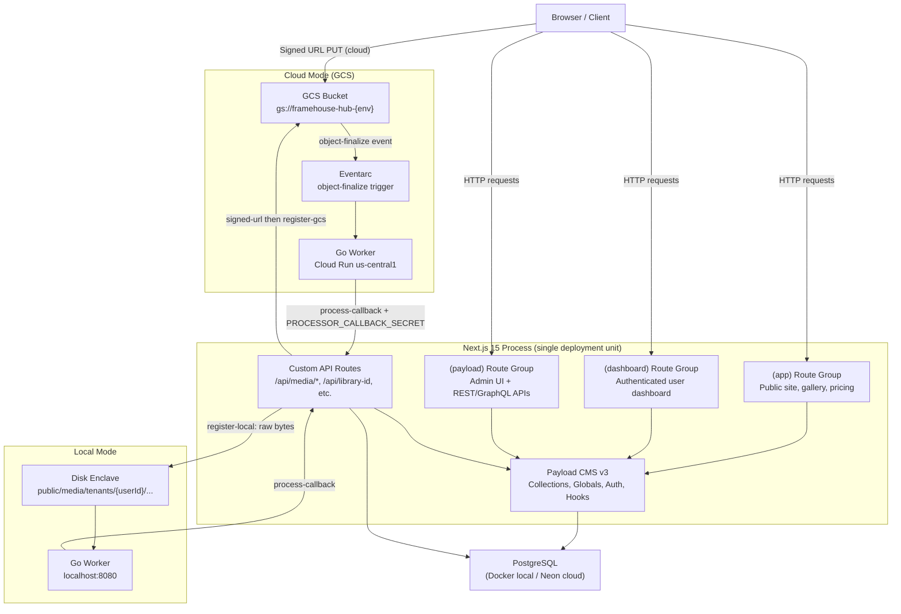

# Architecture Overview — Framehouse Hub

---

## System Diagram



---

## The "Payload-inside-Next.js" Pattern

Payload CMS v3 runs **embedded inside the Next.js process** — there is no separate CMS server. This means:

- A single `pnpm dev` / `pnpm build` / `pnpm start` runs everything: the public site, the authenticated dashboard, and the Payload admin UI.
- Payload is initialised once via `getPayloadClient()` and cached for the lifetime of the process.
- The Payload REST and GraphQL APIs are served from Next.js route handlers under `(payload)/`.
- Custom API routes in `src/app/api/` share the same process and can call `getPayloadClient()` directly without HTTP overhead.

`src/payload.config.ts` is the **single source of truth** for all schema definitions, hooks, access control, plugins, and database/storage configuration.

---

## Route Groups

The `src/app/` directory is partitioned into Next.js route groups. Each group has its own layout and auth boundary, but all run in the same process:

| Route Group | Path Prefix | Purpose |
|---|---|---|
| `(app)` | `/`, `/learn`, `/company`, `/pricing`, etc. | Public-facing marketing site and content pages |
| `(dashboard)` | `/dashboard/...` | Authenticated creative dashboard: upload, library, portfolio builder |
| `(payload)` | `/admin`, `/api/...` (Payload-managed) | Payload admin UI and auto-generated REST/GraphQL APIs |
| `(portfolio)` | Portfolio presentation routes | Client-facing immutable portfolio viewer |
| `(coming-soon)` | Coming soon routes | Pre-launch holding pages |

Custom Next.js API routes (not managed by Payload) live under `src/app/api/`:
- `media/signed-url` — issues GCS pre-signed upload URLs
- `media/register-gcs` — records a GCS-uploaded asset as a Payload Media doc
- `media/register-local` — accepts raw file bytes for local disk ingest
- `media/process-callback` — receives derivative-complete callbacks from the Go worker
- `media/status-stream` — SSE endpoint for real-time processing status
- `media/reprocess` — triggers re-processing of an existing asset
- `media/search` — full-text search over the GIN index
- `seed-hub` — auth-gated remote seeding endpoint

---

## Key Architectural Decisions

### 1. Payload Embedded Inside Next.js

**Decision:** Run Payload as a library inside the Next.js app rather than as a standalone server.

**Rationale:** Unified deployment unit — one Cloud Run service, one build, one process. Eliminates network latency between Next.js and CMS. Simplifies auth (Payload JWT is native to the app). Reduces infrastructure cost within free-tier constraints.

**Trade-off:** Payload admin restarts with the app. Not suitable if the CMS needs independent scaling from the public site.

---

### 2. `push: false` on the Database Adapter

**Decision:** The Postgres adapter is configured with `push: false`. Schema changes must go through explicit migrations.

**Rationale:** Auto-push (`push: true`) applies schema changes immediately, creating drift risk in shared environments and CI. Explicit migrations are versioned, reviewable, and reversible.

**Workflow:** After schema changes:
```bash
pnpm payload migrate:create   # generates .ts + .json migration files
# commit both files
pnpm payload migrate          # applies pending migrations
```

CI runs `migrate:create --name check_drift` after migrating and fails if the working tree is dirty, ensuring committed migrations fully describe the config.

---

### 3. `disableLocalStorage: true` + `filesRequiredOnCreate: false` on Media

**Decision:** The `Media` collection disables Payload's built-in local storage and does not require a file attachment on document creation.

**Rationale:** Framehouse Hub owns the byte storage (disk enclave or GCS). Payload owns only the metadata document. Without `filesRequiredOnCreate: false`, Payload's internal `generateFileData` hook throws a `MissingFile` error on every fileless create — which is the normal state for GCS-staged uploads where the file goes directly to the bucket before the Payload doc is created.

---

### 4. Dual-Mode Media Pipeline

**Decision:** Support two distinct ingest modes — local disk (dev) and GCS (cloud) — with identical processing logic via the Go worker in both.

**Rationale:** Local disk mode enables full pipeline development without GCP credentials or network access. Cloud mode uses GCS for durability and Eventarc for event-driven processing. The Go worker (`scripts/worker/main.go`) is the same binary in both environments; only the trigger mechanism differs.

| Mode | Storage | Worker trigger |
|---|---|---|
| Local | `public/media/tenants/...` | `triggerLocalWorker` afterChange hook → fetch to `LOCAL_WORKER_URL` |
| Cloud | `gs://framehouse-hub-{env}` | GCS object-finalize → Eventarc → Cloud Run worker |

The mode is determined by whether `GCS_BUCKET` is set in the environment.

---

### 5. Unsigned URLs in DB + `signCloudUrls` afterRead Hook

**Decision:** Persist unsigned GCS URLs (`https://storage.googleapis.com/{bucket}/{path}`) in the database. Generate signed GET URLs at read time via the `signCloudUrls` afterRead hook.

**Rationale:** Signed URLs expire (1-hour TTL). Persisting them would require a background job to refresh all stored URLs before expiry. Storing the unsigned canonical path is stable and timeless; signing happens on-demand per request using the Cloud Run runtime SA's `iam.serviceAccountTokenCreator` self-grant.

**UI rule:** Always use the fallback chain `thumbnailUrl || proxyUrl || originalUrl || url` — the afterRead hook populates the first three with signed URLs in cloud mode.

---

### 6. GIN Full-Text Search on Media (Postgres, not Elasticsearch)

**Decision:** Full-text search over media assets uses a Postgres GIN index rather than a dedicated search service.

**Rationale:** Keeps the stack minimal. Postgres `to_tsvector` with a GIN index on `title || filename || original_filename || technical_camera_model || technical_lens_model || shoot_name` is sufficient for the expected data volumes and query patterns. Eliminates an additional managed service within free-tier constraints.

**Index name:** `media_search_idx`. New searchable fields must be added to both the index migration and `/api/media/search`.

---

## Path Aliases

Configured in `tsconfig.json`:

| Alias | Resolves to |
|---|---|
| `@/*` | `src/*` |
| `@payload-config` | `src/payload.config.ts` |
| `@/payload-types` | `src/payload-types.ts` (generated) |

---

## Environment Modes

### Local Mode

```
DATABASE_URI=postgresql://...localhost:5432/framehouse
# GCS_BUCKET and GCS_PROJECT_ID are unset
LOCAL_WORKER_URL=http://localhost:8080
```

- Media bytes written to `public/media/tenants/` by `writeOriginalToEnclave`
- Go worker runs locally via `./scripts/dev-with-worker.sh`
- Worker triggered by `triggerLocalWorker` afterChange hook (detached fetch)

### Cloud Mode

```
DATABASE_URI=postgresql://...neon.tech/...
GCS_BUCKET=framehouse-hub-dev
GCS_PROJECT_ID=my-gcp-project
PROCESSOR_CALLBACK_SECRET=...
```

- Media bytes uploaded directly from browser to GCS via signed PUT URL
- `register-gcs` creates the Payload Media doc (no file bytes in the request)
- GCS object-finalize → Eventarc → Cloud Run Go worker → `process-callback`
- All media reads return signed GET URLs (1-hour TTL) via `signCloudUrls` afterRead hook

---

## Collections and Globals

### Collections

| Collection | Description |
|---|---|
| `Users` | Platform users with roles: `admin`, `creative`, `viewer` |
| `Media` | Photo/video assets with dual-mode storage and derivative tracking |
| `Portfolios` | Curated asset presentations with section-based layout |
| `SmartCollections` | Rule-based dynamic media groupings |
| `UploadBatches` | Batch-level grouping of assets per ingest commit |
| `Sessions` | Shoot-level grouping above batches |
| `Pages` | CMS-managed static pages |
| `Categories` | Taxonomy for organising content |
| `Articles` | Editorial content (learn section) |
| `Downloads` | Downloadable resources (learn section) |
| `Tutorials` | Tutorial content (learn section) |
| `PortfolioClientSessions` | Stateless client viewer session tracking |
| `PortfolioClientReviews` | Client review submissions on portfolios |
| `PortfolioAssetComments` | Per-asset comments from client review sessions |
| `PortfolioDownloadLogs` | Download event logs from client review sessions |
| `AdminActivityLogs` | Admin action audit trail |
| `AdminDiagnosticSessions` | Admin system diagnostic run records |
| `Waitlist` | Pre-launch waitlist registrations |

### Globals

| Global | Description |
|---|---|
| `Header` | Site-wide navigation header configuration |
| `Footer` | Site-wide footer configuration |
| `Pricing` | Pricing tiers and plan configuration |

---

## Key Configuration Files

| File | Purpose |
|---|---|
| `src/payload.config.ts` | Single source of truth: all collections, globals, plugins, DB adapter, storage, hooks |
| `next.config.js` | Next.js configuration: image domains, redirects, headers |
| `tailwind.config.mjs` | Tailwind CSS v4 configuration and design tokens |
| `tsconfig.json` | TypeScript config: strict mode, path aliases |
| `src/migrations/` | All committed Postgres migration files (`.ts` + `.json` pairs) |
| `src/payload-types.ts` | Generated TypeScript types from Payload schema — do not edit manually |
| `src/payload-generated-schema.ts` | Generated DB schema — do not edit manually |
| `src/access/` | Access control modules (`adminOnly`, `creativeOrAdmin`, `ownerOrAdmin`, etc.) |
| `src/lib/storage-paths.ts` | Canonical `buildStoragePath` helper — single source of truth for enclave paths |
| `scripts/worker/main.go` | Go worker source: derivative generation, callback, health endpoint |
| `scripts/verify-local.sh` | Blank-slate verification: ephemeral Postgres, migrate, seed, teardown |

---

## Access Control

Access control logic lives in `src/access/` as named modules. Never inline access logic directly in collection configs — always import from the access modules.

| Module | Grants access to |
|---|---|
| `adminOnly` | Users with `admin` role |
| `creativeOrAdmin` | Users with `creative` or `admin` role |
| `ownerOrAdmin` | Document owner or `admin` role |
| `adminOrPublishedStatus` | Admins, or any user for published documents |

The `Portfolios` collection additionally registers `protectLibraryFolder` (prevents deletion of root library folder) and `ensureFolderParenting` (enforces correct parent on folder move) via `payload.config.ts` `folders.collectionOverrides`.
