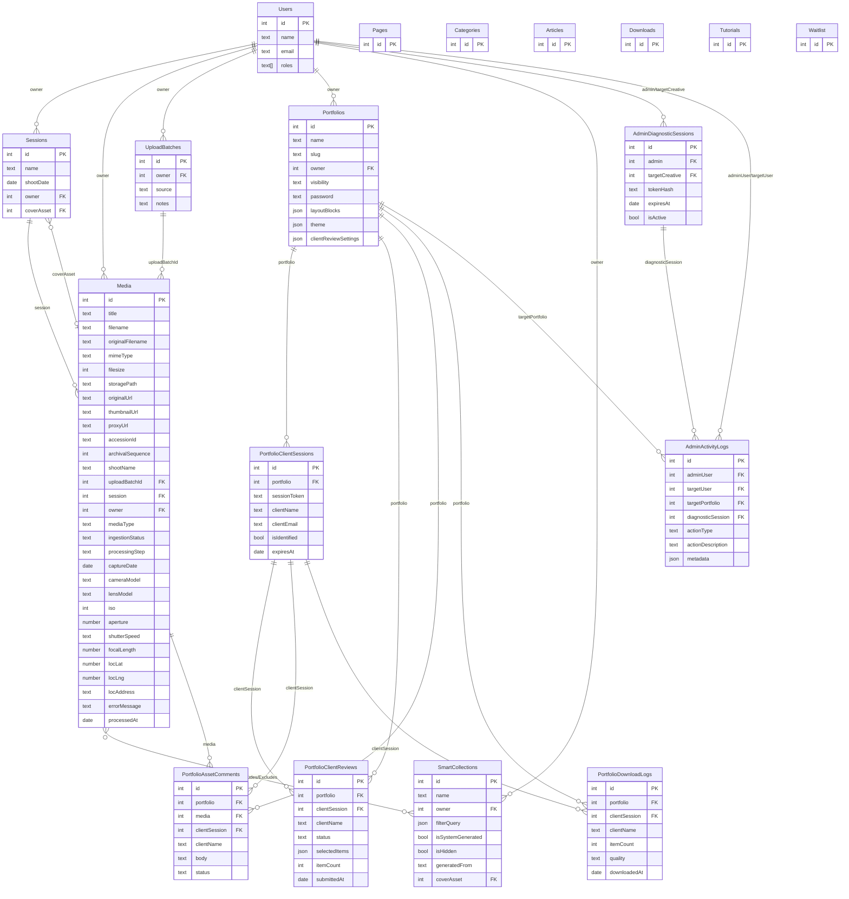
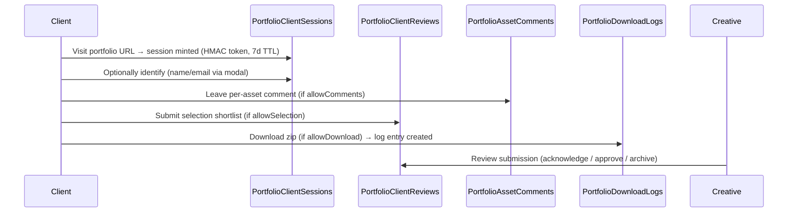

# Data Model Reference

Framehouse Hub is a Payload CMS v3 + Next.js 15 platform. All collections are defined under `src/collections/`. Globals are under `src/globals/`.

---

## ER Diagram

---

## Collections

### Users

**Purpose:** Authentication + authorization. First user created is auto-promoted to admin.

**Key fields:**
- `name` — display name
- `email` — unique, used for login
- `roles` — multi-select: `admin` | `creative` | `viewer` (default: `viewer`)

**Access rules:**
- `read/update`: self or admin
- `create`: public (registration)
- `delete`: admin only
- Admin panel access: admin + creative roles

**Notable hooks:**
- `ensureFirstUserIsAdmin` — promotes the first registered user to admin
- `protectRoles` — prevents non-admins from self-escalating roles

---

### Sessions

**Purpose:** Groups a set of media assets from a single creative shoot. Acts as the top-level ingestion container.

**Key fields:**
- `name` — normalized shoot name (e.g. "Golden Hour Beach Portraits")
- `shootDate` — primary date for the session
- `description`, `location` (address/lat/lng)
- `defaultTags` — array of tags pre-applied to all assets ingested under this session
- `coverAsset` → Media (nullable)
- `owner` → Users

**Access rules:** `ownerOrAdmin` for read/update/delete; `creativeOrAdmin` for create.

**Hook:** `normalizeSessionName` — trims and title-cases the name on beforeValidate.

**Relation to UploadBatches and Media:** A Session has no direct FK to UploadBatches. Instead, each UploadBatch references a session (optionally), and each Media doc references both its `uploadBatchId` and its `session`. The chain is: `Session → (many) UploadBatches → (many) Media`.

---

### UploadBatches

**Purpose:** Represents one "Start Archival Ingest" click. Minted client-side before upload begins. All Media docs created in that upload run carry its ID.

**Key fields:**
- `owner` → Users
- `source` — `dashboard` | `admin` | `seed` | `api`
- `notes` — free-form admin note

**Access rules:** `ownerOrAdmin` for read/update/delete; `creativeOrAdmin` for create.

**Important:** Deleting a batch does NOT delete its media assets. The `uploadBatchId` FK on Media uses `ON DELETE SET NULL`.

---

### Media

**Purpose:** The core archival asset record. Payload owns the document; the pipeline owns the bytes.

**Key fields — identity:**
- `title`, `filename` (slugified), `originalFilename` (pre-slugify)
- `mimeType`, `filesize`, `width`, `height`, `aspectRatio`
- `accessionId` — format `FRH-YYYY-NNNN` (e.g. `FRH-2024-0001`), globally unique, assigned atomically via a Postgres sequence
- `archivalSequence` — raw integer from the same sequence

**Key fields — storage:**
- `storagePath` — canonical path: `tenants/{userId}/{domain}/{year}/{month}/{assetUUID}/original/{filename}`
- `originalUrl` — unsigned GCS URL or `/media/{storagePath}` in local mode
- `thumbnailUrl` — small WebP derivative URL (set by process-callback)
- `proxyUrl` — medium WebP derivative URL (set by process-callback)
- `url` — alias for `originalUrl` (set by `aliasUrl` afterRead hook for legacy consumers)

**Key fields — pipeline state:**
- `ingestionStatus` — `active` | `processing` | `stale` | `ready` | `failed`
- `processingStep` — `upload_complete` | `exif_parsing` | `generating_webp` | `registering_assets` | `ready` | `failed`
- `errorMessage`, `processedAt`

**Key fields — classification:**
- `mediaType` — `image` | `raw` | `video` | `audio` | `document` | `unclassified` (derived from mimeType + extension)
- `shootName` — synced from the linked Session's name via `syncShootNameFromSession` hook
- `session` → Sessions, `uploadBatchId` → UploadBatches

**Key fields — technical metadata** (group `technical`):
- `cameraMake`, `cameraModel`, `lensModel`, `iso`, `aperture`, `shutterSpeed`, `focalLength`

**Key fields — location** (group `location`):
- `latitude`, `longitude`, `address`

**Key fields — tags:**
- `manualTags` — user-defined archival tags
- `heuristicTags` — system-generated rule-based tags (read-only)

**Access rules:**
- `read`: public (media metadata/files readable for gallery)
- `create`: `creativeOrAdmin`
- `update/delete`: `ownerOrAdmin`

**Upload config:**
- `disableLocalStorage: true` — Payload's flat-file adapter is bypassed; `writeOriginalToEnclave` owns disk writes in local mode
- `filesRequiredOnCreate: false` — cloud-mode docs are created without file bytes (already in GCS)

**Hook chain (in execution order):**

| Phase | Hook | Purpose |
|---|---|---|
| `beforeOperation` | `preventDuplicates` | Reject duplicate filenames for the same owner |
| `beforeChange` | `writeOriginalToEnclave` | Generate UUID, write bytes to enclave (local only, no-op in cloud) |
| `beforeChange` | `generateAccessionId` | Mint `FRH-YYYY-NNNN` via Postgres sequence |
| `beforeChange` | `extractMetadata` | Parse EXIF from file bytes |
| `beforeChange` | `syncShootNameFromSession` | Copy shootName from linked Session |
| `afterRead` | `aliasUrl` | Copy `originalUrl` → `url` for legacy consumers |
| `afterRead` | `signCloudUrls` | Rewrite `originalUrl`/`thumbnailUrl`/`proxyUrl` to v4 signed GETs (cloud only, 1h TTL) |
| `afterChange` | `triggerLocalWorker` | Fire detached POST to Go worker at `LOCAL_WORKER_URL` (local only) |
| `afterDelete` | `cleanupEnclave` | Remove tenant enclave directory from disk |

**Search:** GIN index `media_search_idx` over `to_tsvector('english', title || filename || original_filename || ...)`. New searchable fields must be added to both the migration and `/api/media/search`.

---

### SmartCollections

**Purpose:** Saved, dynamic media queries. Can be manually authored or auto-generated from asset metadata (e.g. by camera model, shoot date).

**Key fields:**
- `name`, `description`, `icon`
- `owner` → Users
- `filterQuery` — Payload `Where` query object (JSON) that defines the collection
- `isSystemGenerated` — set by `generateSmartCollections` in process-callback; cleared if user edits the filterQuery
- `isHidden` — soft-hide from grid (never deletes assets)
- `sortOrder` — pin ranking (lower = earlier)
- `generatedFrom` — `manual` | `ai_tags` | `metadata` | `tags` | `location` | `media_type` | `camera` | `date`
- `coverAsset` → Media (explicit cover; falls back to 4-asset mosaic)
- `manualIncludes` → Media[] — always included regardless of filterQuery (cap: 500)
- `manualExcludes` → Media[] — always excluded; exclusions take priority over inclusions

**Access rules:** `ownerOrAdmin` for all operations; `creativeOrAdmin` for create.

**Hook:** On `beforeChange`, if the user edits `filterQuery` on a system-generated collection, `isSystemGenerated` is stripped to `false`.

---

### Portfolios

**Purpose:** Curated, publicly-shareable presentation of Media assets. Supports drafts (autosaved every 3s), versioning (max 10 per doc), and folder organisation via Payload's folders plugin.

**Key fields:**
- `name` (admin title), `slug` (auto-generated, unique, URL-safe)
- `title`, `subheading` — rich text for public display
- `owner` → Users
- `visibility` — `private` | `public` | `shared` (password-protected)
- `password` — plaintext password (shown only when `visibility === 'shared'`)
- `theme` — `fontPairing`, `backgroundColor`, `textColor`, `accentColor`
- `clientReviewSettings` — see Client Review System below
- `layoutBlocks` — polymorphic blocks array (see Portfolio Layout Blocks below)

**Access rules:**
- `read`: admins see all; unauthenticated users see published public/shared portfolios; authenticated users also see their own
- `create`: public
- `update/delete`: `ownerOrAdmin`

**Hooks:**
- `reorderItems`, `stripDocumentId`, `generateSlug`, `ensureLibraryAssignment`, `deduplicateSectionAnchors` on `beforeChange`
- `auditAdminChanges` on `afterChange` — writes to AdminActivityLogs when an admin modifies another user's portfolio

**Portfolio Layout Blocks (`layoutBlocks`):**

Portfolios use a Payload `blocks` field — each block is one of:

| Block slug | Purpose |
|---|---|
| `grid` | Main image/video grid section. Supports `masonry` (justified rows), `filmstrip` (horizontal scroll), `uniform_grid` (fixed columns) layouts |
| `text` | Rich text block with alignment control |
| `featured` | Single hero media item with caption |
| `spacer` | Visual breathing room with optional divider |

**Grid block key sub-fields:**
- `sectionName`, `sectionAnchor` (auto-generated from name, URL-safe, deduplicated), `showSectionHeader`
- `layoutStyle`, `preserveAspectRatio`, `sectionWidth`, `filmstripTrackHeight`, `uniformGridColumns`
- `spacing`
- `items` — array of grid items, each with:
  - `media` → Media (nullable, ON DELETE SET NULL)
  - `size` — `small` | `medium` | `large` | `full`
  - `alt`, `caption`, `link`
  - `instanceId` — stable identity for an item within the grid (used by client review to disambiguate same media in multiple sections)
  - `instanceTitle` — client-facing name override for this placement
  - `focalPoint` — {x, y} percentage from top-left (50/50 = center)
  - `videoThumbnail` — override mode (`auto` | `timecode` | `custom`) with optional `timecodeSeconds` or `customMedia` → Media

---

### Client Review System

The client review system spans four collections: `PortfolioClientSessions`, `PortfolioClientReviews`, `PortfolioAssetComments`, and `PortfolioDownloadLogs`. It enables creatives to share portfolios with clients for selection and feedback without requiring a Framehouse account.

**Flow:**

**PortfolioClientSessions:**
- Created automatically when a client visits a portfolio review URL
- `sessionToken` — HMAC-signed, stored in an httpOnly cookie; never stored in plaintext in DB
- `isIdentified` — true once client completes the name modal
- `savedSelectionIds` — in-progress selection array (pre-submission live state)
- `expiresAt` — 7-day rolling TTL
- Access: `create` is public; `read/update/delete` admin only

**PortfolioClientReviews:**
- Created when a client formally submits their selection
- `status` — `submitted` → `acknowledged` → `approved` → `archived`
- `selectedItems` — array of `{media, instanceId, instanceTitle}` snapshots
- `itemCount` — denormalized count (set by `beforeChange` hook)
- `acknowledgedAt`, `acknowledgedBy` — tracked when the creative acknowledges
- Access: `create` public; `read/update` admin or portfolio owner; `delete` admin only

**PortfolioAssetComments:**
- Per-asset comments left during review
- `status` — `visible` | `resolved` | `archived`
- `resolvedAt`, `resolvedBy` → Users
- Access: `create` public; `read/update` admin or portfolio owner; `delete` admin only

**PortfolioDownloadLogs:**
- Immutable audit record per zip download event
- `quality` — `proxy` (WebP) or `original` (full resolution)
- `downloadedItems` — array of media references
- Access: `create` public (server-side only); `read` admin only; update/delete immutable or admin

**Portfolio `clientReviewSettings` fields** (controls what clients can do):
- `allowSelection`, `allowComments`, `allowDownload`
- `requireClientIdentification` — gate selection/comments behind name modal
- `selectionLimit` — max selectable assets (0 = unlimited)
- `downloadQuality` — `proxy` or `original` (full resolution blocked on public portfolios)
- `reviewMessage` — text shown above the gallery during review

---

### AdminDiagnosticSessions

**Purpose:** Short-lived (15-minute TTL) read-only sessions allowing admins to inspect a creative's workspace without sharing credentials.

**Key fields:**
- `admin`, `targetCreative` → Users
- `tokenHash` — SHA-256 of the raw token; token never stored plaintext
- `isActive`, `expiresAt`, `terminatedAt`, `terminatedBy`

**Access:** admin only for all operations.

---

### AdminActivityLogs

**Purpose:** Immutable audit trail of all administrative actions on creative accounts.

**Key fields:**
- `adminUser`, `targetUser` → Users
- `targetPortfolio` → Portfolios
- `diagnosticSession` → AdminDiagnosticSessions
- `actionType` — `inspect_account` | `launch_diagnostic` | `terminate_diagnostic` | `diagnostic_expired` | `portfolio_password_reset` | `portfolio_visibility_change` | `field_override` | `account_role_change`
- `actionDescription`, `metadata` (JSON), `ipAddress`, `userAgent`

**Access:** `create` is open (server-side hooks use `overrideAccess`); `read` admin only; `update/delete` disabled (immutable).

---

### Content Collections

| Collection | Purpose |
|---|---|
| `Pages` | CMS-managed public pages with block-based content |
| `Categories` | Taxonomy for Articles/content |
| `Articles` | Long-form editorial content |
| `Downloads` | Downloadable files (e.g. guides, templates) |
| `Tutorials` | Step-by-step instructional content |
| `Waitlist` | Pre-launch email capture |

---

## Folder System

Payload's `folders` plugin is enabled on the `Portfolios` collection (`folders: true` in the collection config). This creates a `payload-folders` collection managed by the plugin.

Two hooks are injected into **every** foldered collection via `payload.config.ts` `folders.collectionOverrides`:

- `protectLibraryFolder` (beforeDelete) — prevents deletion of the root "Portfolio Library" folder
- `ensureFolderParenting` (beforeChange) — ensures every portfolio is parented to a folder (defaults to "Portfolio Library")

A custom `/library-id` endpoint lazily creates the root "Portfolio Library" folder on first call and returns its ID. The dashboard uses this to redirect new portfolios into the library.

---

## Globals

Globals are singleton documents edited in the Payload admin panel. All three are publicly readable.

| Global | Slug | Purpose |
|---|---|---|
| `Header` | `header` | Navigation items (links) for the public site header |
| `Footer` | `footer` | Footer navigation, legal links, social links |
| `Pricing` | `pricing` | Tiered plan definitions (name, price, features) shown on the public pricing page; max 3 plans |

Changes to globals take effect immediately on the next page render (ISR-compatible).
