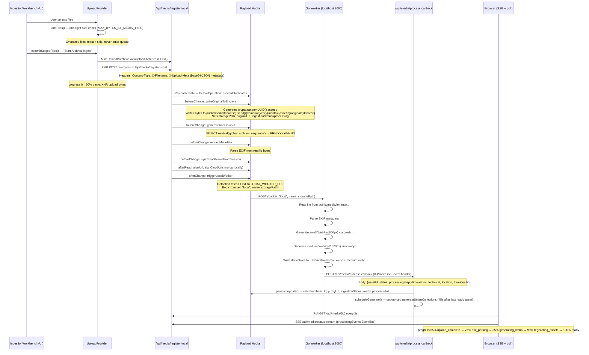
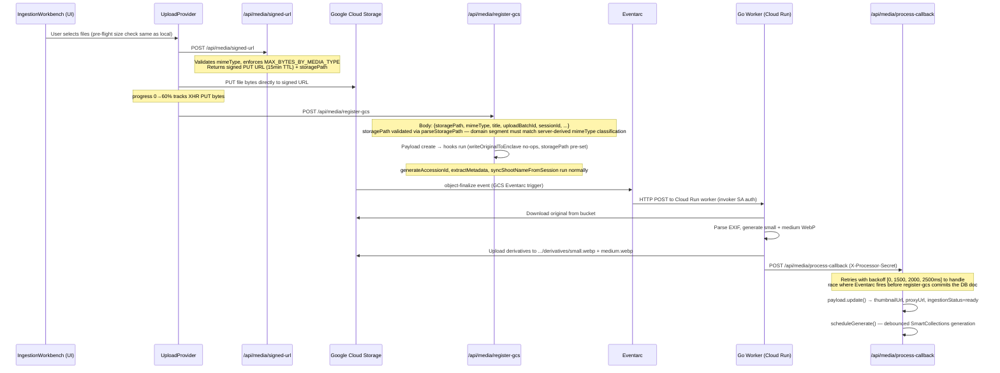

# Media Ingestion Pipeline

The media pipeline is dual-mode: **local** (Docker + Go worker on localhost) and **cloud** (GCS + Cloud Run). The same Payload collection, hooks, and Go worker logic apply in both modes. The mode is determined by whether `GCS_BUCKET` is set.

---

## Local Mode Upload Flow



---

## Cloud Mode Upload Flow



---

## Storage Path Contract

All paths are built by `buildStoragePath()` in `src/lib/storage-paths.ts`. Never hand-construct paths.

```
tenants/{userId}/{domainCategory}/{year}/{month}/{assetUUID}/original/{slugifiedFilename}
tenants/{userId}/{domainCategory}/{year}/{month}/{assetUUID}/derivatives/{size}.webp
```

**Segment index:** `[0]=tenants [1]=userId [2]=domain [3]=year [4]=month [5]=assetId [6]=original|derivatives [7]=filename`

**Domain categories** (derived server-side from mimeType + file extension — never trust client-supplied):

| Domain | mediaType | Triggers |
|---|---|---|
| `visual-media` | `image` | image/* MIME types |
| `digital-negatives` | `raw` | Extensions: dng, arw, cr2, nef, orf, rw2, pef, raf |
| `motion-media` | `video` | video/* MIME types |
| `audio-media` | `audio` | audio/* MIME types |
| `structured-records` | `document` | application/pdf, .json, .csv, .md, .txt |
| `unclassified-artifacts` | `unclassified` | Everything else |

**Security:** In `register-gcs`, the `storagePath`'s embedded domain segment is re-derived from mimeType via `classifyDomainCategory` and compared with `parseStoragePath`. Mismatch → 400 rejection.

**Local disk root:** `public/media/` (served as static files by Next.js from the `public/` directory).

---

## Upload Size Limits

Enforced server-side at every entrypoint (`signed-url`, `register-gcs`, `register-local`) via `enforceUploadSizeLimit()`. Pre-flighted client-side in `addFiles()` to skip before XHR.

| mediaType | Limit |
|---|---|
| `image` | 250 MB |
| `raw` | 5 GB |
| `video` | 5 GB |
| `audio` | 250 MB |
| `document` | 50 MB |
| `unclassified` | 50 MB |

Violations throw `UploadSizeLimitError` with `.status = 413`.

---

## WebP Derivatives

The Go worker (`scripts/worker/main.go`) generates two derivative sizes using `cwebp`:

| Name | Max dimension | Path |
|---|---|---|
| `small` | 800px (longest side) | `.../derivatives/small.webp` |
| `medium` | 1600px (longest side) | `.../derivatives/medium.webp` |

Payload's built-in `imageSizes` are not used. After generation, the worker calls `process-callback` which sets `thumbnailUrl` (small) and `proxyUrl` (medium) on the Media doc.

---

## URL Lifecycle

```
                  DB stores unsigned URL
                  ┌─────────────────────────────────────────────────────────┐
Local:            │  /media/tenants/{userId}/...                            │
Cloud:            │  https://storage.googleapis.com/{bucket}/{storagePath}  │
                  └─────────────────────────────────────────────────────────┘
                                        │
                              afterRead: signCloudUrls
                                        │ (cloud only)
                                        ▼
                  Signed v4 GET URL (1h TTL, HTTPS)
                  https://storage.googleapis.com/{bucket}/{path}?X-Goog-Signature=...
```

- `originalUrl` → unsigned GCS path (stored in DB)
- `thumbnailUrl` → unsigned GCS path to small.webp (stored in DB)
- `proxyUrl` → unsigned GCS path to medium.webp (stored in DB)
- `url` → alias for `originalUrl` (set by `aliasUrl` afterRead hook, not persisted)

**Read URL fallback chain for UI components:**
```
media.thumbnailUrl || media.proxyUrl || media.originalUrl || media.url
```

**Never persist signed URLs client-side.** They expire after 1 hour. Trigger a fresh Payload read to get a new signed URL.

Per-request in-memory cache in `signCloudUrls` makes signing O(unique paths) per HTTP request even when the same Media doc appears multiple times.

---

## Processing Stages and Progress

`ingestionStatus` and `processingStep` on the Media doc track pipeline state. The UI maps `processingStep` to a progress percentage via `STAGE_PROGRESS` in `src/providers/UploadProvider.tsx`:

| processingStep | Progress % | Description |
|---|---|---|
| `upload_complete` | 65% | File received, doc created, enclave written |
| `exif_parsing` | 75% | Worker parsing EXIF metadata |
| `generating_webp` | 85% | Worker running cwebp for small + medium |
| `registering_assets` | 95% | Worker writing derivatives, calling process-callback |
| `ready` | 100% | Doc updated with URLs, SmartCollections scheduled |
| `failed` | 100% | Terminal error state |

**Full progress range:**
- `0%–60%`: XHR upload bytes (tracked by `UploadProvider`)
- `65%–100%`: Processing stages above

---

## Progress Notification: SSE + Polling

The UI uses a dual-mechanism to track processing:

1. **SSE:** `GET /api/media/status-stream` — server-sent events via `processingEvents` EventBus (`src/lib/processing-events.ts`). `process-callback` calls `processingEvents.emitStatusChange()` after each update.
2. **Polling:** `GET /api/media/{id}` every 3 seconds as a mandatory backstop. SSE can silently fail in some environments (observed in CI).

The 3s polling backstop is mandatory — do not remove it.

---

## Reprocessing

**Endpoint:** `POST /api/media/reprocess`

Used to re-trigger the Go worker for a Media doc that is stuck in `processing` or `failed` state. The endpoint:
1. Resets `ingestionStatus` to `processing`, `processingStep` to `upload_complete`
2. Re-fires `triggerLocalWorker` (local) or returns instructions for cloud re-trigger
3. Does not re-upload bytes — the original file must already exist in the enclave or GCS

**Failed state recovery:** A doc in `ingestionStatus: failed` with an `errorMessage` can be reprocessed. If the issue was transient (worker crash, network), reprocessing will succeed. If the original file is missing from disk/GCS, the reprocess call will also fail.

---

## Bearer Auth: Worker ↔ process-callback

Both the Next.js app and the Go worker share `PROCESSOR_CALLBACK_SECRET` (Secret Manager in cloud, env var locally). The worker sets `X-Processor-Secret: {secret}` on every `process-callback` POST. The route validates and returns `401` on mismatch.

Both Cloud Run services must mount the **same** Secret Manager secret. A mismatch means every callback is rejected and all uploads stay in `processing` indefinitely.

---

## Environment Variables Summary

| Variable | Purpose |
|---|---|
| `GCS_BUCKET` | If set, activates cloud mode; if unset, local mode |
| `GCS_PROJECT_ID` | GCP project ID (used by Storage SDK and signing) |
| `LOCAL_WORKER_URL` | Go worker address in local mode (default: `http://localhost:8080`) |
| `PROCESSOR_CALLBACK_SECRET` | Shared secret for worker → process-callback auth |
| `LOCAL_ASYNC_PROCESSING` | Set to `false` to skip worker dispatch (test/seed mode) |
| `DISABLE_WORKER` | Used in CI Playwright tests to bypass the Go worker entirely |
