# CI/CD Pipeline Guide — Framehouse Hub

**Audience:** Engineers, DevOps, onboarding team members  
**Scope:** All GitHub Actions workflows, composite actions, and deployment flows  
**Last updated:** 2026-06-01

---

## How to Read This Document

This guide explains every automated pipeline in the Framehouse Hub repository: when it runs, what it does, and what happens if it fails. Diagrams use Mermaid syntax (rendered in GitHub). Where the system is complex, a plain-English "layman's summary" is included in a blockquote.

> **Layman's summary box** — these explain the concept in everyday terms for onboarding.

---

## Table of Contents

1. [Big Picture — The Two Environments](#1-big-picture)
2. [Branch Strategy](#2-branch-strategy)
3. [Shared Infrastructure (Composite Actions)](#3-composite-actions)
4. [PR Validation Pipeline](#4-pr-validation)
5. [Deploy — Dev Environment](#5-deploy-dev)
6. [Deploy — Prod Environment](#6-deploy-prod)
7. [Deploy — Go Worker](#7-deploy-worker)
8. [Rollback — Production](#8-rollback-prod)
9. [Reset Engine](#9-reset-engine)
10. [Safety Layers & Guardrails](#10-safety-layers)
11. [Secret & Variable Reference](#11-secrets-and-variables)
12. [Failure Runbook](#12-failure-runbook)
13. [Free-Tier Budget](#13-free-tier-budget)

---

## 1. Big Picture

> **Layman's summary:** We have two live environments — `dev` (for testing) and `prod` (for real users). Code flows from a feature branch → `dev` branch → `main` branch. Each step has automated tests and gates that must pass before code advances.

The system consists of two independently deployed cloud environments:

| Environment | Branch | URL | Safety gate |
|---|---|---|---|
| **dev** | `dev` | `https://dev.framehouseworks.com` | None — auto-deploys on push |
| **prod** | `main` | `https://hub.framehouseworks.com` | Reviewer approval + 2-hour wait |

Each environment runs two Cloud Run services:
- **App** — the Next.js + Payload CMS application
- **Worker** — the Go image-processing worker

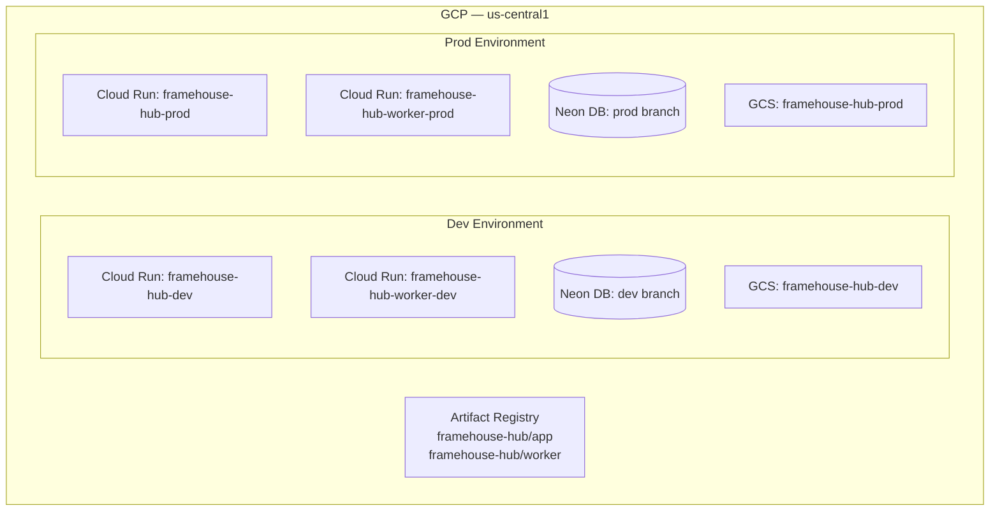

---

## 2. Branch Strategy

> **Layman's summary:** Think of branches like lanes on a highway. Feature work happens in a side lane (`feature/`), merges into the testing lane (`dev`), then the fast lane (`main`) only after review. You can't skip directly from a side lane to the fast lane.

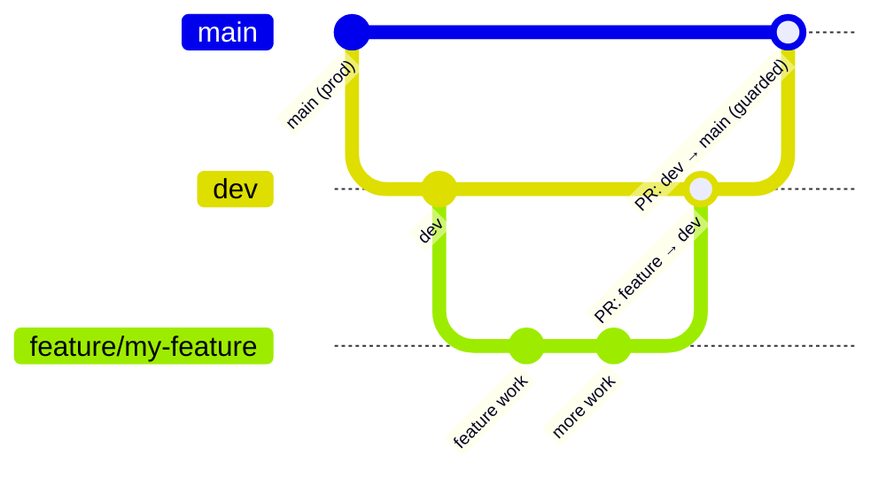

| Branch prefix | Merges to | Triggers |
|---|---|---|
| `feature/`, `fix/`, `chore/` | `dev` | PR Validation |
| `hotfix/` | `dev` first, then escalate to `main` | PR Validation |
| `dev` | `main` (only) | PR Validation + Deploy Dev |
| `main` | — | Deploy Prod + Deploy Worker Prod |

**Guardrail rule:** `main` only accepts PRs from `dev`. Any other source branch is rejected by the `guardrail` job with a step summary error. This is enforced in CI — not just a convention.

---

## 3. Composite Actions

> **Layman's summary:** Composite actions are like reusable Lego bricks. Instead of writing the same "log in to GCP" or "install Node" steps in every workflow file, we write them once and use them everywhere.

### 3.1 `setup-node-pnpm`
**Path:** `.github/actions/setup-node-pnpm/action.yml`  
**Used by:** Every job that needs Node.js (pr-validation, deploy, reset-engine)

**Inputs:**

| Input | Required | Default | Purpose |
|---|---|---|---|
| `node-version` | Yes | — | Node.js version (from `vars.NODE_VERSION`) |
| `pnpm-version` | Yes | — | pnpm version (from `vars.PNPM_VERSION`) |
| `skip-install` | No | `'false'` | Skip `pnpm install` (use when downloading pre-built artifact) |

**Steps (in order):**
1. `pnpm/action-setup` — installs pnpm at the pinned version
2. `actions/setup-node` — installs Node with pnpm store caching enabled
3. `pnpm install --frozen-lockfile` — installs dependencies (skipped if `skip-install: 'true'`)

> **Important:** `actions/checkout` must run in the calling job BEFORE this action. The composite action cannot check out the repo itself — GitHub needs to read `action.yml` from the repo, which requires checkout to have already happened.

### 3.2 `gcp-auth`
**Path:** `.github/actions/gcp-auth/action.yml`  
**Used by:** All deploy, rollback, and reset jobs

Authenticates to GCP using **keyless OIDC / Workload Identity Federation** — no long-lived service account keys are stored anywhere.

**Inputs:**

| Input | Required | Purpose |
|---|---|---|
| `workload_identity_provider` | Yes | WIF provider resource name (from secret) |
| `service_account` | Yes | Runtime SA email to impersonate |

**Steps:**
1. `google-github-actions/auth@v2` — exchanges the GitHub OIDC token for a short-lived GCP access token
2. `docker/login-action` — authenticates Docker to `us-central1-docker.pkg.dev` using the GCP token

After this action, `gcloud` commands and Docker pushes work without any additional credentials.

### 3.3 `deploy-cloudrun`
**Path:** `.github/actions/deploy-cloudrun/action.yml`  
**Used by:** `_deploy-app.yml`, `_deploy-worker.yml`, `rollback-prod.yml`

The core deploy action. Handles Docker build + push + Cloud Run update in one atomic unit.

**Key inputs:**

| Input | Default | Purpose |
|---|---|---|
| `service` | — | Cloud Run service name |
| `image` | — | Full Artifact Registry image path (no tag) |
| `tag` | — | Primary image tag (e.g. `sha-abc1234`, `dev`) |
| `extra_tags` | `''` | Additional tags, newline-separated (e.g. `:latest`, `:sha-abc1234`) |
| `skip_build` | `'false'` | Skip Docker build+push (rollback uses this) |
| `skip_deploy` | `'false'` | Skip Cloud Run update (dry-run uses this) |
| `revision_suffix` | `''` | Cloud Run revision name suffix (prod uses sha7 for addressability) |
| `min_instances` | `'0'` | Scale-to-zero for free tier |
| `max_instances` | `'4'` | Burst cap |
| `no_allow_unauthenticated` | `'false'` | `true` for worker (private endpoint) |
| `secrets` | `''` | Secret Manager mounts: `ENV_VAR=SECRET_NAME:version` |

**What happens during a deploy:**

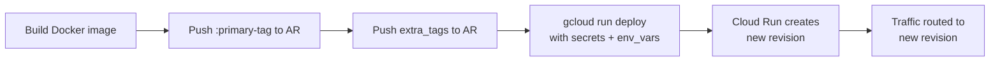

**What happens during a rollback** (`skip_build: 'true'`):

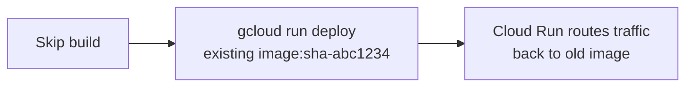

---

## 4. PR Validation

**File:** `.github/workflows/pr-validation.yml`  
**Trigger:** Any PR opened/updated targeting `dev` or `main`; also `workflow_dispatch`

> **Layman's summary:** Every time you open a pull request, this pipeline runs automatically. It checks your code for type errors, runs tests, builds the app, and (for `dev→main` PRs) runs the migrations against a real database. If anything fails, the PR is blocked from merging.

### 4.1 Job Graph

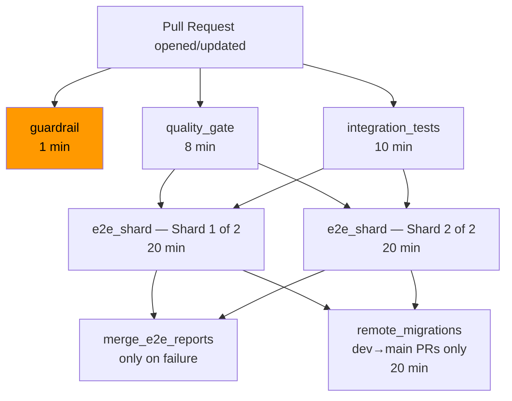

> **Why this order?** `quality_gate` and `integration_tests` run in parallel — cheap checks (type errors, lint) fast-fail before expensive DB tests. E2E only starts once both pass. Remote migrations only run for `dev→main` PRs (the most critical path) to conserve Neon branch quota.

### 4.2 Job Details

#### `guardrail` (1 min)
**Only runs on `dev→main` PRs.** Checks that `github.head_ref == 'dev'`. If not, fails with a human-readable summary. Prevents feature branches from being merged directly to `main`.

#### `quality_gate` (up to 8 min)
Runs in order:
1. Checkout + Node + pnpm install
2. **TypeScript type check** — `pnpm exec tsc --noEmit` (~30s, fast-fails on type errors)
3. **Lint** — `pnpm run lint`
4. **Schema integrity** — runs `generate:importmap` + `generate:types`, fails if git tree is dirty (generated files not committed)
5. **Restore Next.js build cache** — speeds up repeated builds
6. **Production build** — `pnpm run build` with `IS_BUILD_PHASE=true` (skips live DB requirement)
7. **Upload `.next/` artifact** — for e2e job to reuse (avoids 4-min rebuild per shard)

#### `integration_tests` (up to 10 min)
Runs vitest integration tests (`tests/int/**/*.int.spec.ts`). Postgres is managed by vitest's globalSetup — no services block needed. Uploads JUnit XML for 7-day retention.

#### `e2e_shard` (up to 20 min, ×2 parallel runners)
Runs Playwright tests split across 2 parallel runners via a matrix strategy (`shard: [1, 2]`). Each runner processes half the test suite using Playwright's built-in `--shard=N/2` flag. Wall-clock time is halved; total CPU cost is unchanged. GitHub displays these as "E2E / Shard 1 of 2" and "E2E / Shard 2 of 2" in the checks list.
- Downloads pre-built `.next/` artifact from `quality_gate` (artifact retained 3 days to survive re-runs of failed shards the following day)
- Spins up Postgres service container
- Applies DB migrations
- **Verifies schema drift** — `migrate:create --name check_drift` must produce no new files
- Runs Playwright with `DISABLE_WORKER=1` (Go worker is not present in CI; tests synthesise the callback)
- Uploads blob reports for merge step

> **Why `DISABLE_WORKER=1`?** The Go worker converts images to WebP. CI doesn't install `cwebp`. Tests synthesise the `/api/media/process-callback` call directly, skipping the worker entirely. This is intentional — the worker has its own test path.

#### `merge_e2e_reports` (only on e2e failure)
Combines the two shard blob reports into a single HTML Playwright report and uploads it for 7-day retention. Only runs if e2e fails — avoids artifact waste on passing runs.

#### `remote_migrations` (only on `dev→main` PRs)
Validates that migrations can be applied cleanly against a real Neon Postgres database:
1. Creates ephemeral Neon branch from `prod` parent (pre-deletes first for idempotency)
2. Connects via SSL
3. Runs `payload migrate`
4. Seeds the database
5. **Always cleans up** the Neon branch (`if: always()`) — prevents hitting the 10-branch free-tier limit

### 4.3 Concurrency

```yaml
group: pr-validation-${{ github.event.pull_request.number || github.run_id }}
cancel-in-progress: true
```

New pushes to the same PR cancel in-flight runs. Manual `workflow_dispatch` triggers use `run_id` so they never cancel each other.

---

## 5. Deploy — Dev Environment

**Files:** `deploy-dev.yml` → calls `_deploy-app.yml`

**Trigger:** Push to `dev` branch (any path)

> **Layman's summary:** When code is merged into the `dev` branch, this pipeline automatically builds a Docker image and deploys it to the dev Cloud Run service. No human approval needed — dev is for testing.

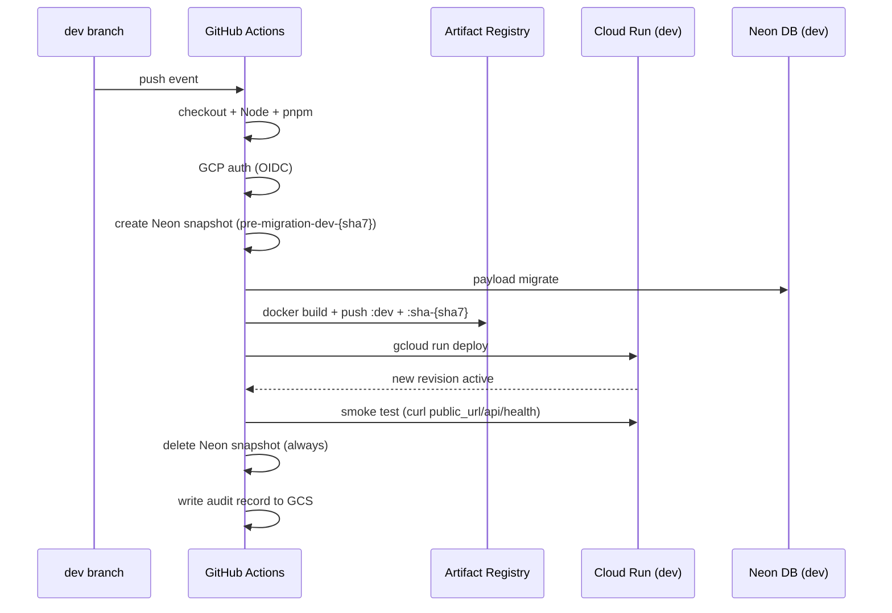

**Key parameters for dev:**

| Parameter | Value |
|---|---|
| Cloud Run service | `framehouse-hub-dev` |
| Image tag (primary) | `dev` (floating) |
| Image tag (extra) | `sha-{sha7}` (for rollback addressability) |
| Min instances | `0` (scale-to-zero) |
| Max instances | `4` |
| Environment gate | None — auto-proceeds |
| Neon parent | `dev` branch |

**`_deploy-app.yml` — reusable deploy workflow (step by step):**

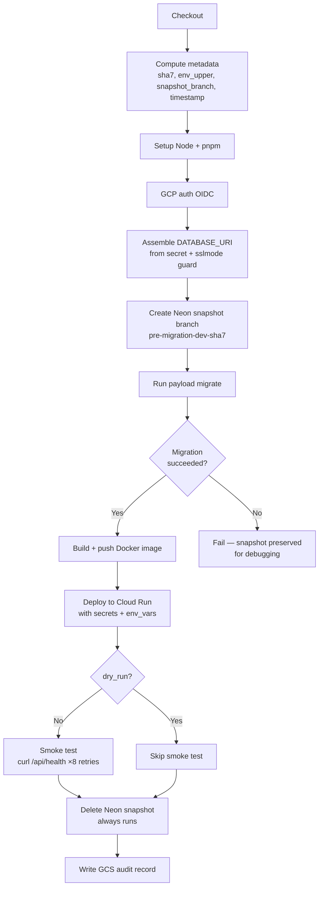

---

## 6. Deploy — Prod Environment

**Files:** `deploy-prod.yml` → calls `_deploy-app.yml`

**Trigger:** Push to `main` branch

> **Layman's summary:** When the `dev` branch is merged into `main`, this starts a production deployment. Unlike dev, production requires a human reviewer to click "Approve" before anything actually deploys. There's also a 2-hour wait window — if someone accidentally triggers this, they have time to cancel it.

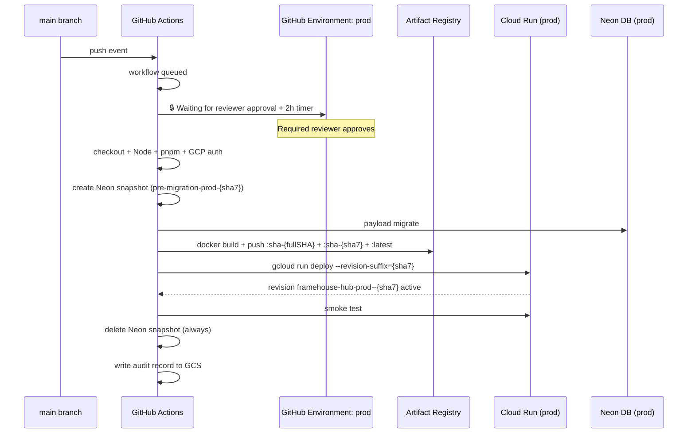

**Key parameters for prod (vs dev):**

| Parameter | Dev | Prod |
|---|---|---|
| Image tag (primary) | `dev` | `sha-${{ github.sha }}` (40-char, immutable) |
| Image tag (extra) | `sha-{sha7}` | `sha-{sha7}` + `:latest` |
| Cloud Run revision | auto-generated | `{service}--{sha7}` (addressable by sha7) |
| Environment gate | None | `prod` — requires reviewer + 2h wait |
| Neon parent | `dev` | `prod` |

**Why the 40-char primary tag?** Full SHA guarantees global uniqueness — no two commits can produce the same tag. The sha7 extra tag exists so rollback can reference it with a human-friendly 7-character input.

**Why named Cloud Run revisions?** `--revision-suffix={sha7}` names the revision `framehouse-hub-prod--{sha7}`. This allows surgical traffic splitting: `gcloud run services update-traffic framehouse-hub-prod --to-revisions=framehouse-hub-prod--abc1234=100`.

---

## 7. Deploy — Go Worker

**Files:** `deploy-worker-dev.yml`, `deploy-worker-prod.yml` → both call `_deploy-worker.yml`

> **Layman's summary:** The Go worker is a separate microservice that converts uploaded images to WebP. It has its own Docker image and Cloud Run service. It only rebuilds when its source code changes (`scripts/worker/**`), saving Artifact Registry storage.

**Trigger:** Push to `dev` or `main`, **only when `scripts/worker/**` files change**

```yaml
paths:
  - 'scripts/worker/**'
```

This path scoping keeps the worker image from rebuilding on every app deploy — important for staying under the 0.5 GB Artifact Registry free allowance.

### 7.1 Worker Deploy Flow

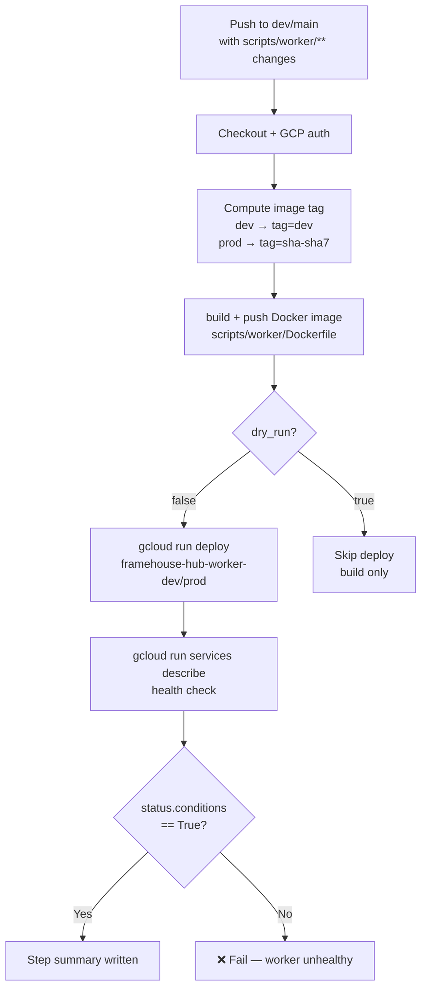

### 7.2 Worker vs App Key Differences

| | App | Worker |
|---|---|---|
| Authenticated? | Public | `--no-allow-unauthenticated` (private) |
| Trigger | Eventarc (GCS object-finalize) | Called by GCS object events, not HTTP |
| Secrets | DATABASE_URI, PAYLOAD_SECRET, PROCESSOR_CALLBACK_SECRET, SEED_SECRET | PROCESSOR_CALLBACK_SECRET only |
| Max instances | 4 | 2 |
| Health check | `curl /api/health` | `gcloud run services describe` |

---

## 8. Rollback — Production

**File:** `rollback-prod.yml`  
**Trigger:** `workflow_dispatch` only (manual)

> **Layman's summary:** If a bad deploy reaches production, this workflow lets you point production back at an older version of the code in about 5 minutes. You give it a 7-character commit SHA (the short hash shown in `git log`), and it redeploys that specific Docker image — no rebuild needed.

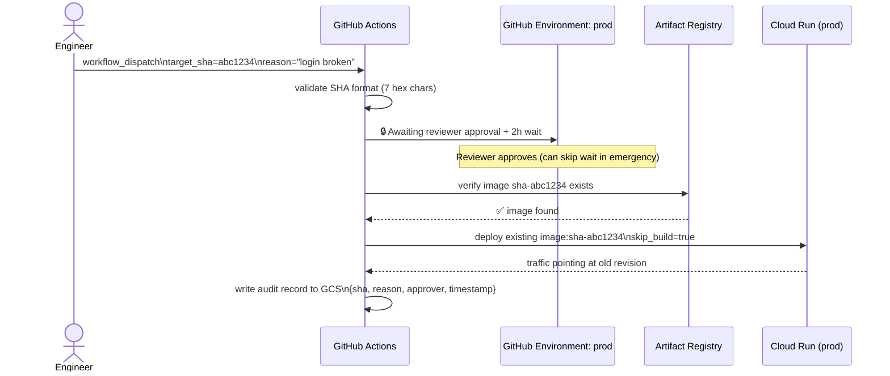

**Inputs:**

| Input | Description | Example |
|---|---|---|
| `target_sha` | 7-character git SHA of image to roll back to | `abc1234` |
| `reason` | Human-readable reason (logged to audit record) | `"login broken after #94"` |

**Safety layers:**
1. SHA format validated with regex before any GCP call (`^[0-9a-f]{7}$`)
2. Image existence checked in Artifact Registry before deploy
3. `prod` GitHub Environment gate — reviewer must approve
4. Audit record written to GCS after rollback completes

**To find the right SHA:**
```bash
git log --oneline main | head -10
# Pick the commit you want to roll back TO (the last known-good commit)
# Use the first 7 characters
```

---

## 9. Reset Engine

**File:** `reset-engine.yml`  
**Trigger:** `workflow_dispatch` only (manual)

> **Layman's summary:** This is the "nuclear option" for when an environment gets into a broken state. It drops the database schema, optionally clears the GCS bucket, runs migrations fresh, and seeds starter data. Use it when `dev` is corrupted and you need a clean slate. Think of it like factory-resetting a phone.

**Inputs:**

| Input | Type | Options | Purpose |
|---|---|---|---|
| `environment` | choice | `dev`, `prod` | Target environment |
| `confirm_phrase` | string | — | Safety phrase (see below) |
| `preserve_storage` | boolean | true/false | Keep GCS bucket files |
| `redeploy` | boolean | true/false | Trigger a fresh deploy after reset |

**Confirmation phrase system:**

| Mode | Required phrase | Use case |
|---|---|---|
| `preserve_storage=true` | `RESET-DEV` | Routine dev data reset (DB only) |
| `preserve_storage=false, environment=dev` | `NUKE-DEV` | Full dev wipe (DB + GCS) |
| `preserve_storage=false, environment=prod` | `NUKE-PROD` | Full prod wipe (DB + GCS) |

> Note: `preserve_storage=true` is **dev-only**. Attempting it on prod is rejected at the phrase-guard step before any GCP auth occurs.

### 9.1 Reset Flow

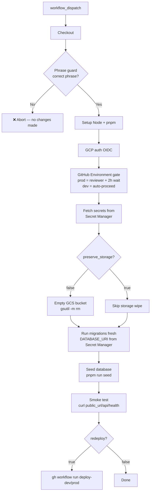

**Concurrency:** Shares the `deploy-dev` / `deploy-prod` concurrency group with the deploy workflows. This queues a reset behind any in-flight deploy, preventing race conditions.

---

## 10. Safety Layers & Guardrails

> **Layman's summary:** Multiple independent safety checks exist so that no single mistake — a typo, a forgotten review, an accidental trigger — can break production. Think of them like a car with seatbelts, airbags, AND ABS brakes. Each one is independent.

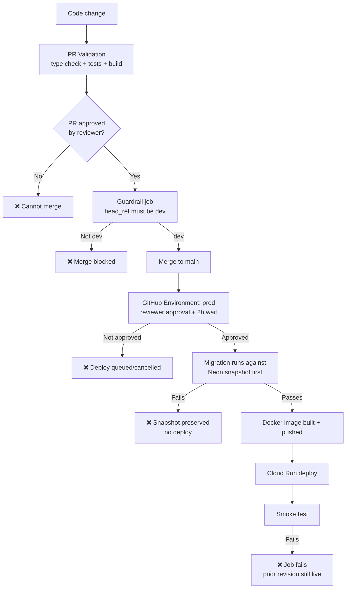

### 10.1 Layer Summary

| Layer | Mechanism | What it prevents |
|---|---|---|
| **Type check** | `tsc --noEmit` in PR | Type errors reaching dev/prod |
| **Lint** | `pnpm run lint` in PR | Style + correctness violations |
| **Integration tests** | vitest against real Postgres | Logic bugs in API/collection code |
| **E2E tests** | Playwright, 2 shards | UI regressions, broken flows |
| **Schema drift check** | `migrate:create` must produce no new files | Uncommitted migrations |
| **Guardrail** | `head_ref == 'dev'` | Feature branches merging directly to main |
| **Environment gate** | GitHub Environment `prod` — reviewer + 2h wait | Accidental or unauthorised prod deploys |
| **Neon snapshot** | Branch created before migration, deleted after | Irreversible DB state from bad migration |
| **Smoke test** | `curl /api/health` ×8 retries | Silent deploy failures |
| **Confirmation phrase** | Reset engine phrase guard | Accidental environment wipes |
| **SHA validation** | Regex `^[0-9a-f]{7}$` | Malformed rollback inputs |
| **Image existence check** | AR tag lookup | Rolling back to a purged/non-existent image |
| **Concurrency groups** | `deploy-dev`, `deploy-prod` | Concurrent deploys corrupting state |
| **Permissions: {}** | Workflow-level empty permissions | Supply-chain compromise blast radius |
| **persist-credentials: false** | On checkout | GITHUB_TOKEN not persisted after checkout |
| **Keyless auth** | OIDC WIF — no long-lived SA keys | Credential theft |

### 10.2 Concurrency Groups

| Group name | Used by | Effect |
|---|---|---|
| `deploy-dev` | deploy-dev.yml, reset-engine (dev) | Serialises dev deploys + resets |
| `deploy-prod` | deploy-prod.yml, deploy-worker-prod.yml, rollback-prod.yml, reset-engine (prod) | Serialises all prod operations |
| `pr-validation-{PR#}` | pr-validation.yml | Cancels stale runs on new push to the same PR |

> **Why share rollback and deploy in one concurrency group?** If a deploy and a rollback run simultaneously, they'd race to update Cloud Run traffic routing. The concurrency group ensures only one operation runs at a time. The rollback queues behind the deploy, or vice versa.

---

## 11. Secrets and Variables

### 11.1 GitHub Repository Variables (`vars.*`)

| Variable | Used for |
|---|---|
| `NODE_VERSION` | Node.js version in all jobs |
| `PNPM_VERSION` | pnpm version in all jobs |
| `GCS_PROJECT_ID` | GCP project ID (canonical — do not use `GCP_PROJECT_ID`) |
| `NEON_PROJECT_ID` | Neon project ID for branch operations |

### 11.2 GitHub Repository Secrets (`secrets.*`)

| Secret | Used by | Notes |
|---|---|---|
| `CI_DB_PASSWORD` | pr-validation (e2e Postgres service) | Local Postgres only |
| `GCP_WORKLOAD_IDENTITY_PROVIDER` | gcp-auth action | WIF provider resource name |
| `GCP_SERVICE_ACCOUNT_EMAIL` | gcp-auth action | Runtime SA email |
| `NEON_API_KEY` | pr-validation (remote_migrations) | Neon API access |
| `DATABASE_URI_DEV` | _deploy-app (dev) | Mounted via Secret Manager |
| `DATABASE_URI_PROD` | _deploy-app (prod) | Mounted via Secret Manager |
| `PAYLOAD_SECRET_DEV` | _deploy-app (dev), pr-validation | Payload CMS secret |
| `PAYLOAD_SECRET_PROD` | _deploy-app (prod) | Payload CMS secret |
| `PROCESSOR_CALLBACK_SECRET_DEV` | _deploy-worker (dev) | Worker ↔ app auth |
| `PROCESSOR_CALLBACK_SECRET_PROD` | _deploy-worker (prod) | Worker ↔ app auth |
| `SEED_SECRET` | _deploy-app | Remote seeding endpoint auth |

### 11.3 GCP Secret Manager Mounts

Secrets are NOT baked into Docker images. They are mounted at runtime by Cloud Run using `--update-secrets`:

```
DATABASE_URI=DATABASE_URI_DEV:latest        → env var DATABASE_URI inside container
PAYLOAD_SECRET=PAYLOAD_SECRET_DEV:latest    → env var PAYLOAD_SECRET
PROCESSOR_CALLBACK_SECRET=PROCESSOR_CALLBACK_SECRET_DEV:latest
SEED_SECRET=SEED_SECRET:latest
```

> **Layman's summary:** The database password is never stored in the code or the Docker image. Cloud Run fetches it from a secure vault (Secret Manager) at the moment the container starts. If you rotate the password, you just update the vault — no redeploy needed for the new value to take effect.

### 11.4 Secret Name Convention

| Pattern | Example | Used for |
|---|---|---|
| `{NAME}_{ENV_UPPER}` | `DATABASE_URI_DEV`, `DATABASE_URI_PROD` | Environment-specific secrets |
| `{NAME}` (no suffix) | `SEED_SECRET` | Environment-agnostic secrets |

---

## 12. Failure Runbook

### PR Validation failing

| Symptom | Likely cause | Fix |
|---|---|---|
| `tsc` fails | Type error in new code | Fix type error locally |
| `generate:importmap` / `generate:types` dirty | Schema changed without regenerating | Run `pnpm generate:types && pnpm generate:importmap` and commit |
| `migrate:create check_drift` dirty | Migration not committed | Run `pnpm payload migrate:create` and commit output |
| `e2e_shard` fails — "Artifact not found" | Build artifact expired (retention is 3 days); this happens when a re-run of failed e2e shards occurs after the artifact window | Push a new commit to trigger a fresh quality_gate build, or re-run ALL jobs (not just failed) |
| `e2e_shard` fails — test assertion | UI regression or test flake | Download the merged HTML report artifact from `merge_e2e_reports`, inspect Playwright traces |
| `remote_migrations` fails — "parent branch not found" | Neon parent branch doesn't exist | Verify `prod` branch exists in Neon console |

### Deploy failing

| Symptom | Likely cause | Fix |
|---|---|---|
| `payload migrate` fails | Bad migration | Restore from Neon snapshot branch; fix migration locally |
| Docker build fails | `Dockerfile` or `next.config.js` issue | Check build logs; fix locally with `IS_BUILD_PHASE=true pnpm build` |
| Cloud Run deploy fails — "secret not found" | Secret deleted or renamed in Secret Manager | Verify all 4 secrets exist in Secret Manager for the env |
| Smoke test fails | App crashed on startup | Check Cloud Run logs; prior revision is still serving traffic |
| `guardrail` blocks merge | PR is not from `dev` | Retarget PR to `dev`, not `main` |

### Rollback failing

| Symptom | Likely cause | Fix |
|---|---|---|
| "image not found" | Target SHA's image was purged by AR cleanup policy | Find the most recent surviving SHA with `gcloud artifacts tags list` |
| Reviewer approval gate — nobody to approve | On-call engineer needed | Check runbook for emergency approval escalation |

### Reset Engine failing

| Symptom | Likely cause | Fix |
|---|---|---|
| "Confirmation phrase did not match" | Wrong phrase entered | Re-trigger with the correct phrase (see §9) |
| `preserve_storage=true` rejected | Tried on prod | Dev only — use `preserve_storage=false` for prod |
| Smoke test fails after reset | Seed data issue or app misconfiguration | Check Cloud Run logs; may need a fresh deploy |

---

## 13. Free-Tier Budget

| Resource | Free tier limit | How we stay within it |
|---|---|---|
| GitHub Actions minutes | 2,000 min/month | Path-scoped worker trigger; E2E sharding; cache reuse |
| Artifact Registry storage | 0.5 GB | Keep-10 / delete-30d cleanup policy; path-scoped worker builds |
| Cloud Run | 2M requests + 360k vCPU-s/month | `--min-instances=0` (scale-to-zero); `--max-instances=4` |
| Neon DB | 10 branches | Ephemeral branches deleted immediately after use; pre-delete before create (idempotent) |
| GCS | 5 GB storage + 1 GB egress/month | Private bucket; signed URLs expire after 1h |

---

## Appendix A — Workflow File Index

| File | Trigger | Calls | Environment gate |
|---|---|---|---|
| `pr-validation.yml` | PR → dev, main | — | None |
| `deploy-dev.yml` | push → dev | `_deploy-app.yml` | None |
| `deploy-prod.yml` | push → main | `_deploy-app.yml` | `prod` |
| `deploy-worker-dev.yml` | push → dev (scripts/worker/**) | `_deploy-worker.yml` | None |
| `deploy-worker-prod.yml` | push → main (scripts/worker/**) | `_deploy-worker.yml` | `prod` |
| `rollback-prod.yml` | manual | `deploy-cloudrun` action | `prod` |
| `reset-engine.yml` | manual | — | `prod` (prod only) |
| `_deploy-app.yml` | reusable | `gcp-auth`, `deploy-cloudrun` | Inherited from caller |
| `_deploy-worker.yml` | reusable | `gcp-auth`, `deploy-cloudrun` | Inherited from caller |

## Appendix B — GitHub Environments Setup

Two GitHub Environments must exist in **Settings → Environments** before any deploy workflow can run.

**`dev`** — no protection rules. Create, leave all toggles off, save.

**`prod`** — protection rules required:
1. Enable **Required reviewers** → add 1+ team leads
2. Enable **Wait timer** → `120` minutes
3. Under **Deployment branches** → select **Selected branches** → add rule `main`
4. Save

> The 2-hour wait window means an accidental trigger can be cancelled before it runs. A reviewer can override the wait by approving immediately in an emergency.

## Appendix C — Full Pipeline Trigger Matrix

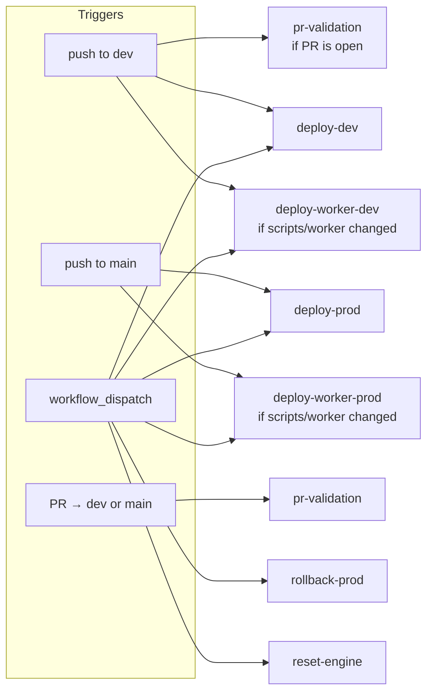
