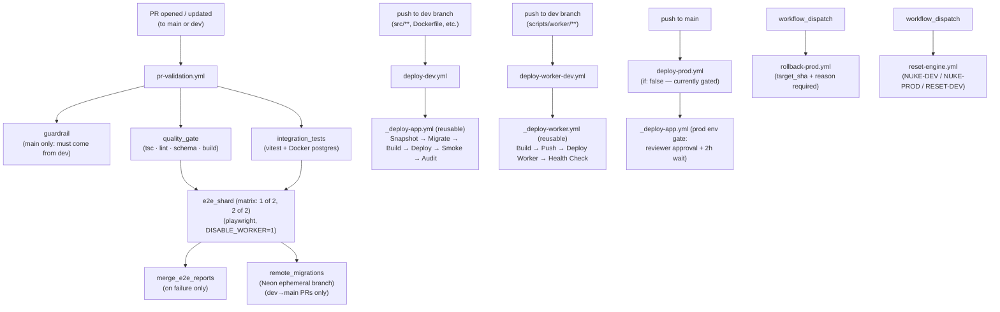

# CI/CD Reference — Framehouse Hub

## Workflow Map



---

## pr-validation.yml

Triggers: `pull_request` to `main` or `dev`; also `workflow_dispatch`. Ignores `**.md`, `docs/**`, `.github/pull_request_template.md` path changes.

**Concurrency:** `pr-validation-{PR_NUMBER}` with `cancel-in-progress: true`. New pushes to the same PR cancel the old run immediately.

**Global env:** `FORCE_JAVASCRIPT_ACTIONS_TO_NODE24: true` (all jobs inherit this).

**Permissions:** none at workflow level; each job declares only what it needs (supply-chain blast-radius limitation).

### Job: `guardrail`

- Runs only when `base_ref == 'main'`.
- Fails if `head_ref != 'dev'`. Writes a blocking step summary.
- Passes silently for PRs targeting `dev`.

### Job: `quality_gate`

Timeout: 15 min. No DB needed.

| Step | What it does | Failure means |
|---|---|---|
| TypeScript type check | `pnpm exec tsc --noEmit` | Type error in source |
| Lint | `pnpm run lint` | ESLint violation |
| Verify schema integrity | `generate:importmap && generate:types`, then `git status --porcelain` | Generated files not committed; run both locally and commit the diff |
| Restore Next.js build cache | Keyed on `pnpm-lock.yaml` + `src/**/*.{ts,tsx}` hash | — |
| Production build | `pnpm run build` with `IS_BUILD_PHASE=true` | Build error (no live DB needed; IS_BUILD_PHASE triggers escape hatch in `getPayloadClient`) |
| Upload build artifact | Uploads `.next/` as `build-pr-{run_id}`, 3-day retention | Artifact missing in e2e step |

`PAYLOAD_SECRET: ci_secret` and `NEXT_PUBLIC_SERVER_URL: http://localhost:3000` are set for the build step. No real secrets.

### Job: `integration_tests`

Runs in **parallel** with `quality_gate` (no dependency between them). Timeout: 10 min.

- Runs `pnpm run test:int --reporter=verbose --reporter=junit`.
- Docker postgres is managed by vitest's `globalSetup` — no service container needed here.
- JUnit XML uploaded to `vitest-results-{run_id}`, retained 7 days.

### Job: `e2e_shard`

Runs after both `quality_gate` and `integration_tests`. Matrix: `shard: [1, 2]` (two parallel runners, `fail-fast: false`).

Service container: `postgres:15-alpine` on port 5432 with health checks.

| Step | Notes |
|---|---|
| Assemble DATABASE_URI | Built from `CI_DB_PASSWORD` secret; masked immediately |
| Apply migrations | `pnpm run payload migrate` against the ephemeral postgres |
| Verify schema drift | `migrate:create --name check_drift`, then `git status --porcelain src/migrations/`. Dirty = fail → run `pnpm payload migrate:create` locally and commit. |
| Download build artifact | Reuses `.next/` from `quality_gate` — avoids 4-min rebuild per shard |
| Restore Playwright browser cache | Keyed on Playwright version |
| Install browsers | Only if cache miss; chromium only (no `cwebp` / `libwebp-tools` needed) |
| Run E2E tests | `DISABLE_WORKER=1` — Go worker skipped; tests synthesise the process-callback |

**`DISABLE_WORKER=1`:** Skips the Go worker binary entirely. E2E tests call `/api/media/process-callback` directly with the `PROCESSOR_CALLBACK_SECRET` to simulate worker completion. Do not remove — the Go worker is not installed on CI runners.

### Job: `merge_e2e_reports`

Only runs when `e2e_shard` fails. Downloads all `playwright-blob-*` artifacts, merges into a single HTML report, uploads as `playwright-report-{run_id}` (7-day retention).

### Job: `remote_migrations`

Only runs for `dev → main` PRs, after `e2e_shard` passes. Timeout: 20 min.

1. Creates an ephemeral Neon branch (`gh-pr-{PR_NUMBER}`) from `production`.
2. Pre-flight deletes a stale branch with the same name (idempotent re-runs).
3. Runs `pnpm run payload migrate` against the ephemeral branch.
4. Runs `pnpm run seed` against it.
5. Deletes the branch in an `always()` step (conserves the 10-branch free-tier limit).

Uses `NEON_API_KEY` secret. Connection string is masked immediately after retrieval. Appends `?sslmode=require` if not already present.

---

## Dev Deploy Pipeline

### Trigger: `deploy-dev.yml`

Fires on push to `dev` branch when any of these paths change:

```
src/**  public/**  next.config.js  payload.config.ts  tailwind.*
tsconfig.json  package.json  pnpm-lock.yaml  Dockerfile  redirects.js
```

Also fires on `workflow_dispatch` (dry_run defaults to `true` — build+push only, no Cloud Run deploy).

**Concurrency:** `deploy-dev`, `cancel-in-progress: false`. Rapid pushes queue; running deploys are never aborted.

Calls `_deploy-app.yml` with:
- `env_name: dev`, `docker_tag: dev`, `gcs_bucket: framehouse-hub-dev`
- `public_url: https://dev.framehouseworks.com`
- `cloud_run_service: framehouse-hub-dev`
- `extra_allowed_origins: https://framehouse-hub-dev-588985538639.us-central1.run.app`

### Reusable: `_deploy-app.yml`

Ordered steps (destructive steps skipped on `dry_run: true`):

1. **Validate variables** — fail fast if `GCS_PROJECT_ID`, `NODE_VERSION`, `PNPM_VERSION` are missing.
2. **Compute metadata** — `sha7`, `env_upper` (DEV/PROD), `snapshot_branch`, `timestamp`.
3. **GCP auth** — OIDC keyless via `gcp-auth` composite (no long-lived keys).
4. **Pre-migration Neon snapshot** — creates copy-on-write branch `pre-migration-{env}-{sha7}` before touching the live DB. Idempotent (deletes stale branch with same name first).
5. **Apply migrations** — `pnpm payload migrate` against live Neon DB with `sslmode=require`. Runs **before** image build — if it fails, old Cloud Run revision keeps serving.
6. **Build + push + deploy** — calls `deploy-cloudrun` composite:
   - Builds Docker image with layer cache (`cache_scope: app-{env}`).
   - Tags as `app:{docker_tag}` and `app:sha-{sha7}`.
   - Deploys to Cloud Run with Secret Manager mounts (see secrets block below).
7. **Smoke test** — `curl` with 8 retries to `{public_url}/api/healthz`, must return `{"db":"ok"}`.
8. **Audit record** — Python script writes JSON to `gs://framehouse-hub-{env}/audit/deploys/{date}/{run_id}.json`.
9. **Snapshot lifecycle** — on success/cancel: delete snapshot. On failure: retain branch for recovery, print delete command to step summary.

**Secrets mounted on Cloud Run** (via Secret Manager, not visible in Console):
```
DATABASE_URI=DATABASE_URI_DEV:latest
PAYLOAD_SECRET=PAYLOAD_SECRET_DEV:latest
PROCESSOR_CALLBACK_SECRET=PROCESSOR_CALLBACK_SECRET_DEV:latest
SEED_SECRET=SEED_SECRET:latest
```

**Plain env vars** on Cloud Run:
```
GCS_BUCKET  GCS_PROJECT_ID  NEXT_PUBLIC_SERVER_URL  EXTRA_ALLOWED_ORIGINS
```

---

## Worker Deploy Pipeline

### Trigger: `deploy-worker-dev.yml`

Fires on push to `dev` branch when **only** `scripts/worker/**` or the workflow file itself changes. Path-scoped to keep Artifact Registry under the 0.5 GB free-tier allowance.

**Concurrency:** Shares `deploy-dev` group with `deploy-dev.yml` — enforces app-first ordering. The app must be stable before the worker receives callbacks.

### Reusable: `_deploy-worker.yml`

1. Validate `GCS_PROJECT_ID` variable.
2. GCP auth.
3. Compute image metadata: dev → tag `dev`; prod → tag `sha-{sha7}` + `latest` alias.
4. `deploy-cloudrun` composite with worker-specific flags:
   - `build_context: ./scripts/worker`, `dockerfile: scripts/worker/Dockerfile`
   - `min_instances: 0`, `max_instances: 2`, `memory: 512Mi`, `cpu: 1`, `concurrency: 4`, `timeout: 300s`
   - `no_allow_unauthenticated: true` — only Eventarc invoker SA can reach it
5. Health check via `gcloud run services describe` — verifies `status.conditions[0].status == True` (can't curl directly due to auth requirement).

---

## Composite Actions

### `setup-node-pnpm`

Sets up Node.js and pnpm. Inputs: `node-version`, `pnpm-version` (pulled from repo vars `NODE_VERSION`, `PNPM_VERSION`).

### `gcp-auth`

Authenticates to GCP via Workload Identity Federation (OIDC, no service account keys). Inputs: `workload_identity_provider`, `service_account`. Also logs in to `us-central1-docker.pkg.dev` for Docker push/pull.

**Calling job must declare:**
```yaml
permissions:
  id-token: write
  contents: read
```

### `deploy-cloudrun`

Builds, pushes, and deploys to Cloud Run. Key inputs:

| Input | Purpose |
|---|---|
| `skip_build: true` | Rollback mode — don't rebuild, redeploy existing image |
| `skip_deploy: true` | Dry-run — build+push only, don't touch live service |
| `no_allow_unauthenticated: true` | Worker: block public access |
| `revision_suffix` | Prod: SHA7 for immutable, rollback-addressable revisions |
| `secrets` | Secret Manager bindings — not visible in Cloud Run Console |
| `env_vars` | Plain non-sensitive vars |

Output: `image_digest` (sha256 of pushed image; empty when `skip_build` is true).

---

## Secret / Env Var Management in CI

| Secret | Used by |
|---|---|
| `GCP_WORKLOAD_IDENTITY_PROVIDER` | `gcp-auth` composite in all deploy workflows |
| `GCP_SERVICE_ACCOUNT_EMAIL` | `gcp-auth` composite |
| `DATABASE_URI_DEV` | `_deploy-app.yml` migration step + Cloud Run mount |
| `PAYLOAD_SECRET_DEV` | Cloud Run mount + `remote_migrations` job |
| `PROCESSOR_CALLBACK_SECRET_DEV` | Cloud Run mount + e2e tests |
| `NEON_API_KEY` | `_deploy-app.yml` snapshot steps + `remote_migrations` |
| `CI_DB_PASSWORD` | e2e postgres service container |
| `SEED_SECRET` | Cloud Run mount + `reset-engine.yml` |

Repository variables (not secrets): `NODE_VERSION`, `PNPM_VERSION`, `GCP_PROJECT_ID` (used as `vars.GCS_PROJECT_ID` internally), `NEON_PROJECT_ID`, `GCP_RUNTIME_SA_EMAIL`.

`IS_BUILD_PHASE=true` is set during `pnpm run build` in both `quality_gate` and `_deploy-app.yml`. This activates the `getPayloadClient` escape hatch — skips live DB connection during build, preventing failures in environments without DATABASE_URI.

---

## Prod Deploy (Currently Gated)

`deploy-prod.yml` exists but is **not active**. The workflow file has no `if: false` gate at the workflow level — the gate is that no infrastructure (Cloud Run service, bucket, secrets) exists yet for prod.

To enable:
1. Provision prod GCP infrastructure (see `docs/devops/gcp-infrastructure.md` prod checklist).
2. Add GitHub secrets: `DATABASE_URI_PROD`, `PAYLOAD_SECRET_PROD`, `PROCESSOR_CALLBACK_SECRET_PROD`.
3. Configure GitHub Environment `prod` with required reviewers and a 2-hour wait window.
4. Create custom domain mapping for `hub.framehouseworks.com`.

When prod infrastructure is ready, merges to `main` will automatically trigger `deploy-prod.yml`. The `_deploy-app.yml` `environment: prod` gate inside the reusable workflow handles the approval + wait.

Prod images are tagged `sha-{full_sha}` (immutable) plus `:latest` alias. Each Cloud Run revision is named `sha-{sha7}` for direct addressability during rollback.

---

## Rollback Procedure

Use `rollback-prod.yml` (manual `workflow_dispatch`):

1. Find the 7-char SHA to roll back to (from audit records in GCS or git log).
2. Trigger the workflow with `target_sha` and `reason`.
3. A `validate` job checks SHA format immediately (before the prod environment gate fires).
4. After reviewer approval + 2h wait, the workflow:
   - Verifies the image `app:sha-{target_sha}` exists in Artifact Registry.
   - Redeploys it with `skip_build: true` (no rebuild — critical, would overwrite the historical image).
   - Smoke-tests `https://framehouseworks.com/api/healthz`.
   - Writes a rollback audit record to GCS.

**Important:** Rollback does NOT reverse migrations. If a migration was destructive, use the retained Neon pre-migration snapshot branch for data recovery separately.

If the target image was evicted by the AR cleanup policy (keep-10 / delete-30d): create a hotfix branch from the target git commit and trigger `deploy-prod.yml` via `workflow_dispatch`.

Manual Cloud Run revision rollback (bypasses the workflow):
```bash
gcloud run services update-traffic framehouse-hub-prod \
  --to-revisions=sha-{sha7}=100 \
  --region=us-central1 \
  --project=framehouse-hub
```

---

## Reset Engine

`reset-engine.yml` (manual `workflow_dispatch`). Two modes:

| Mode | Confirmation phrase | Effect |
|---|---|---|
| Full reset | `NUKE-DEV` / `NUKE-PROD` | Drop DB schema + empty GCS bucket + migrate + seed |
| Fast reset (dev only) | `RESET-DEV` | Drop and reseed DB only; GCS media preserved |

Shares `deploy-dev` or `deploy-prod` concurrency group to queue behind in-progress deploys. The `preserve_storage: true` fast reset is dev-only — prod always requires a full reset for storage consistency.

Optional `redeploy: true` (default) triggers `deploy-dev.yml` or `deploy-prod.yml` after reset completes to restore the latest revision.

---

## Adding a New Workflow Trigger

1. Create the workflow file in `.github/workflows/`.
2. Add `FORCE_JAVASCRIPT_ACTIONS_TO_NODE24: true` to the `env` block.
3. Set `permissions: {}` at workflow level; declare minimal permissions per job.
4. If the workflow deploys to an environment, add `environment: dev` or `environment: prod` to the job — this wires the GitHub Environment gate.
5. If it touches the same Cloud Run service as an existing deploy, use the same `concurrency.group` (`deploy-dev` or `deploy-prod`) with `cancel-in-progress: false`.
6. If it calls `_deploy-app.yml` or `_deploy-worker.yml`, pass all required secrets explicitly — reusable workflows do not inherit caller secrets automatically.
7. For new path-scoped triggers, verify the `paths:` filter doesn't overlap unintentionally with existing workflows.
