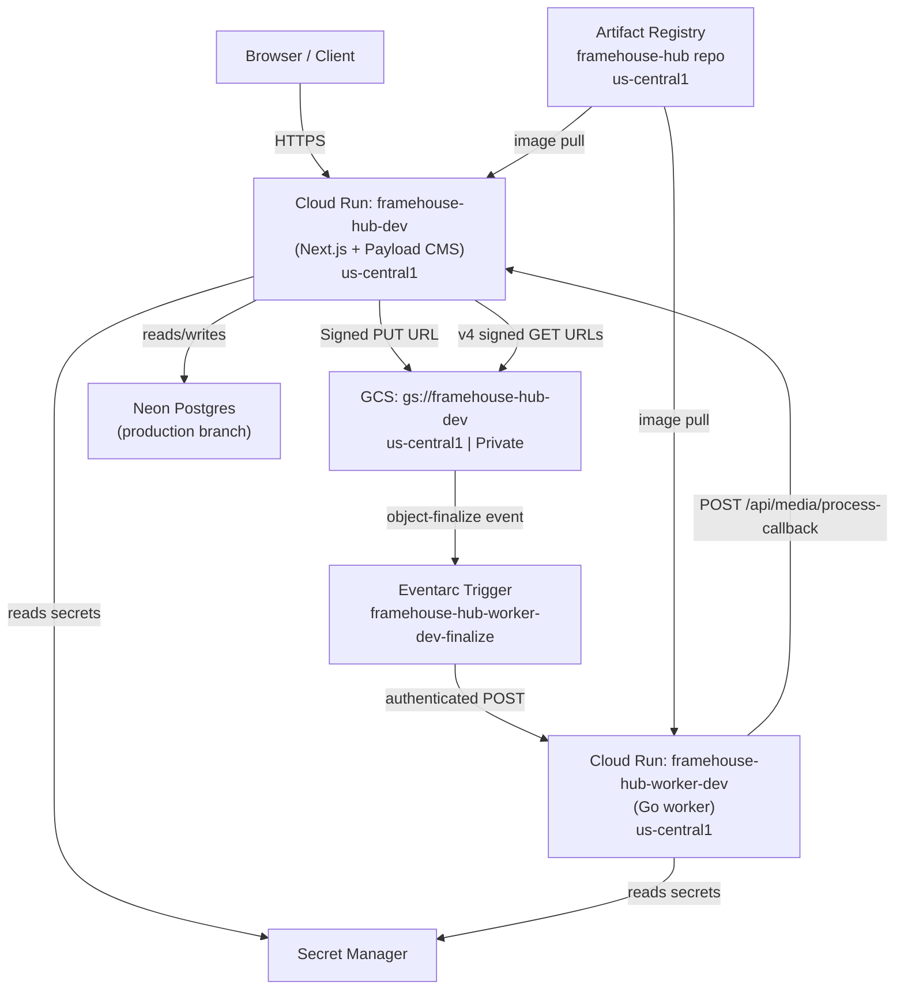

# GCP Infrastructure — Framehouse Hub

## Architecture Overview



---

## Cloud Run Services

### `framehouse-hub-dev` (Next.js app)

| Flag | Value | Reason |
|---|---|---|
| `--min-instances` | `0` | Scale-to-zero; zero idle cost on free tier |
| `--max-instances` | `4` | Caps burst; prevents runaway billing |
| `--memory` | `512Mi` | Sufficient for Next.js SSR + Payload admin |
| `--cpu` | `1` | Single vCPU adequate for request traffic |
| `--concurrency` | `4` | Low value because each request may hit DB |
| `--timeout` | `300s` | Covers full media ingest + processing callbacks |
| `--allow-unauthenticated` | (default) | Public-facing app |

Cloud Run URL (also set as `EXTRA_ALLOWED_ORIGINS` for CORS):
`https://framehouse-hub-dev-588985538639.us-central1.run.app`

Custom domain: `https://dev.framehouseworks.com`

### `framehouse-hub-worker-dev` (Go worker)

| Flag | Value | Reason |
|---|---|---|
| `--min-instances` | `0` | Cold start acceptable; async processing |
| `--max-instances` | `2` | Tighter cap; Eventarc burst is bounded |
| `--memory` | `512Mi` | Covers `cwebp` on ~10 MP JPEGs |
| `--cpu` | `1` | `cwebp` is single-threaded |
| `--concurrency` | `4` | Prevents shell-out contention for cwebp |
| `--timeout` | `300s` | Full raw-to-WebP pipeline for large files |
| `--no-allow-unauthenticated` | set | Only Eventarc's invoker SA can reach it |

---

## GCS Bucket

**Bucket:** `gs://framehouse-hub-dev`
**Region:** `us-central1` (must match Eventarc trigger region — cross-region adds billable egress)

### Private access prevention

Public access prevention is enforced at the bucket level. All reads are served via v4 signed URLs generated at request time by the `signCloudUrls` afterRead hook. Signed URLs are never persisted (1h TTL).

### CORS configuration

There is **no Console UI** for bucket CORS. Apply via:

```bash
gcloud storage buckets update gs://framehouse-hub-dev \
  --cors-file=scripts/infra/cors-dev.json
```

CORS allowlist must match exactly (scheme + host, no trailing slash):
- `https://dev.framehouseworks.com`
- `https://framehouse-hub-dev-588985538639.us-central1.run.app`

Never use `*` — signed URLs are credential-equivalent.

### Storage paths

All media is stored under:
```
tenants/{userId}/{domain}/{year}/{month}/{assetUUID}/original/{filename}
```

URLs in DB are unsigned: `https://storage.googleapis.com/{bucket}/{path}`. The `signCloudUrls` hook rewrites them to signed GETs at read time.

---

## Eventarc Trigger

**Trigger:** `framehouse-hub-worker-dev-finalize`
**Event:** `google.cloud.storage.object.v1.finalized` (object-finalize)
**Source:** `gs://framehouse-hub-dev`
**Destination:** `framehouse-hub-worker-dev` Cloud Run service

Flow:
1. Client uploads original file to GCS via signed PUT URL.
2. GCS publishes `object.finalized` to Pub/Sub via the GCS service agent.
3. Eventarc receives the Pub/Sub event and authenticates the HTTP POST to the worker.
4. Worker downloads the original, generates `small` + `medium` WebP thumbnails via `cwebp`.
5. Worker POSTs to `/api/media/process-callback` on the Next.js app.

---

## IAM — Three Distinct Service Agents

These are **not the same SA** — do not conflate them.

### 1. GCS Service Agent

Format: `service-{PROJECT_NUMBER}@gs-project-accounts.iam.gserviceaccount.com`

Required role: `roles/pubsub.publisher` (project scope)

Purpose: GCS needs to publish `object.finalized` events to Pub/Sub so Eventarc can route them to the worker.

```bash
GCS_SA=$(gcloud storage service-agent --project=framehouse-hub | xargs)
gcloud projects add-iam-policy-binding framehouse-hub \
  --member="serviceAccount:${GCS_SA}" \
  --role="roles/pubsub.publisher"
```

> `gcloud storage service-agent` output has **leading whitespace** — always pipe through `xargs` when capturing into a shell variable, or IAM bindings fail with "principal does not exist".

### 2. Eventarc Service Agent

Format: `service-{PROJECT_NUMBER}@gcp-sa-eventarc.iam.gserviceaccount.com`

Note the different domain (`gcp-sa-eventarc`, not `gs-project-accounts`).

Required role: `roles/storage.legacyBucketReader` on the bucket (not project scope)

Purpose: Eventarc needs to read bucket metadata to validate the trigger.

```bash
EVENTARC_SA="service-${PROJECT_NUMBER}@gcp-sa-eventarc.iam.gserviceaccount.com"
gcloud storage buckets add-iam-policy-binding gs://framehouse-hub-dev \
  --member="serviceAccount:${EVENTARC_SA}" \
  --role="roles/storage.legacyBucketReader"
```

### 3. Cloud Run Runtime SA (Invoker / Signing)

Format: `{PROJECT_NUMBER}-compute@developer.gserviceaccount.com` (Compute Engine default SA, or a custom SA configured in `GCP_RUNTIME_SA_EMAIL`)

Required roles:

| Role | Scope | Purpose |
|---|---|---|
| `roles/eventarc.eventReceiver` | Project | SA can receive Eventarc event deliveries |
| `roles/run.invoker` | Worker service | SA can invoke the `--no-allow-unauthenticated` worker |
| `roles/iam.serviceAccountTokenCreator` | Self-grant | SA can sign blobs for v4 signed URL generation |

```bash
RUNTIME_SA="${PROJECT_NUMBER}-compute@developer.gserviceaccount.com"

# eventarc.eventReceiver (project)
gcloud projects add-iam-policy-binding framehouse-hub \
  --member="serviceAccount:${RUNTIME_SA}" \
  --role="roles/eventarc.eventReceiver"

# run.invoker (worker service)
gcloud run services add-iam-policy-binding framehouse-hub-worker-dev \
  --region=us-central1 \
  --member="serviceAccount:${RUNTIME_SA}" \
  --role="roles/run.invoker"

# iam.serviceAccountTokenCreator (self-grant for v4 signing)
gcloud iam service-accounts add-iam-policy-binding "${RUNTIME_SA}" \
  --member="serviceAccount:${RUNTIME_SA}" \
  --role="roles/iam.serviceAccountTokenCreator"
```

The `roles/iam.serviceAccountTokenCreator` self-grant is **required** for any v4 signed URL signing — both upload PUT URLs and read GET URLs. Without it, the Storage SDK cannot call `iamcredentials.signBlob` and signing fails at runtime.

---

## Secret Manager

Secrets follow the naming convention `{SECRET_NAME}_{ENV}` where ENV is `DEV` or `PROD`.

| Secret name | Contents |
|---|---|
| `DATABASE_URI_DEV` | Neon connection string for dev |
| `PAYLOAD_SECRET_DEV` | Payload CMS signing secret |
| `PROCESSOR_CALLBACK_SECRET_DEV` | Shared secret between worker and process-callback endpoint |
| `SEED_SECRET` | Auth token for the `/api/seed-hub` remote seed endpoint |

Secrets are mounted on Cloud Run via the `secrets:` block in the `deploy-cloudrun` composite:

```yaml
secrets: |
  DATABASE_URI=DATABASE_URI_DEV:latest
  PAYLOAD_SECRET=PAYLOAD_SECRET_DEV:latest
  PROCESSOR_CALLBACK_SECRET=PROCESSOR_CALLBACK_SECRET_DEV:latest
  SEED_SECRET=SEED_SECRET:latest
```

Mounted secrets are **not visible** in the Cloud Run Console revision details — they are injected as environment variables at runtime from Secret Manager. Pin to `:latest` for dev; use explicit version numbers in prod so rotations are deliberate.

To create a new secret:
```bash
echo -n "$SECRET_VALUE" | gcloud secrets create SECRET_NAME \
  --data-file=- \
  --project=framehouse-hub
```

To update an existing secret version:
```bash
echo -n "$NEW_VALUE" | gcloud secrets versions add SECRET_NAME \
  --data-file=- \
  --project=framehouse-hub
```

---

## Signed URLs

### Upload PUT URLs (short TTL)

Generated by `/api/media/signed-url`. The browser makes a direct PUT to GCS using these — avoids routing upload bytes through Cloud Run.

### Read GET URLs (1h TTL)

Generated by the `signCloudUrls` afterRead hook when `GCS_BUCKET` env var is set. The hook rewrites `originalUrl`, `thumbnailUrl`, and `proxyUrl` from unsigned `storage.googleapis.com` URLs to v4 signed GET URLs.

Never persist or cache signed URLs client-side — they expire. Trigger a fresh Payload read to refresh.

Signing uses the runtime SA's `iam.serviceAccountTokenCreator` self-grant (see IAM section above).

Canonical env var for the GCP project ID: **`GCS_PROJECT_ID`** (not `GCP_PROJECT_ID`). All code paths use this name — do not reintroduce the old name.

---

## Artifact Registry

**Repository:** `framehouse-hub` in `us-central1`

Two image paths:
- `us-central1-docker.pkg.dev/{PROJECT_ID}/framehouse-hub/app` — Next.js app
- `us-central1-docker.pkg.dev/{PROJECT_ID}/framehouse-hub/worker` — Go worker

**Cleanup policy:** keep-10 / delete-30d (applied by `scripts/infra/set-cleanup-policy.sh`). This retains at minimum the last 10 tagged images per path. Rollback to images older than 10 or 30 days requires rebuilding from the target git commit.

Layer cache is scoped per service+environment (`cache_scope: app-dev`, `worker-dev`, etc.) to prevent cross-contamination.

---

## Infra Scripts

### `scripts/infra/setup-eventarc.sh`

One-shot script to configure the Eventarc trigger and required IAM bindings. Run once per environment.

Known patches needed (not yet applied):
- Add `xargs` trim for `gcloud storage service-agent` output (leading whitespace bug).
- Add Eventarc service-agent bucket grant (`roles/storage.legacyBucketReader`).
- Accept `--bucket-region` separate from `--service-region` (currently assumes they match).

### `scripts/infra/set-cleanup-policy.sh`

Applies keep-10 / delete-30d cleanup policy to Artifact Registry. Run once; idempotent.

---

## Free-Tier Knobs and Constraints

| Resource | Limit | How we stay under |
|---|---|---|
| Cloud Run idle cost | 0 | `--min-instances=0` on all services |
| Cloud Run burst | Controlled | `--max-instances=4` (app), `--max-instances=2` (worker) |
| Artifact Registry storage | 0.5 GB free | Path-scoped worker deploys + keep-10/30d cleanup policy |
| Neon branches | 10 free | Pre-migration snapshots deleted on success; ephemeral PR branches always cleaned up |
| GCS egress | Free within same region | Bucket region = Eventarc region = Cloud Run region = `us-central1` |

Cross-region deployments add billable egress — always keep bucket, Eventarc trigger, and Cloud Run services in the same region.

---

## Common Gotchas

**`gcloud storage service-agent` leading whitespace**

```bash
# Wrong — binding will fail with "principal does not exist"
SA=$(gcloud storage service-agent --project=framehouse-hub)

# Correct
SA=$(gcloud storage service-agent --project=framehouse-hub | xargs)
```

**Bucket CORS has no Console UI**

Use `gcloud storage buckets update --cors-file=` exclusively. Do not attempt to set CORS via the GCP Console — the option does not exist for GCS.

**Worker is `--no-allow-unauthenticated`**

Cannot be curl'd directly for health checks. The worker deploy workflow uses `gcloud run services describe` to verify `status.conditions[0].status == True`.

**Signed URLs expire**

1h TTL on read URLs. Never cache them client-side. Every page render should trigger a fresh Payload read to get fresh signed URLs. Do not persist signed URLs to DB — the `signCloudUrls` hook generates them at read time from unsigned stored paths.

**`GCS_PROJECT_ID` is the canonical env var name**

All code paths (gcsStorage plugin, `signed-url` route, `signCloudUrls` hook) read `GCS_PROJECT_ID`. The old name `GCP_PROJECT_ID` must not be reintroduced. Repository variable in GitHub Actions is `GCP_PROJECT_ID` (historical naming) but is mapped to `GCS_PROJECT_ID` inside workflow steps.
