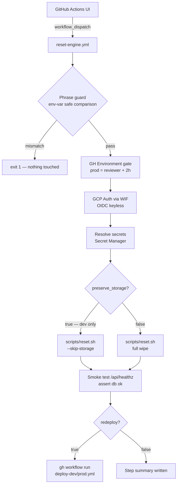

# Reset Engine

**Workflow:** `.github/workflows/reset-engine.yml`  
**Trigger:** `workflow_dispatch` only — never fires automatically.

Two modes:

| Mode | Phrase | Wipes | Environments |
|------|--------|-------|--------------|
| **Fast reset** — DB only | `RESET-DEV` | Neon schema → migrate → seed | `dev` only |
| **Full reset** — DB + storage | `NUKE-DEV` / `NUKE-PROD` | Neon schema + GCS bucket → migrate → seed | `dev`, `prod` |

---

## Quick reference

| Scenario | Action |
|----------|--------|
| Broken local DB | `./scripts/verify-local.sh` |
| Stale dev data, keep media files | Actions → Reset Engine · `dev` · `RESET-DEV` · `preserve_storage=true` |
| Full dev wipe (DB + GCS) | Actions → Reset Engine · `dev` · `NUKE-DEV` |
| Full prod wipe (break-glass only) | Actions → Reset Engine · `prod` · `NUKE-PROD` · reviewer required |

---

## When to use

**Use when:**
- Schema migration broke an environment and the app won't start.
- Preparing for a demo with dirty test data.
- A feature branch left orphaned rows conflicting with new constraints.
- CI is failing due to stale cloud state (always use dev, never prod).
- You want a fresh DB but need to preserve existing media uploads (fast reset).

**Do not use when:**
- You only need to apply new migrations — run `pnpm payload migrate`.
- The issue is a code bug — reset won't help and wastes minutes.
- Any real user data is in prod — reset is total destruction with no recovery.
- You want to test migration rollback — use `verify-local.sh` against a local ephemeral DB.

---

## How to use

### Local reset

```bash
./scripts/verify-local.sh              # ephemeral Postgres → migrate → seed → teardown
./scripts/verify-local.sh --keep-open  # keep DB running; prints DATABASE_URI for pnpm dev
./scripts/cleanup-local.sh             # tear down a --keep-open session
```

---

### Cloud dev — fast reset (preserve GCS media)

Drops and reseeds the DB only. GCS media files are untouched. Use for post-demo cleanup or stale seed data.

1. **Actions → Reset Engine → Run workflow**
2. `environment` = `dev`
3. `confirm_phrase` = `RESET-DEV`
4. `preserve_storage` = `true`
5. `redeploy` = `false` (set `true` to trigger a fresh deploy after)

Wall-clock: ~2 min.

---

### Cloud dev — full reset (DB + GCS)

1. **Actions → Reset Engine → Run workflow**
2. `environment` = `dev`
3. `confirm_phrase` = `NUKE-DEV`
4. `preserve_storage` = `false` (default)

Wall-clock: ~3 min.

Post-reset access:
```
Email:    sys.admin@framehouseworks.com
Password: password123
URL:      https://dev.framehouseworks.com/admin
```

---

### Cloud prod — full reset (break-glass only)

> **Requires a GitHub environment reviewer to approve** before any step runs. No fast reset on prod — storage and DB must stay in sync.

Follow the same steps as full dev reset. Use `prod` + `NUKE-PROD`.

Post-reset prod has only seed data — no real user accounts, no uploaded media.

---

## Safety layers

1. **Phrase guard** — all `${{ inputs.* }}` values passed via shell `env:`, never interpolated directly into shell commands (injection-safe). Wrong phrase → `exit 1` before any GCP auth.
2. **preserve_storage restriction** — `preserve_storage=true` is rejected for `prod` by the phrase guard step.
3. **GitHub Environment gate** — the `prod` environment requires reviewer approval + 2h wait window before any step runs.
4. **Concurrency group** — shares `deploy-dev` / `deploy-prod` with deploy workflows; queues behind any in-progress deploy.

---

## Post-reset state

After any reset, the environment contains exactly what `src/seed/index.ts` defines. See [`seed-guide.md`](seed-guide.md) for full fixture details.

| Account | Role | Password |
|---------|------|----------|
| `sys.admin@framehouseworks.com` | Admin | `password123` |
| `creative@framehouseworks.com` | Creative | `password123` |
| `alex.chen@framehouseworks.com` | Creative | `password123` |
| `maya.patel@framehouseworks.com` | Creative | `password123` |
| `leo.strand@framehouseworks.com` | Creative | `password123` |
| `viewer@framehouseworks.com` | Viewer | `password123` |

**GCS media bytes are not re-uploaded by the seed.** Upload fixture media manually via the dashboard after a full cloud reset.

---

## Architecture



### Job structure

Single `purge` job, sequential steps:

| Step | What it does |
|------|-------------|
| Phrase guard | Env-var comparison — injection-safe. `preserve_storage=true` rejected for prod |
| Setup Node + pnpm | Composite action: checkout + pnpm + node + install |
| GCP Auth | OIDC WIF — no static keys |
| Resolve secrets | `get-secretmanager-secrets` for DB URI, Payload secret, callback secret |
| Run reset | `scripts/reset.sh --target {env} [--skip-storage] --no-confirm` |
| Smoke test | `curl /api/healthz` — asserts `{"db":"ok"}` |
| Trigger redeploy | `gh workflow run deploy-{env}.yml` (only if `redeploy=true`) |
| Step summary | Table written to `$GITHUB_STEP_SUMMARY` |

### Permissions (job-scoped)

```yaml
permissions:
  id-token: write    # GCP OIDC token
  contents: read     # composite action checkout
  actions: write     # gh workflow run (redeploy trigger)
```

---

## Secrets and variables

| Name | Source | Purpose |
|------|--------|---------|
| `GCP_WORKLOAD_IDENTITY_PROVIDER` | GitHub Secret | OIDC WIF provider |
| `GCP_SERVICE_ACCOUNT_EMAIL` | GitHub Secret | SA to impersonate |
| `DATABASE_URI_{DEV\|PROD}` | Secret Manager | DB connection string |
| `PAYLOAD_SECRET_{DEV\|PROD}` | Secret Manager | Payload CMS initialisation |
| `PROCESSOR_CALLBACK_SECRET_{DEV\|PROD}` | Secret Manager | Worker callback signing |
| `GCS_PROJECT_ID` | GitHub Variable | GCP project ID |
| `NODE_VERSION` | GitHub Variable | Node.js version |
| `PNPM_VERSION` | GitHub Variable | pnpm version |

---

## Failure modes and idempotency

| Failure | Behaviour |
|---------|-----------|
| Phrase mismatch | `exit 1` before any GCP call. Nothing touched. |
| `gcloud storage rm` on empty bucket | Exit code swallowed (`|| true`). Safe to re-run. |
| Schema drop after partial migration | Re-creates `public` schema. Idempotent. |
| Seed failure | DB is migrated-but-empty. Re-triggering the workflow recovers. |
| Manual cancel mid-step | Re-trigger is safe — every step is idempotent. |

---

## Troubleshooting

| Symptom | Fix |
|---------|-----|
| `Confirmation phrase mismatch` | Exact casing: `NUKE-DEV`, `NUKE-PROD`, `RESET-DEV` |
| `preserve_storage is only allowed for dev` | Prod always requires full reset — omit `preserve_storage` |
| `DATABASE_URI not resolved` | Check Secret Manager binding; SA needs `roles/secretmanager.secretAccessor` |
| Schema drop failed | Neon may be paused — wake via console first |
| `gcloud storage rm` fails | SA missing `roles/storage.objectAdmin` on bucket |
| Seed fails, DB empty | Re-trigger — schema and bucket are already clean, seed is idempotent |
| Prod stuck at "Waiting for review" | Expected — approve in the GitHub Actions UI |
