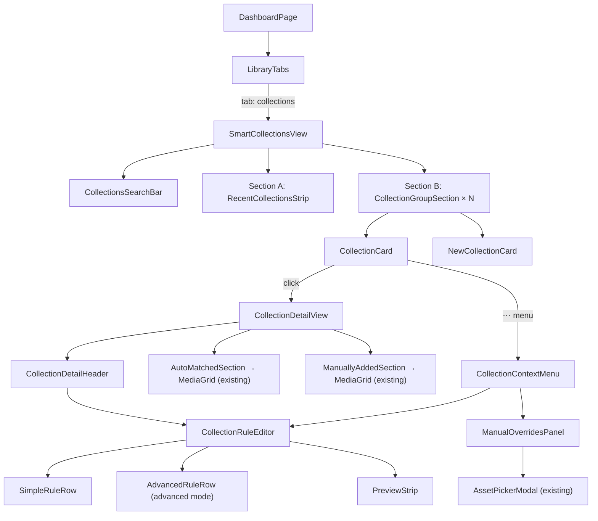

> **IMPLEMENTATION STATUS: FULLY IMPLEMENTED** — Audited against codebase 2026-06-02.
>
> **Key deviations from spec:**
> - Three collection types (`rule-based`, `manual`, `hybrid`) all live in the **single `SmartCollections` Payload collection** with a `type` discriminator field — no separate collections per type.
> - Auto-generation from Sessions (`POST /api/smart-collections/generate`) is implemented but not described in this spec — see [`ingest-sessions.md`](ingest-sessions.md).
> - `ManualOverridesPanel`, `CollectionPickerPopover`, `BulkAddToCollectionModal` were added during implementation (not in this spec).
> - `CollectionGroupSection` groups auto-generated vs user-created collections in the UI.
> - Tag suggestions endpoint: `GET /api/smart-collections/tag-suggestions`.
>
> **Key files:** `src/collections/SmartCollections/`, `src/components/SmartCollections/`, `src/app/api/smart-collections/`

---

# FRH-47 — Smart Collections: UX/UI Spec

> **North Star:** Smart Collections are _dynamic editorial lenses_, not folders. They surface semantic groupings of assets without duplicating storage. Every screen — from a 320px phone to a 1440px desktop — must communicate this distinction naturally through hierarchy, spacing, and motion, never through explanatory text.

---

## 1. Problem Statement

Creators with hundreds of thousands of assets cannot manually maintain folders at scale. A single drone photo from Iceland belongs simultaneously in "Drone Videos," "Iceland 2026," and "Black & White." Smart Collections solve this with query-driven views — not copies — while the UI makes the "no storage duplication" guarantee feel obvious, not technical.

The current flat grid of collections creates: low information hierarchy, weak semantic scanning, unclear system intelligence, and visual overload. The experience should optimise for **retrieval confidence**, not cataloguing exhaustion.

---

## 1.5 Core UX Principles

### Collections Are Views, Not Containers

This distinction must be reinforced at every layer — naming, iconography, microcopy, and interactions.

**Language guide (mandatory):**

| ❌ Avoid | ✅ Use instead |
|---|---|
| Move to Collection | Appears in |
| Store in | Matches |
| Duplicate | Grouped by |
| Directory | Filtered by |
| Remove from folder | Hide from this view |
| Add to Collection | Include in view |

### Three Collection Types (MVP)

| Type | Icon | Meaning |
|---|---|---|
| **Rule-based** | `Filter` icon (funnel) | Auto-maintained by `filterQuery` logic |
| **Manual** | `Bookmark` icon (pin) | Explicitly curated by user |
| **Hybrid** | `SlidersHorizontal` icon | Rule-based with manual inclusions/exclusions |

These must be visually distinct at all times — card, detail header, and empty state. Users lose mental model clarity without this distinction.

### Retrieval over Organisation

Collections are intelligent shortcuts into content, not filing systems. The page hierarchy must optimise for:
1. **Recognition** — what did I recently use?
2. **Discovery** — what groupings exist that I haven't explored?
3. **Continuation** — pick up where I left off

NOT: browsing every collection with equal visual weight.

---

## 2. Scope

### In MVP
- Smart Collections grid on the dashboard library view (tab-based, mobile-first)
- `CollectionCard` component (cover mosaic, live count, context menu)
- Rule editor — structured UI over `filterQuery` JSON (users never see raw JSON)
- System auto-generated collections from existing Media fields
- Manual inclusions / exclusions per collection
- Hide / archive a collection (soft, never touches assets)
- Collection detail view (filtered `MediaGrid` reuse)
- Full mobile gesture support (swipe-to-dismiss overlays, bottom sheets on mobile)

### Deferred (post-MVP)
- AI tag–based generation (awaiting Vision API / `aiTags` field)
- Geo-cluster collections (lat/lng bounding box) — filter type stubbed, no UI
- Public shareable collection URLs
- Bulk collection assignment from asset multi-select

---

## 3. Design System Alignment

All new components strictly follow `DESIGN.md` — "The Curated Gallery."

### Token Reference

| Token | Value | Usage in Smart Collections |
|---|---|---|
| `gallery-gold` | `#d79922` | Active states, AUTO badge accent, count labels |
| `on_surface` | `#1a1c1c` | All body text — never pure black |
| `surface` | `#f9f9f9` | Card backgrounds |
| `surface_container_lowest` | `#ffffff` | Page background |
| `surface_container_low` | `#f3f3f4` | Input fills, inner containers |
| `surface_container` | `#eeeeee` | Metadata chips, skeleton states |
| `outline_variant` | `#d5c4af` | Ghost borders at 15% opacity only |
| Shadow | `0px 20px 40px rgba(26,28,28,0.06)` | Card lift, modal ambient |

### Typography

| Role | Font | Weight | Usage |
|---|---|---|---|
| Collection name | Inter | 600 | `text-sm` on card, `text-xl` on detail header |
| Asset count | Rubik Mono One | 400 | `text-[10px]` uppercase tracking-widest |
| Section labels | Inter | 400 | `text-xs text-on-surface/40` |
| Badges | Rubik Mono One | 400 | `text-[9px]` uppercase tracking-widest |

### Rules (mandatory)
- **No 1px dividers.** Use 40px gap or tonal background shift.
- **`ROUND_SIXTEEN` minimum** on all cards, inputs, overlays.
- **`ROUND_TWENTY_FOUR`** on primary CTAs.
- Glassmorphism on floating panels: `surface_variant` 70% opacity + `backdrop-blur-[20px]`.
- Primary CTA gradient: `from-[#7f5700] to-[#d79922]`.

### Reuse Targets
- `<Card>`, `<CardHeader>`, `<CardContent>` — `@/components/ui/card`
- `<Badge>` with `variant="outline"` — `@/components/ui/badge`
- `<Sheet>` — `@/components/ui/sheet` for bottom-sheet overlays on mobile
- `<Dialog>` — `@/components/ui/dialog` for rule editor on desktop
- `<DropdownMenu>` — `@/components/ui/dropdown-menu` for context menus
- `cn()` — `@/utilities/cn` for all conditional class merging
- `CollectionExplorer` token patterns (`gallery-gold/10`, `rounded-[24px]`, hover transitions) as direct precedent

---

## 4. Data Model

The existing `SmartCollection` document maps to this spec with the following additions (one migration required):

| New Field | Type | Default | Purpose |
|---|---|---|---|
| `isSystemGenerated` | `boolean` | `false` | Read-only badge; editing converts to user-owned |
| `isHidden` | `boolean` | `false` | Soft-hide from default grid |
| `manualIncludes` | `relationship[]` → `media` | `[]` | Always-in overrides |
| `manualExcludes` | `relationship[]` → `media` | `[]` | Always-out overrides |
| `sortOrder` | `number` | `0` | User pin ranking |
| `coverAsset` | `relationship` → `media` (nullable) | `null` | Explicit cover override |
| `generatedFrom` | `select` | `manual` | `ai_tags \| metadata \| tags \| location \| media_type \| manual` |

Existing fields retained: `name`, `owner`, `filterQuery`, `icon`, `description`.

**`filterQuery`** is evaluated at runtime via `payload.find('media', { where: filterQuery })`. The rule editor UI serialises to/from this field — users never interact with the JSON.

---

## 5. Auto-Generated System Collections

Triggered when an `UploadBatch` status transitions to `ready` (not per-asset, to avoid overhead).

| Source Field | Example Name | Filter |
|---|---|---|
| `mediaType = 'video'` | Videos | `{ mediaType: { equals: 'video' } }` |
| `mediaType = 'image'` | Photos | `{ mediaType: { equals: 'image' } }` |
| `mediaType = 'raw'` | RAW Files | `{ mediaType: { equals: 'raw' } }` |
| `shootName` distinct values | Iceland 2026 | `{ shootName: { equals: '...' } }` |
| `manualTags[].tag` distinct | Bird Photography | `{ 'manualTags.tag': { in: ['...'] } }` |
| `heuristicTags[].tag` distinct | Black & White | same pattern |
| `technical.cameraModel` | Sony A7 IV | `{ 'technical.cameraModel': { equals: '...' } }` |
| `captureDate` year-month | May 2025 | `{ and: [{ captureDate: { gte } }, { captureDate: { lt } }] }` |

**Guards:**
- Min 3 assets → skip (avoid noise)
- Hash `filterQuery` → skip if identical query exists for user
- Same title + different query → append "(2)" suffix

---

## 6. Component Architecture



New files (all under `src/components/SmartCollections/`):

| File | Type | Notes |
|---|---|---|
| `SmartCollectionsView.tsx` | Server Component | Fetches collections list, renders page |
| `CollectionsSearchBar.tsx` | Client Component | Client-side filter across all sections |
| `RecentCollectionsStrip.tsx` | Client Component | Horizontal scroll strip, `localStorage`-backed |
| `CollectionGroupSection.tsx` | Client Component | Collapsible section by `generatedFrom` category |
| `CollectionCard.tsx` | Client Component | Card UI: type icon, rule summary, context menu |
| `CollectionDetailHeader.tsx` | Client Component | Back nav, name, rule summary, action buttons |
| `CollectionRuleEditor.tsx` | Client Component | Rule builder modal/sheet (simple + advanced) |
| `SimpleRuleRow.tsx` | Client Component | Attribute › value chip, no operator dropdown |
| `AdvancedRuleRow.tsx` | Client Component | Full attribute / operator / value controls |
| `ManualOverridesPanel.tsx` | Client Component | Include/exclude slide-over |
| `PreviewStrip.tsx` | Client Component | Debounced count + 4-thumbnail preview |

---

## 7. Information Architecture

### 7.1 Dashboard — Collections Tab

Collections live as a tab within the dashboard library view. Tab indicator uses `gallery-gold` underline on active.

- "✦" tab badge (Rubik Mono One, `gallery-gold`) appears when new auto-generated collections are available; clears on tab visit
- Tabs use existing `CategoryTabs` component pattern as precedent

### 7.2 Page Structure — Three Sections

The collections page replaces the flat grid with a three-tier retrieval-first hierarchy:

```
┌─────────────────────────────────────────────────────────────┐
│  Library                                                     │
│  All Assets    Collections ✦    Batches                     │
│               ──────────────                                │
│                                                             │
│  ┌─────────────────────────────────────────────────────┐   │
│  │  🔍  Search collections...                           │   │  ← Search bar (always visible)
│  └─────────────────────────────────────────────────────┘   │
│                                                             │
│  RECENT  ·  ·  ·  ·  ·  ·  ·  ·  ·  ·  ·  ·  ·  ·  ·   │  ← Section A
│  ┌──────┐  ┌──────┐  ┌──────┐  ┌──────┐                  │
│  │ Bird │  │Icelnd│  │Drone │  │ B&W  │                  │
│  └──────┘  └──────┘  └──────┘  └──────┘                  │
│                                                             │
│  BY MEDIA TYPE  ·  ·  ·  ·  ·  ·  ·  ·  ·  ·  ·  ·  ·  │  ← Section B (grouped)
│  ┌──────┐  ┌──────┐  ┌──────┐  + New Collection          │
│  │Photos│  │ RAW  │  │Videos│                             │
│  └──────┘  └──────┘  └──────┘                             │
│                                                             │
│  BY SHOOT  ·  ·  ·  ·  ·  ·  ·  ·  ·  ·  ·  ·  ·  ·  · │
│  ┌──────┐  ┌──────┐                                        │
│  │Icelnd│  │Tokyo │                                        │
│  └──────┘  └──────┘                                        │
│                                                             │
│  BY CAMERA  ·  ·  ·  ·  ·  (collapsed by default)  ›     │
│  MANUAL  ·  ·  ·  ·  ·  ·  (collapsed by default)  ›     │
└─────────────────────────────────────────────────────────────┘
```

#### Section A — Recent & Active

Top horizontal scroll strip (4 cards wide on desktop, 2 on mobile). Shows:
- **Recently Viewed** collections (last 4, from `localStorage`)
- **Recently Updated** (sorted by Payload `updatedAt` desc)

No section header on the very first visit (hidden until user has ≥ 2 collections they've opened).

#### Section B — Grouped by Category

Collections are automatically bucketed by `generatedFrom` value and rendered as collapsible sections.

| Section Header | `generatedFrom` values included | Default state |
|---|---|---|
| `BY MEDIA TYPE` | `media_type` | Expanded |
| `BY SHOOT` | `metadata` (shoot name) | Expanded if ≥ 1 |
| `BY TAG` | `tags` | Expanded if ≥ 1 |
| `BY CAMERA` | `metadata` (camera model) | Collapsed |
| `MANUAL` | `manual` | Expanded if ≥ 1 |

Section headers: `text-[10px] tracking-widest font-medium text-on-surface/40` + expand/collapse chevron. Collapsed sections show a single-line count chip: `"4 collections"`.

A **`+ New Collection`** card appears at the end of the `MANUAL` section (or appended after all sections if no manual collections exist).

#### Search Bar

Always-visible `<input>` at top of the Collections tab. Filters across all sections in real-time (client-side, no API call) — matching on collection `name` and `description`. Matching sections remain visible; non-matching sections collapse. If no collections match: show "No collections matching '…'" with a "+ Create one" text link.

### 7.3 Mobile Layout

On mobile (< 640px):
- Section A renders as horizontal scroll strip (`overflow-x-auto snap-x`)
- Section B group headers are full-width, tappable expand/collapse
- Grid within each section collapses to 1 column
- Search bar remains sticky at top of scroll area

---

## 8. CollectionCard

### Visual Design

```
┌──────────────────────────────────┐
│                                  │  ← surface (#f9f9f9), rounded-[24px]
│  ┌────────────────────────────┐  │  ← cover area, aspect-[4/3]
│  │   2×2 thumbnail mosaic     │  │     rounded-[16px] inside
│  │   (or single cover image)  │  │     tonal gradient overlay bottom
│  └────────────────────────────┘  │
│                                  │
│  🔵 Bird Photography       ⋯    │  ← type icon + Inter 600 text-sm + DropdownMenu
│  847 ASSETS                      │  ← Rubik Mono One text-[10px] uppercase
│  Tag = bird photography          │  ← rule summary, text-[10px] text-on-surface/40
└──────────────────────────────────┘
```

**Rule summary line** (new): single-line human-readable rule summary rendered below the asset count. Max 1 line, truncated with ellipsis. Examples:
- `Tag = bird photography` → for a single tag filter
- `Media Type = Video + RAW` → multiple values on same field
- `Shoot = Iceland 2026 · Camera = Sony A7` → two rules joined with `·`
- `3 rules active` → fallback when >2 rules (too long to summarise)
- Manual collections show: `Manually curated · 12 items` (no rule summary needed)

This builds retrieval confidence — users immediately understand why the collection exists without opening it.

**Tailwind classes (canonical):**
```
bg-gallery-surface/50 dark:bg-white/[0.02]
rounded-[24px]
shadow-[0px_20px_40px_rgba(26,28,28,0.06)]
hover:-translate-y-0.5
hover:shadow-[0px_24px_48px_rgba(26,28,28,0.10)]
transition-all duration-300
```

**Cover thumbnail logic (priority):**
1. Explicit `coverAsset` set by user
2. 4 most recent `captureDate` assets matching query → 2×2 mosaic
3. 1 asset → single full-bleed thumbnail

**Overlay gradient** on cover (bottom): `from-transparent to-black/20` — adds depth without competing with content.

**Type icon (prefix to collection name):**

| Type | Icon | Token colour |
|---|---|---|
| Rule-based (`filterQuery` only) | `Filter` (funnel, 12px) | `text-gallery-gold` |
| Manual (`manual` generatedFrom, no filterQuery) | `Bookmark` (pin, 12px) | `text-on-surface/40` |
| Hybrid (filterQuery + manual overrides) | `SlidersHorizontal` (12px) | `text-gallery-gold/70` |

**Badges (bottom of card, below asset count):**

| Badge | Condition | Style |
|---|---|---|
| `AUTO` | `isSystemGenerated = true` | `bg-gallery-gold/10 text-gallery-gold`, Rubik Mono One 9px |
| `HIDDEN` | `isHidden = true` (management view only) | `bg-surface_container text-on-surface/40` |

**Ghost border:** `outline outline-1 outline-[#d5c4af]/15` applied only when `isSystemGenerated = false` (user-created) to give slight structure.

**States:**

| State | Treatment |
|---|---|
| Default | Ambient shadow, no border |
| Hover | `translateY(-2px)`, shadow deepens, name transitions to `gallery-gold` |
| Active (navigating to detail) | `ring-2 ring-gallery-gold/20` |
| Loading (count resolving) | Skeleton pulse on count line using `bg-surface_container animate-pulse rounded` |
| Empty (0 assets) | `opacity-60`, cover shows placeholder icon centered, non-navigable (`pointer-events-none`) |

### Context Menu (⋯)

Trigger: `<DropdownMenu>` on `⋯` icon-button. Icon-button uses `rounded-full p-1.5 hover:bg-surface_container` to avoid border.

| Item | Condition | Label copy | Outcome |
|---|---|---|---|
| Edit Rules | Rule-based / Hybrid | "Edit Rules" | Opens `CollectionRuleEditor` |
| Manage Assets | Always | "Include / Exclude Assets" | Opens `ManualOverridesPanel` |
| Set Cover Image | Always | "Set Cover Image" | Opens asset picker for `coverAsset` |
| Rename | Always | "Rename" | Inline focus on card title (contentEditable) |
| Duplicate | Always | "Duplicate View" | Clone doc + " (Copy)" |
| Hide | `isHidden = false` | "Hide from Library" | Sets `isHidden = true` |
| Delete | Always | "Delete View" | Confirmation `<Dialog>` — states explicitly "Assets are never deleted" |

Note the label "Duplicate **View**" (not "Duplicate") and "Delete **View**" — reinforces Collections-as-views mental model.

---

## 9. New Collection Card

Always the last card in the grid. Full-width on mobile.

```
┌──────────────────────────────────┐
│                                  │
│         +  New Collection        │  ← dashed ghost border: border-2
│                                  │     border-dashed border-[#d5c4af]/30
│   Organise your assets with      │     rounded-[24px]
│   custom rules                   │     on click → opens CollectionRuleEditor
│                                  │     (create mode)
└──────────────────────────────────┘
```

Hover: background shifts to `gallery-gold/[0.03]`, dashed border colour to `gallery-gold/30`.

---

## 10. Collection Detail View

Route: `/dashboard/library/collections/[id]`

### Header

```
┌──────────────────────────────────────────────────────────────┐
│  ← Collections                                               │  ← text-xs text-on-surface/40
│                                                              │
│  🔵 Bird Photography                [Edit Rules]  [⋯]       │  ← type icon + text-xl Inter 600
│  847 ASSETS  ·  UPDATED 2 MIN AGO                           │  ← Rubik Mono One text-[10px]
│                                                              │
│  Updates automatically from:                                 │  ← rule summary prose, visible on
│  Tag = bird photography · Media Type = Image                 │    rule-based / hybrid only
└──────────────────────────────────────────────────────────────┘
```

- Rule summary prose (new): renders immediately below the count line for rule-based/hybrid collections. Uses `text-xs text-on-surface/40`. Manual collections show "Manually curated" instead.
- `[Edit Rules]` → opens `CollectionRuleEditor` in modal (desktop) / bottom sheet (mobile). Label is `"Edit Rules"` for rule-based, `"Manage View"` for manual.
- `[⋯]` → same context menu as CollectionCard
- Back link uses `router.back()` with `← Collections` label — no hardcoded href

### Asset Grid — Separated Sections

The detail grid is split into distinct sections, not a single merged feed:

```
┌──────────────────────────────────────────────────────────────┐
│  AUTOMATICALLY MATCHED  (832 assets)               [filter]  │  ← section header
│  ┌───┐ ┌───┐ ┌───┐ ┌───┐ ┌───┐ ...                         │
│  └───┘ └───┘ └───┘ └───┘ └───┘                              │
│                                                              │
│  MANUALLY ADDED  (15 assets)                                 │  ← only shown if manualIncludes ≥ 1
│  ┌───┐ ┌───┐ ┌───┐ ...                                       │
│  └───┘ └───┘ └───┘                                           │
│  + Include Assets                                            │  ← opens ManualOverridesPanel
└──────────────────────────────────────────────────────────────┘
```

Section headers: `text-[10px] tracking-widest font-medium text-on-surface/40` (same pattern as Section B group headers on the collections list page).

Manual-only collections omit the "AUTOMATICALLY MATCHED" section entirely and show only "YOUR CURATED ASSETS".

### Effective Query (passed to `MediaGrid`)

```ts
const effectiveQuery = {
  and: [
    filterQuery,
    ...(manualExcludes.length ? [{ id: { not_in: manualExcludes.map(a => a.id) } }] : []),
  ],
}
// manualIncludes are fetched separately and prepended to the rendered grid
```

`MediaGrid` receives `where={effectiveQuery}` — existing component, zero changes needed.

**Mobile:** Header stacks vertically. `[Edit Rules]` becomes a full-width button below the rule summary. `[⋯]` collapses to the existing mobile nav pattern. Asset sections stack with the same headers.

---

## 11. CollectionRuleEditor

Desktop: `<Dialog>` centred, 640px max-width, `rounded-[24px]`, glassmorphism backdrop.  
Mobile: `<Sheet>` side = `"bottom"`, full-width, `rounded-t-[24px]`, drag handle at top.

### Progressive Disclosure — Simple Mode (Default)

The editor opens in Simple Mode by default. Simple Mode hides ALL/ANY logic and shows rules as human-readable prose.

```
┌─────────────────────────────────────────────────────────────┐
│  ┄┄┄ (drag handle — mobile only)                            │
│  Edit Rules: Bird Photography                    [× Close]  │
│  ─────────────────────────────────────────────────────────  │
│                                                             │
│  This view includes assets that match:                      │  ← prose framing
│                                                             │
│  ┌──────────────────────────────────────────────────────┐  │
│  │  Tag  ›  bird photography                         [×]│  │  ← Simple RuleRow
│  └──────────────────────────────────────────────────────┘  │
│  ┌──────────────────────────────────────────────────────┐  │
│  │  Media Type  ›  Image                             [×]│  │
│  └──────────────────────────────────────────────────────┘  │
│                                                             │
│  + Add a rule                                               │
│                                                 [Advanced ›]│  ← text link, right-aligned
│                                                             │
│  ┄┄┄┄┄┄┄┄┄┄┄┄┄┄┄┄┄┄┄┄┄┄┄┄┄┄┄┄┄┄┄┄┄┄┄┄┄┄┄┄┄┄┄┄┄┄┄┄┄┄┄┄┄  │
│  [PreviewStrip: ▪▪▪▪  847 assets match]                    │
│                                                             │
│  [Cancel]                              [Save Rules →]       │
└─────────────────────────────────────────────────────────────┘
```

Simple RuleRow renders as `[attribute label] › [value chip]`. No operator dropdown in simple mode — each attribute has an implied default operator (Tag = `contains`, Media Type = `is`, Date = `after`). The `[×]` removes the rule.

### Advanced Mode (opt-in)

Toggled via the `[Advanced ›]` text link. Replaces simple row rendering with full attribute/operator/value controls. A `[Simple ‹]` link returns to simple mode (rules are preserved; if rules use operators not representable in simple mode, the editor stays locked in advanced).

```
┌─────────────────────────────────────────────────────────────┐
│  ┄┄┄                                                        │
│  Edit Rules: Bird Photography              [× Close]        │
│  ─────────────────────────────────────────────────────────  │
│  Include assets matching  [ALL ▾]  of the following:        │
│                                                             │
│  ┌──────────────────────────────────────────────────────┐  │
│  │  [Tag ▾]  [contains ▾]  [bird photography ______]  × │  │
│  └──────────────────────────────────────────────────────┘  │
│  ┌──────────────────────────────────────────────────────┐  │
│  │  [Media Type ▾]  [is ▾]  [Image ▾]              ×   │  │
│  └──────────────────────────────────────────────────────┘  │
│                                                             │
│  + Add Rule                                    [Simple ‹]   │
│  ...                                                        │
└─────────────────────────────────────────────────────────────┘
```

**Background:** `bg-white/70 backdrop-blur-[20px]` (glassmorphism).  
**Inner containers (each RuleRow):** `bg-surface_container_low rounded-[16px] px-4 py-3`.  
**Inputs:** `bg-surface_container_low` fill, `rounded-[16px]`, `focus:outline-2 focus:outline-[#d79922]`.  
**"+ Add Rule" button:** `text-gallery-gold text-sm font-semibold` — no background, no border.  
**"Save Rules →" CTA:** `bg-gradient-to-r from-[#7f5700] to-[#d79922] text-white rounded-[24px]`.

### RuleRow — Attribute/Operator/Value

| Attribute | Operators | Value Input Type |
|---|---|---|
| Tag | contains, is, is not | Text with autocomplete (distinct values) |
| Heuristic Tag | contains, is, is not | Text with autocomplete |
| Shoot Name | is, is not, starts with | Text with autocomplete |
| Media Type | is, is not | Select (Image, RAW, Video, Audio, Document) |
| Camera Model | is, contains | Text with autocomplete |
| Lens Model | is, contains | Text with autocomplete |
| Capture Date | before, after, between | `<DatePicker>` / date range |
| File Size | greater than, less than | Number + unit select (KB/MB) |
| Aspect Ratio | is | Text (e.g. 16:9) |

**ALL / ANY toggle** → `and:[...]` / `or:[...]` at query root. Rendered as a small pill toggle: `rounded-full px-3 py-1 text-xs`.

**Mobile RuleRow:** Each row stacks vertically (attribute → operator → value on separate lines) below 480px. `×` delete becomes a trash icon row below the value input.

### PreviewStrip

Debounced 400ms + `AbortController`. Calls `POST /api/smart-collections/preview`.

```
┌────────────────────────────────────────────────┐
│  ▪▪▪▪  (4 thumbnails, 28×28, rounded-[8px])   │
│  847 ASSETS MATCH                              │  ← Rubik Mono One text-[9px] gallery-gold
└────────────────────────────────────────────────┘
```

States: loading (skeleton), 0 results ("No assets match — adjust rules"), error ("Preview unavailable").  
Background: `bg-surface_container_low rounded-[16px] px-4 py-3`.

---

## 12. ManualOverridesPanel

Desktop: `<Sheet>` side = `"right"`, 480px width.  
Mobile: `<Sheet>` side = `"bottom"`, full-height (80vh), drag handle.

```
┌─────────────────────────────────────┐
│  ┄┄┄ (drag handle — mobile)        │
│  Manual Overrides          [Close] │
│  ─────────────────────────────────  │
│  Always Include                     │
│  + Add assets                       │
│  ┌────┐ ┌────┐ ┌────┐              │  ← 3-col thumbnail strip
│  │    │ │    │ │ ×  │              │     28px thumbnails, removable
│  └────┘ └────┘ └────┘              │
│                                     │
│  Always Exclude                     │
│  + Add assets                       │
│  (empty)                            │
└─────────────────────────────────────┘
```

- Section headers: Inter 600 `text-sm`, `text-on-surface`
- Thumbnails: `rounded-[12px]`, tonal bg on hover, `×` remove chip overlaid top-right
- Exclusion thumbnails: `opacity-50` + `line-through` on tooltip name + `EXCLUDED` chip
- Conflict warning (asset in both lists): amber inline notice `bg-[#d79922]/10 rounded-[12px] px-3 py-2 text-xs` — "X assets appear in both lists. Exclusions take priority."

---

## 13. Responsiveness

| Breakpoint | Grid cols (per section) | Section A | Rule Editor | Overrides Panel |
|---|---|---|---|---|
| Mobile `< 480px` | 1 col | 2-card horizontal scroll | Bottom sheet, full-screen | Bottom sheet, 80vh |
| Mobile `480–639px` | 2 col | 3-card horizontal scroll | Bottom sheet | Bottom sheet |
| Tablet `640–1023px` | 2–3 col | 4-card scroll | Bottom sheet | Right sheet, 100% |
| Desktop `1024–1279px` | 3 col | 4-card strip (no scroll) | Centred Dialog 640px | Right sheet, 480px |
| Wide `≥ 1280px` | 4 col | 4-card strip (no scroll) | Centred Dialog 640px | Right sheet, 480px |

**Horizontal scroll for Collections tab on mobile:** `overflow-x-auto scroll-smooth snap-x snap-mandatory`. Each card: `snap-start`.

**Touch interactions:**
- Swipe down on bottom sheets → dismiss (native `<Sheet>` behaviour)
- Long-press on CollectionCard → opens context menu (same as `⋯` tap)
- Swipe-to-delete not used (destructive; requires explicit confirmation)

**Safe area insets:** Bottom sheets add `pb-[env(safe-area-inset-bottom)]` to respect iPhone home indicator.

---

## 14. Performance at Scale (100k+ Assets)

| Concern | Strategy |
|---|---|
| Collection asset counts | Cached server-side per collection; invalidated on media `afterChange` / `afterDelete` via background queue. Never COUNT(*) on page render. |
| Cover thumbnails | Single `payload.find` with `limit: 4, select: ['thumbnailUrl']` — no full doc hydration. |
| Rule preview | Debounce 400ms, `AbortController` per keystroke. Server uses `limit: 0` COUNT-only. |
| Collections list | Page size 24; `IntersectionObserver`-based infinite scroll for users with >24 collections. |
| `manualIncludes` union | Fetch as separate query, merge client-side. UI cap: 500 assets per list. |
| DB indices | `mediaType`, `captureDate`, `technical.cameraModel` need B-tree indices — verify in migration. `media_search_idx` GIN covers tag/title queries (existing). |

---

## 15. API Surface

| Endpoint | Method | Auth | Description |
|---|---|---|---|
| `POST /api/smart-collections/preview` | POST | User session | Body: `{ filterQuery, manualExcludes? }`. Returns `{ count, thumbnails: string[] }`. COUNT query only — no full docs. |
| `POST /api/smart-collections/generate` | POST | User session | Triggers auto-generation for authed user. Idempotent — safe to call after every batch completion. |
| `/api/smart-collections` (Payload REST) | CRUD | `ownerOrAdmin` | Standard Payload endpoints — create, read, update, delete docs. |

---

## 16. Accessibility

- All `CollectionCard` components: `role="button"` or `<Link>`, `tabIndex=0`, `aria-label="Open {name} collection"`.
- Context `⋯` button: `aria-haspopup="menu"`, `aria-expanded` state managed.
- Rule editor rows: `aria-label="Rule {n}: {attribute} {operator} {value}"`.
- `PreviewStrip` count: `aria-live="polite"` region — announces count changes without interrupting.
- `<Sheet>` and `<Dialog>` trap focus on open; restore on close.
- Empty card (`opacity-60`): `aria-disabled="true"`, removed from tab order.
- Colour contrast: `AUTO` badge (`gallery-gold/10` bg, `gallery-gold` text) must meet 4.5:1 — verify with design token; fallback to darker text if needed.
- Skeleton states include `aria-busy="true"` on containing element.
- WCAG 2.1 AA minimum across all states and breakpoints.

---

## 17. Empty & Error States

| State | UI Treatment |
|---|---|
| No collections (first visit) | No sections rendered. Full-width card with gallery icon: "Your first views will appear here automatically after you upload assets." + gradient CTA "Create a View" |
| Collections exist but all sections empty after search | Inline: "No collections matching '…'" + `+ Create one` text link in `gallery-gold` |
| 0 matching assets in collection (detail view) | "AUTOMATICALLY MATCHED" section shows camera icon placeholder: "No assets currently match these rules." + "Edit Rules" text-link |
| Preview endpoint error | Inline banner in PreviewStrip: `bg-[#ff7f67]/10 rounded-[12px] px-3 py-2 text-xs` — "Preview unavailable — check rules" |
| Count stale (>24h unchecked) | `text-on-surface/30` sub-label on count: "Last checked X days ago" — no hard error |
| Rule conflict (same asset in includes + excludes) | Inline warning in `ManualOverridesPanel`: `bg-[#d79922]/10` notice, "Exclusions take priority." |
| System-generated collection being edited (strips AUTO badge) | Inline notice inside `CollectionRuleEditor` header: `bg-surface_container rounded-[12px] px-3 py-2 text-xs`: "Editing this view removes the AUTO label. It will be yours to manage." |
| Delete confirmation | `<Dialog>` with `rounded-[24px]`, body: **"This removes the view only. Your assets are never deleted."** Confirm button uses `tertiary` bg (`#bb1800`). |

---

## 18. Out-of-Scope Clarifications

- **No upload affordance inside collection detail.** The upload FAB/button is library-global only. Collections are read-only views of existing assets.
- **Renaming a collection has zero effect on assets** — no filename or metadata mutations.
- **Deleting a collection deletes only the `SmartCollection` document.** Confirmation dialog must say so.
- **Assets can exist in unlimited collections simultaneously.** No cap enforced.

---

## 19. Open Questions (Decisions Required Before Implementation)

| # | Question | Recommendation |
|---|---|---|
| 1 | Auto-generation trigger: on every upload complete, or on `UploadBatch` → `ready`? | Batch level — avoids per-asset overhead on large ingests |
| 2 | "Smart Collections" vs "Collections" in UI? | "Collections" in UI (simpler); "Smart Collections" remains the internal/developer term |
| 3 | Can users edit `filterQuery` of a system-generated collection? | Yes, but editing strips `isSystemGenerated = true` and removes `AUTO` badge — document in confirmation tooltip |
| 4 | URL structure for future sharing: `/collections/[id]` vs `/u/[username]/collections/[id]`? | Decide now to avoid future migration — recommend `/u/[username]/collections/[id]` for multi-tenant readiness |
