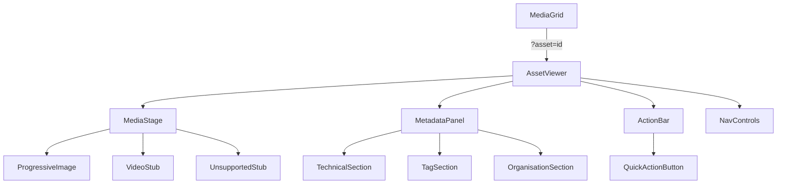

> **IMPLEMENTATION STATUS: FULLY IMPLEMENTED** — Audited against codebase 2026-06-02.
>
> **Key deviations from spec:**
> - `ForensicDrawer.tsx` has been **deleted** and fully replaced by `AssetViewer/`.
> - All components in `src/components/AssetViewer/` exist as specced: `index.tsx`, `MediaStage.tsx`, `MetadataPanel.tsx`, `ActionBar.tsx`, `NavControls.tsx`, `ProgressiveImage.tsx`, `VideoStub.tsx`.
> - Hooks exist: `hooks/useAssetNavigation.ts`, `hooks/useViewerKeyboard.ts`, `hooks/useZoom.ts`.
> - `MediaDetailModal.tsx` remains in `src/components/Gallery/` for the gallery context — `AssetViewer` is the full-screen overlay mode.
> - The `?asset=<id>` URL param pattern is implemented as specced.
> - `UnsupportedStub.tsx` is **not a separate file** — unsupported type handling is inline in `VideoStub.tsx`.
> - Pinch-to-zoom on mobile remains deferred (spec §2 lists as out of scope — confirmed).
>
> **Key files:** `src/components/AssetViewer/`, `src/components/Gallery/MediaGrid.tsx` (mounts AssetViewer)

---

# FRH-56 — Expanded Asset Viewer: Spec & Design Plan

> **North Star:** A cinematic, distraction-free lightbox workspace that frames creative work with the same editorial quality as "The Curated Gallery" design system. Not an inspector panel. Not an editing suite. A stage.

---

## 1. Problem Statement

The current `ForensicDrawer` is a right-side sheet with a two-column split (preview left, metadata form right). It opens inside the layout bounds (no true immersion), uses a standard Shadcn `Sheet` component, and mixes editing/inspection concerns in a dense panel. It does not feel cinematic — it feels like a file browser. This spec replaces it with a purpose-built `AssetViewer` overlay.

---

## 2. Scope

**In MVP:**
- Photos (`image`, `raw`)
- All metadata inspection (read-only + inline edit mode)
- Sequential asset navigation (keyboard + swipe)
- Quick action bar (favourite, portfolio, download, share)
- Desktop + mobile responsive
- Loading / error / processing states

**Framework-ready (not wired in MVP):**
- Video inline playback hooks (component accepts `mediaType === 'video'` without crashing; proxy-first URL logic stubbed)
- Audio, document stubs (graceful unsupported state)

**Out of scope:**
- Bulk editing
- Collection/portfolio assignment UI (action triggers modal — modal out of scope)
- AI tagging UI
- Zoom on mobile pinch (deferred post-MVP)

---

## 3. Routing & State Architecture

| Concern | Decision | Rationale |
|---|---|---|
| Viewer open state | `?asset=<id>` URL search param | Deep-linkable; browser back closes viewer; preserves scroll position naturally via Next.js shallow routing |
| Navigation | Modify param in-place with `router.replace` | No history stack pollution |
| Exit | Remove `?asset` param | Masonry scroll position preserved by Next.js scroll restoration |
| SSR | Viewer rendered client-only via `dynamic()` | Avoids hydration mismatch on overlay |

**Migration from current pattern:**  
`MediaGrid` currently uses `useState<Media | null>` → `setSelectedMedia`. Replace with `useRouter` + `useSearchParams`. `MediaGrid` reads `?asset=id`, fetches/finds that media object, passes to `AssetViewer`.

---

## 4. Component Architecture



### File structure

```
src/components/AssetViewer/
  index.tsx                  ← default export, orchestrates all sub-components
  MediaStage.tsx             ← full-res/proxy image presentation + zoom
  MetadataPanel.tsx          ← collapsible right panel (desktop) / bottom drawer (mobile)
  ActionBar.tsx              ← persistent minimal actions
  NavControls.tsx            ← prev/next arrows + keyboard/swipe bindings
  ProgressiveImage.tsx       ← thumbnail → proxy → original progressive loading
  VideoStub.tsx              ← framework stub for video (MVP: renders placeholder)
  UnsupportedStub.tsx        ← graceful unsupported format state
  hooks/
    useAssetNavigation.ts    ← manages prev/next index in the current filtered list
    useViewerKeyboard.ts     ← ESC, ←, → bindings
    useZoom.ts               ← click-to-zoom, drag-pan state
```

> **Delete:** `src/components/Gallery/ForensicDrawer.tsx` — replaced entirely. All edit actions migrate into `MetadataPanel`'s inline edit mode.

---

## 5. Visual Design

### Overlay layer
- Full-viewport fixed overlay (`z-[200]`)
- Background: `#000` at **88% opacity** with `backdrop-blur-sm` (2px) — not pure black; lets the gallery "breathe" behind
- Entry animation: `fade-in` 200ms + media stage `scale(0.96) → scale(1)` 280ms `ease-out`
- Exit: reverse, 180ms

### Media Stage
- Centered, `max-h-[calc(100vh-120px)]` on desktop, `max-h-[calc(100dvh-160px)]` on mobile
- Image uses `object-contain` — never crops
- `ROUND_SIXTEEN` radius on the image container (matches card system)
- Ambient shadow: `0px 40px 80px rgba(0,0,0,0.5)` — cinematic lift
- Background behind image: `surface_container_lowest` (#ffffff) at 4% — barely-there canvas

### Metadata Panel (desktop)
- Right side, fixed width `320px`
- Background: `surface_container_low` (#f3f3f4) — tonal shift, no border
- `ROUND_TWENTY_FOUR` on outer container left edge (convex into stage)
- Collapsible via chevron toggle — collapses to `0px` with smooth width transition
- Content sections use **40px negative space gaps** (no dividers per design rules)
- Labels: `label-sm` **Rubik Mono One** for data points (ISO, f-stop, resolution)
- Body: `body-sm` Inter for descriptive fields
- Panel persists open/closed state in `localStorage` key `frh:viewer:panel`

### Metadata Panel (mobile)
- Bottom sheet drawer, 60vh default height, drag-to-expand to 90vh
- Peek height: `72px` (shows filename + capture date) — always visible
- Background glassmorphism: `surface_variant` 70% opacity + `backdrop-blur-[20px]`
- Handle bar: 4px × 32px, `outline_variant` 40% opacity

### Action Bar
- Desktop: horizontal pill, floating bottom-center of media stage
- Mobile: integrated into metadata panel peek strip
- Background: glassmorphism (`surface_variant` 70% + `backdrop-blur`)
- Icons only; label appears on hover (desktop) / on long-press (mobile)
- Gold (`primary_container`) fill only on active/toggled states (e.g. starred)
- **Never** larger than 48px height — actions must not dominate media

### Navigation Controls
- Desktop: edge-zone chevrons (48px × 120px hit zones, left/right edges of overlay)
- Chevrons: `on_surface` #1a1c1c at 60% opacity, white backing circle `surface` 80%
- `ROUND_TWENTY_FOUR` on backing circles
- Appear on hover of edge zones only (opacity transition 150ms)
- Mobile: swipe left/right gesture (no visible controls)

### Close Button
- Top-right, `32px × 32px`, glassmorphism backing, `X` icon `on_surface`
- Also: ESC key, swipe-down on mobile, background tap

---

## 6. UX Flows

### Entry
1. User clicks MediaCard → `onView(media)` fires
2. `MediaGrid` pushes `?asset=<id>` via `router.replace`
3. `AssetViewer` mounts, reads asset id from params, looks up media in current list
4. Overlay fades in; thumbnail appears instantly; progressive load begins

### Navigation
1. Arrow key / chevron click → `useAssetNavigation` increments/decrements index
2. `router.replace` updates `?asset=<nextId>`
3. Media stage cross-fades: current image fades to 0, new thumbnail appears, full-res loads
4. Metadata panel content swaps with `AnimatePresence` slide

### Exit
1. ESC / close button / background tap → `router.replace` removes `?asset` param
2. Overlay fades out; page scroll position unchanged (Next.js handles this)
3. Previously focused `MediaCard` receives focus (accessibility)

### Edit mode
1. "Edit" button in MetadataPanel → inline fields become editable
2. Save / Discard buttons replace Edit button
3. `updateMediaAction` server action (reuse existing from `actions/media.ts`)
4. On save: optimistic update local state + `router.refresh()`

---

## 7. Progressive Image Loading

```
thumbnailUrl (instant, low-res) → shown immediately as base layer
proxyUrl (medium WebP) → fades in over thumbnail when loaded
originalUrl (full-res) → fades in over proxy for zoom-ready viewing
```

Implementation in `ProgressiveImage.tsx`:
- Three `` layers stacked, each fades in on `onLoad`
- Fallback chain mirrors `MediaCard`: `thumbnailUrl || proxyUrl || originalUrl || url`
- Skeleton shimmer shown until first layer resolves (reuse shimmer CSS from `globals.css`)

---

## 8. Zoom (Desktop, MVP)

| Gesture | Behaviour |
|---|---|
| Single click | Toggle 2× zoom at click point |
| Double click | Cycle: 1× → 2× → 4× → 1× |
| Drag when zoomed | Pan (cursor: `grab` → `grabbing`) |
| Scroll wheel | Zoom in/out 0.25× steps, clamped 1×–8× |

State in `useZoom.ts`: `{ scale: number, origin: {x, y}, offset: {x, y} }`.  
Applied via CSS `transform: scale() translate()` on image wrapper.  
Zoom resets to 1× on asset navigation.

---

## 9. Metadata Panel Sections

### Identity
- Title (editable inline)
- Accession ID chip (Rubik Mono One, `tertiary_container` background)
- Media type badge

### Capture
- Capture date (formatted: `DD MMM YYYY, HH:mm`)
- Shoot name

### Technical
- Camera body
- Lens model
- ISO · f/aperture · shutter · focal length (single row, Rubik Mono One)
- Resolution: `{width}×{height}` + aspect ratio
- File size (human-readable)

### Organisation
- Manual tags (editable inline chips)
- Heuristic/system tags (read-only, lighter style)
- Colour label picker (6 swatches — deferred, stub only in MVP)

### Location
- Address (if present)
- Map pin icon link (opens maps URL)

### System
- Ingest date
- Processing status badge
- `alt` text (editable)

---

## 10. Quick Actions (ActionBar)

| Action | Icon | Behaviour |
|---|---|---|
| Favourite | `Star` | Toggle `isFeatured` via `updateMediaAction` |
| Add to Portfolio | `FolderPlus` | Opens portfolio picker modal (modal TBD) |
| Download | `Download` | Triggers browser download of `originalUrl` |
| Share | `Link2` | Copies signed URL to clipboard via `navigator.clipboard` |
| Delete | `Trash2` | Opens `SafetyLockDeleteModal` (reuse existing) |

---

## 11. Loading & Error States

| State | Treatment |
|---|---|
| No URL yet (processing) | Shimmer skeleton stage + amber "Processing…" badge |
| `ingestionStatus: 'failed'` | Stage shows `tempAsset` placeholder + red "Failed" badge + error message |
| Image load error | `onerror` falls back down URL chain; final fallback: broken-image illustration |
| Unsupported type (video MVP) | `VideoStub` — film-strip icon + "Video playback coming soon" |
| Network timeout | Retry button appears after 8s on current layer |

---

## 12. Accessibility

- Viewer is a `role="dialog"` with `aria-modal="true"` and `aria-label="Asset viewer"`
- Focus trap inside viewer while open (`focus-trap-react` or manual `tabIndex` management)
- `aria-live="polite"` region announces asset navigation ("Image 3 of 47")
- ESC key always closes; documented in `aria-keyshortcuts`
- Return focus to originating `MediaCard` on close
- All icon-only buttons have `aria-label`

---

## 13. Files to Create / Modify

| File | Action |
|---|---|
| `src/components/AssetViewer/index.tsx` | **Create** |
| `src/components/AssetViewer/MediaStage.tsx` | **Create** |
| `src/components/AssetViewer/MetadataPanel.tsx` | **Create** (absorbs ForensicDrawer metadata sections) |
| `src/components/AssetViewer/ActionBar.tsx` | **Create** |
| `src/components/AssetViewer/NavControls.tsx` | **Create** |
| `src/components/AssetViewer/ProgressiveImage.tsx` | **Create** |
| `src/components/AssetViewer/VideoStub.tsx` | **Create** |
| `src/components/AssetViewer/hooks/useAssetNavigation.ts` | **Create** |
| `src/components/AssetViewer/hooks/useViewerKeyboard.ts` | **Create** |
| `src/components/AssetViewer/hooks/useZoom.ts` | **Create** |
| `src/components/Gallery/MediaGrid.tsx` | **Modify** — replace `selectedMedia` state with `?asset` param pattern; mount `AssetViewer` |
| `src/components/Gallery/ForensicDrawer.tsx` | **Delete** |
| `src/app/(dashboard)/dashboard/page.tsx` | **Verify** — no changes expected |

Reuse without modification:
- `src/app/(dashboard)/actions/media.ts` — `updateMediaAction`, `deleteMediaAction`
- `src/components/Gallery/SafetyLockDeleteModal.tsx` — delete confirmation
- `src/app/(app)/globals.css` — `shimmer` keyframe
- Shadcn `Button`, `Sheet` (mobile bottom drawer only)

---

## 14. Responsive Breakpoints Summary

| Viewport | Panel | Navigation | Actions |
|---|---|---|---|
| `< 768px` (mobile) | Bottom sheet drawer | Swipe gestures | Peek strip in drawer |
| `768px–1024px` (tablet) | Collapsible right panel (240px) | Edge chevrons | Floating pill |
| `> 1024px` (desktop) | Right panel (320px) | Edge chevrons + arrow keys | Floating pill |

---

## 15. Acceptance Criteria

- [ ] Viewer opens over gallery without page navigation (overlay pattern)
- [ ] `?asset=<id>` URL param is set on open; removed on close; browser back closes viewer
- [ ] Media fills available stage; never crops; `object-contain` always
- [ ] Thumbnail visible within 100ms of open; full-res loads progressively
- [ ] Keyboard: `←`/`→` navigate assets, `ESC` closes
- [ ] Click/double-click zoom functional (desktop)
- [ ] Metadata panel: collapsible on desktop, drawer on mobile
- [ ] All 5 quick actions functional (Favourite, Portfolio, Download, Share, Delete)
- [ ] Processing/failed states render without crash
- [ ] Exit returns scroll position to same masonry position
- [ ] No 1px borders anywhere in viewer (design rule)
- [ ] All interactive elements ≥ 44px touch target
- [ ] `role="dialog"` + focus trap + ESC tested with screen reader

---

## 16. Open Questions (resolve before implementation starts)

1. **Colour labels** — Include stub chip in MVP or defer entirely?
2. **Portfolio picker modal** — Is `FRH-56` the ticket for this or separate?
3. **Share link** — Copy signed URL (1h TTL) or a permanent public permalink?
4. **Video in MVP** — Confirm `VideoStub` only; no wiring to proxy video URL?
