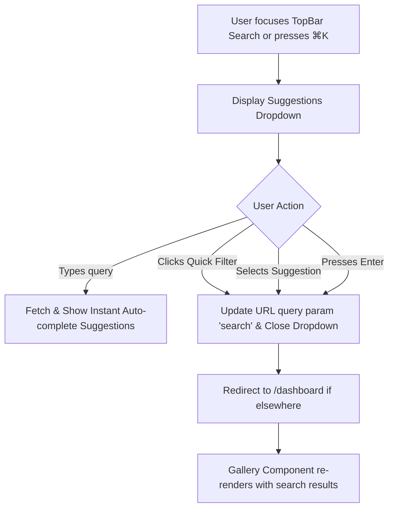

> **IMPLEMENTATION STATUS: FULLY IMPLEMENTED** — Audited against codebase 2026-06-02.
>
> **Implementation summary:**
> - `GlobalSearch/index.tsx` in `src/components/GlobalSearch/` — embedded in `TopBar` in the dashboard layout.
> - Search API: `GET /api/media/search?q=&limit=&offset=` — full-text search against GIN index `media_search_idx` / `media_full_search_idx`.
> - GIN index covers: `title`, `filename`, `original_filename`, `technical_camera_model`, `technical_lens_model`, `shoot_name` (see migrations `20260519_161500_add_media_search_gin_index.ts` and `20260522_100000_add_media_full_search_idx.ts`).
> - `⌘K` / `/` keyboard shortcut confirmed implemented.
> - E2E test coverage: `tests/e2e/globalSearch.spec.ts`.
> - Integration test: `tests/int/mediaSearch.int.spec.ts`.
> - `SearchInput` UI component in `src/components/ui/search-input.tsx`.
>
> **Key files:** `src/components/GlobalSearch/`, `src/app/api/media/search/route.ts`, `src/lib/searchMedia.ts`, `src/components/layout/DashboardLayout/TopBar.tsx`

---

# Global Search & Frontend Cleanup Specification

This document details the specification for designing and implementing the omnipresent Global Search in the authenticated user dashboard of **Framehouse Hub**, aligning with **"The Curated Gallery"** design system and **GCP/Neon free-tier constraints**.

---

## 1. User Journey & UI/UX Design

The visual design is structured as a premium stage for assets, ensuring zero clutter and visual elegance without resorting to generic form elements.

### 1.1 Sticky Global Search input
*   **Location:** Anchored in the center of the `TopBar` component, sticky across all dashboard routes (`/dashboard`, `/dashboard/collections`, `/dashboard/shared`, etc.).
*   **Styling (Curated Gallery Style):**
    *   **Container:** Filled with `surface_container_low` (`#f3f3f4` in light / white opacity in dark) with a corner radius of `ROUND_SIXTEEN` (16px).
    *   **Borders:** Strictly **no 1px solid borders** (violating sectioning lines). Tonal shifts define boundaries.
    *   **Focus State:** Smooth transition where the outline receives a 2px offset "Ghost Border" of `primary` gold (`#d79922`).
    *   **Input Font:** Inter for query typing, with the label accent in **Rubik Mono One** for metadata tags.
*   **Shortcut Support:** Pressing `/` or `Cmd+K` anywhere on the dashboard focuses the global search input. A helper text `⌘K` or `/` is rendered in `Rubik Mono One` inside the input as a keyboard shortcut indicator.



### 1.2 Suggestion Dropdown Overlay
*   **Layout:** Floats directly below the `TopBar` input.
*   **Styling:**
    *   **Glassmorphism:** `surface_variant` at 70% opacity with a `backdrop-blur` of 20px.
    *   **Shadow:** Deep, ambient shadow: `0px 20px 40px rgba(26, 28, 28, 0.06)` simulating natural light.
    *   **Radius:** `ROUND_TWENTY_FOUR` (24px) for the overlay card.
*   **Content Sections:**
    1.  **Quick Filters (Chips):** Responsive chips for `RAW`, `Video`, `Drone`, `Portrait`.
        *   *Chip Style:* `tertiary_container` (`#ff7f67`) background with `on_tertiary_container` text, rendered in `Rubik Mono One` font. On selection, switches to gold `primary_container` (`#d79922`).
    2.  **Suggested/Recent Queries:** E.g., "birds in Iceland", "4k drone clips", "Canon RAW portraits" with an icon to help user discover natural query options.
    3.  **Live Auto-complete Match Highlights:** As the user types, highlight matching tags, camera models, filename terms, or collection names.
*   **Mobile Layout:** Full-screen overlay trigger when tapped on small viewports, ensuring readable touch targets and responsive behavior.

### 1.3 Frontend Cleanup
*   **Remove Grid-local Search Input:** The existing search input inside `MediaGrid` is completely removed to prevent redundant, stacked search boxes.
*   **URL Syncing Strategy:**
    *   The `TopBar` search input uses URL query parameters (`?search=<query>`) as the single source of truth.
    *   When query parameters change, Next.js page re-renders, and the server component `Gallery` retrieves the updated media list.
    *   If a user is on another page (e.g., `/dashboard/settings` or `/dashboard/collections`) and enters a query, the application redirects them back to `/dashboard?search=<query>`.

---

## 2. Data Journey & Backend Architecture

To fit free-tier constraints (Neon PostgreSQL, no elasticsearch/algolia instances), search is backed by native **PostgreSQL Full-Text Search (FTS)** using a highly optimized GIN index and relations joining.

### 2.1 Schema Mapping & Search Sources
We query across seven sources. The SQL query performs `LEFT JOIN` operations across the normalized array and relationship tables.

| Source | Field/Table | Format in SQL |
| :--- | :--- | :--- |
| **filenames** | `media.filename`, `media.original_filename` | Text |
| **tags** | `media_manual_tags.tag`, `media_heuristic_tags.tag` | Joined tables |
| **EXIF** | `technical_camera_model`, `technical_lens_model`, `technical_iso` | Text / Numbers |
| **AI labels** | `media_heuristic_tags.tag` (Vision API targets) | Joined tables |
| **locations** | `media.location_address` | Text |
| **dates** | `media.capture_date` | Date (cast to text formatted) |
| **collections** | `portfolios.name` | Joined tables |

### 2.2 Database-native Search GIN Index
To index relational fields (like joined tags and portfolios) without maintaining slow materialized views or complex triggers, we index all core media metadata columns with a single `GIN` index on expression.

```sql
CREATE INDEX IF NOT EXISTS "media_full_search_idx" ON "public"."media"
USING gin(to_tsvector('english',
  COALESCE(title, '') || ' ' ||
  COALESCE(filename, '') || ' ' ||
  COALESCE(original_filename, '') || ' ' ||
  COALESCE(technical_camera_model, '') || ' ' ||
  COALESCE(technical_lens_model, '') || ' ' ||
  COALESCE(shoot_name, '') || ' ' ||
  COALESCE(location_address, '') || ' ' ||
  COALESCE(to_char(capture_date, 'YYYY-MM-DD Month YYYY'), '')
));
```

### 2.3 Optimized SQL Query with Weighted FTS Ranking
When a query `q` is executed, the server queries the database. We rank hits using `ts_rank` and scale results by incorporating relational checks:

```sql
SELECT DISTINCT
  m.id,
  ts_rank(
    to_tsvector('english',
      COALESCE(m.title, '') || ' ' ||
      COALESCE(m.filename, '') || ' ' ||
      COALESCE(m.original_filename, '') || ' ' ||
      COALESCE(m.technical_camera_model, '') || ' ' ||
      COALESCE(m.technical_lens_model, '') || ' ' ||
      COALESCE(m.shoot_name, '') || ' ' ||
      COALESCE(m.location_address, '') || ' ' ||
      COALESCE(to_char(m.capture_date, 'YYYY-MM-DD Month YYYY'), '')
    ),
    plainto_tsquery('english', $1)
  ) AS search_rank
FROM media m
LEFT JOIN media_manual_tags mmt ON mmt._parent_id = m.id
LEFT JOIN media_heuristic_tags mht ON mht._parent_id = m.id
LEFT JOIN portfolios_blocks_grid_items pbgi ON pbgi.media_id = m.id
LEFT JOIN portfolios_blocks_grid pbg ON pbg.id = pbgi.parent_id
LEFT JOIN portfolios p ON p.id = pbg.parent_id
WHERE m.owner_id = $2::int
  AND (
    to_tsvector('english',
      COALESCE(m.title, '') || ' ' ||
      COALESCE(m.filename, '') || ' ' ||
      COALESCE(m.original_filename, '') || ' ' ||
      COALESCE(m.technical_camera_model, '') || ' ' ||
      COALESCE(m.technical_lens_model, '') || ' ' ||
      COALESCE(m.shoot_name, '') || ' ' ||
      COALESCE(m.location_address, '') || ' ' ||
      COALESCE(to_char(m.capture_date, 'YYYY-MM-DD Month YYYY'), '')
    ) @@ plainto_tsquery('english', $1)
    OR to_tsvector('english', COALESCE(mmt.tag, '')) @@ plainto_tsquery('english', $1)
    OR to_tsvector('english', COALESCE(mht.tag, '')) @@ plainto_tsquery('english', $1)
    OR to_tsvector('english', COALESCE(p.name, '')) @@ plainto_tsquery('english', $1)
  )
ORDER BY search_rank DESC
LIMIT $3::int;
```

---

## 3. API & Code Changes

### 3.1 Backend `/api/media/search/route.ts`
*   Accepts `q` (query), `limit` (max returns), `mediaType` (image/video/raw), and a query parameter `type=suggestions|results`.
*   If `type=suggestions`, it returns a lightweight list of auto-complete matches for tags, camera models, and filenames matching the partial input, instead of full documents.
*   Authenticates queries via Payload's `auth` context.

### 3.2 Frontend Components Cleanup
*   `src/components/layout/DashboardLayout/TopBar.tsx`:
    *   Replace dummy `<input>` with the dynamic `<GlobalSearch>` widget.
    *   Maintain active text state, triggering suggestion fetches.
    *   Perform a route push `router.push('/dashboard?search=' + encodeURIComponent(query))` on submit.
*   `src/components/Gallery/MediaGrid.tsx`:
    *   Remove `searchQuery` and `debouncedSearchQuery` state.
    *   Directly consume the prop `initialFilters?.search` to update local display of results.
    *   Keep the virtualized grid performance high since state updates are simplified.

---

## 4. Verification Plan

### 4.1 Automated Tests
*   **Integration Tests:** Verify SQL search logic fetches joined collections/tags by adding tests to `tests/int/mediaSearch.int.spec.ts`.
*   **E2E (Playwright) Tests:** Add E2E tests in `tests/e2e/globalSearch.spec.ts`:
    *   Verify keyboard shortcuts `/` and `Cmd+K` focus input.
    *   Verify suggestion dropdown displays correctly.
    *   Verify typing query and clicking suggestion routes to `/dashboard?search=...` and updates media grid results.

### 4.2 Manual Verification
*   Log in to the dashboard locally.
*   Verify that search is sticky and omnipresent, displaying the same input value across pages.
*   Select one of the quick filter chips (e.g., "Video" or "RAW") and verify that correct filtering is applied to the dashboard view.
