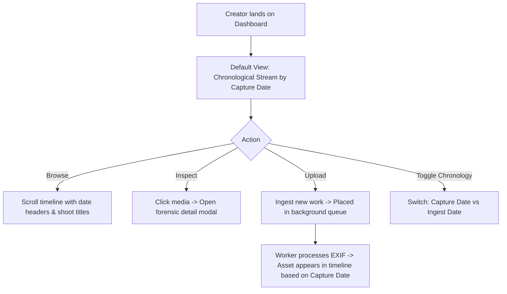

> **IMPLEMENTATION STATUS: PARTIALLY IMPLEMENTED** — Audited against codebase 2026-06-02.
>
> **What is implemented:**
> - Core media archive stream: `MediaGrid.tsx`, `MasonryGrid.tsx`, `TimelineStream.tsx` with grouping and infinite scroll in `src/components/Gallery/`.
> - `MediaCard.tsx` with status badges, hover metadata, card identity bar.
> - `GroupHeader.tsx` for timeline grouping.
> - `BulkEditTagsModal.tsx` for bulk tag operations.
> - `SaveViewModal.tsx` for saving filter states.
> - `EmptyState.tsx` for empty library states.
>
> **What is deferred / not yet implemented:**
> - AI-powered tag suggestions from Vision API (`aiTags` field exists in schema but not populated).
> - Video poster-frame UI (worker code path exists; UI surface missing).
> - Smart ordering/ranking algorithm — current sort is by date.
>
> **Key files:** `src/components/Gallery/MediaGrid.tsx`, `src/components/Gallery/MasonryGrid.tsx`, `src/components/Gallery/TimelineStream.tsx`, `src/components/Gallery/MediaCard.tsx`

---

# SPEC: MEDIA ARCHIVE STREAM OVERHAUL

## 1. USER JOURNEY (UX FLOW)

---

## 2. UI LAYOUT & SECTIONS

- **Stage Canvas**
  - High negative space. No borders, lines, or grid dividers.
  - Tonal changes define boundaries between control bar and media canvas.
- **Top Control Bar**
  - "Source of Truth" main title.
  - Action buttons: Selection mode, Upload queue.
  - Search bar + view presets.
  - Toggle switch: "Capture Date" (EXIF) vs "Upload Date" (Archival sequence).
- **Temporal Group Headers**
  - "TODAY" / "THIS WEEK" (Caps, Monospaced metadata font).
  - Shoot Clusters: "Northern Lights Expedition" (Bold, clean body font).
  - Month/Year separators (Small, monospaced metadata font).
- **Adaptive Masonry Grid**
  - Mixed media grid: Aspect-ratio preserving blocks.
  - No cropping. 16:9 videos next to vertical RAW portraits next to square photos.
  - Cards show media preview, badge for type (RAW, Video, etc.).
- **Museum Label Metadata (Hover/Detail)**
  - Technical metadata (ISO, shutter, aperture, resolution, size) in monospaced font.
  - Body descriptions and tags in clean Inter text.

---

## 3. LOGIC & DATA FLOW

- **Chronological Grouping Engine**
  1. Fetch all media sorted by `captureDate` (primary) and `createdAt` (fallback).
  2. Parse date into buckets: Today, This Week, Month, Year, or Shoot (if `shootName` set).
  3. Render bucket header. Render masonry items inside bucket.
- **Upload vs Capture Chronology**
  - *Default View:* Sorted by `captureDate` (EXIF timestamp).
  - *Ingested View:* Sorted by `createdAt` / `uploadBatchId`. Separate stream for quick retrieval of recent uploads.
- **Performance Scroll (Virtuoso Masonry)**
  - Dynamic height virtualization.
  - Only render visible timeline items and headers.
  - Lazy-load original assets using low-res proxy previews.
