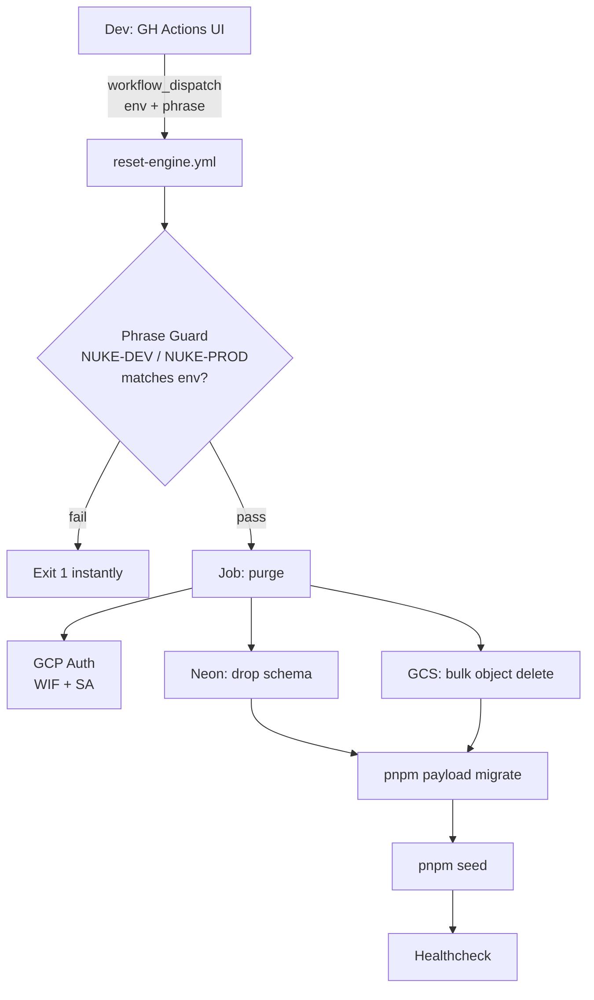
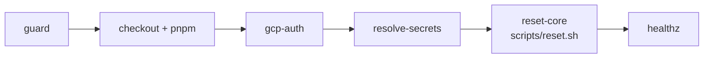
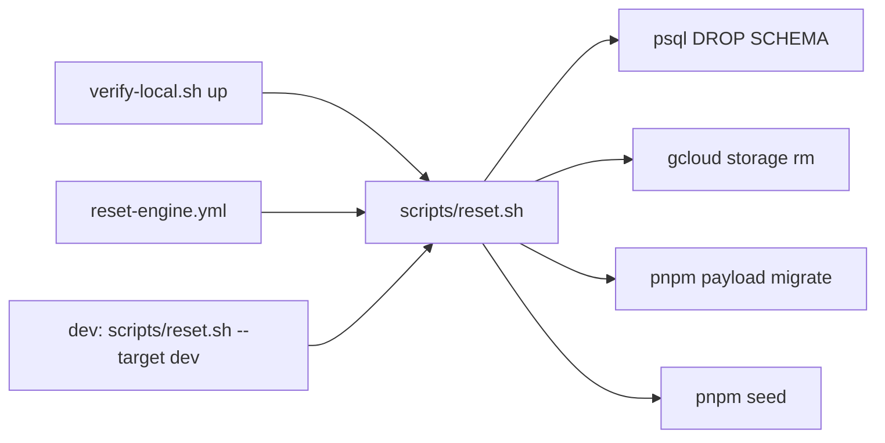

# Reset Engine

## Quick Reference

| Scenario | Command |
|---|---|
| Local dev DB is broken / stale | `./scripts/verify-local.sh` |
| Tear down local verify container | `./scripts/verify-local.sh down` |
| Nuke cloud dev env from CI | GitHub Actions → **Reset Engine** → `dev` + `NUKE-DEV` |
| Nuke cloud prod env | GitHub Actions → **Reset Engine** → `prod` + `NUKE-PROD` (requires reviewer) |
| Debug: reset without seeding | `./scripts/reset.sh --target local --database-uri <uri> --skip-seed --no-confirm` |

---

## When to Use

**Use Reset Engine when:**
- A schema migration broke the dev environment and the app won't start.
- You changed the seed data structure and need a clean baseline to test against.
- Preparing for a demo and the DB has dirty test data.
- A feature branch left orphaned rows that conflict with new constraints.
- CI is failing due to stale cloud state (use dev reset, never prod).

**Do NOT use Reset Engine when:**
- You just need to apply new migrations — run `pnpm payload migrate` instead.
- You want to test a migration rollback — use a local ephemeral DB via `verify-local.sh`.
- The issue is a code bug, not data state — reset won't help and wastes time.
- Any real user data exists in prod — reset is **total destruction**, no recovery.

---

## How to Use

### Local reset (most common)

Spins an ephemeral Postgres container, wipes it, migrates, seeds, tears down. Zero cloud cost.

```bash
./scripts/verify-local.sh
```

Keep the DB running to poke around with `pnpm dev`:

```bash
./scripts/verify-local.sh --keep-open
# prints: DATABASE_URI=postgres://... pnpm run dev
./scripts/verify-local.sh down   # when done
```

---

### Cloud dev reset (GitHub Actions)

1. Go to **Actions → Reset Engine → Run workflow** in GitHub.
2. Set `environment` = `dev`.
3. Set `confirm_phrase` = `NUKE-DEV` (exact case, no spaces).
4. Click **Run workflow**.

What happens:
- Wrong phrase → job fails immediately, nothing touched.
- Correct phrase → Neon dev schema dropped → `gs://framehouse-hub-dev` emptied → migrations applied → seed runs → `/api/healthz` polled.
- Total wall-clock: ~3 min.

After completion, the seeded system admin is available:
```
Email:    sys.admin@framehouseworks.com
Password: password123
URL:      https://framehouse-hub-dev-588985538639.us-central1.run.app/admin
```

---

### Cloud prod reset (break-glass only)

> Requires a **GitHub environment reviewer** to approve before any step runs. Default: deny unless explicitly needed.

1. Go to **Actions → Reset Engine → Run workflow**.
2. Set `environment` = `prod`.
3. Set `confirm_phrase` = `NUKE-PROD`.
4. A reviewer must approve in the Actions UI before destruction begins.

After reset, prod has only seed data — no real user accounts, no uploaded media. Only use during initial provisioning or a catastrophic data incident.

---

## Seeded Baseline (post-reset state)

After any reset, the environment contains exactly what `src/seed/index.ts` defines:

| Account | Role | Password |
|---|---|---|
| `sys.admin@framehouseworks.com` | System Admin | `password123` |
| Seeded creative users | Creative | (see seed file) |
| Seeded viewers | Viewer | (see seed file) |

Media: fixture items with pre-built derivatives. GCS bytes are **not** re-uploaded by the seed (known limitation — upload manually via dashboard after cloud reset).

---

## Troubleshooting

| Symptom | Fix |
|---|---|
| `Confirmation phrase mismatch` | Check exact casing: `NUKE-DEV` not `nuke-dev` |
| `DATABASE_URI not resolved` | Pass `--database-uri` explicitly or check Secret Manager binding |
| `schema drop failed` | Check DB connectivity; Neon may be paused — wake it via console first |
| `gcloud storage rm` fails | SA missing `roles/storage.objectAdmin` on bucket — check IAM |
| Seed fails, DB empty | Re-trigger the workflow — schema + bucket are already clean, idempotent |
| Prod job stuck at "Waiting for review" | Expected — a reviewer must approve in GitHub Actions UI |

---

## User Story
As dev, me want single trigger to kill environment state and rebirth it fresh.
Me want cloud match local cleanup layout.
Me want zero data footprint leftover.

## Product Journey (The Core Loop)
1. Environment messy or feature update broke old data structure.
2. Dev go to GitHub Actions.
3. Dev choose Reset Workflow.
4. Dev MUST enter safety input unlock phrase ("NUKE-DEV" or "NUKE-PROD"). Accidental click impossible.
5. Automation wakes up ($0 free tier limits preserved).
6. Database drop schema instantly.
7. Storage bucket empty completely.
8. Native seed runner injects clean mock baseline data.
9. System fresh, ready for next demo or test cycle.

## Absolute Boundaries (Acceptance Criteria)
* **Dev Purge**: Kill Neon Dev database schema + empty Dev storage bucket + run seed.
* **Prod Purge**: Kill Neon Prod database schema + empty Prod storage bucket + run seed.
* **Local Parity**: Workflow wraps native local cleanup scripts (`cleanup-local.sh`, `psql drop`, `pnpm seed`). Flexible to scale when new features modify the seed.
* **Anti-Oops Guard**: Input string check mandatory before destructive script run. Wrong phrase = workflow fail instantly.
* **Free Tier Safe**: Bucket object delete only (no bucket recreation fees). Compute fits within free GitHub Action minutes and free Neon tier capacities.

---

## Architecture

### Topology



### Workflow file: `.github/workflows/reset-engine.yml`

* **Trigger**: `workflow_dispatch` only. Inputs:
  * `environment` — choice `[dev, prod]`.
  * `confirm_phrase` — string. Required.
* **Permissions**: `id-token: write`, `contents: read` (WIF only; no static GCP keys).
* **Concurrency**: `group: reset-${{ inputs.environment }}`, `cancel-in-progress: false` — prevent parallel nukes on same env.
* **Environment gating**: GH `environment: ${{ inputs.environment }}` so prod requires a reviewer approval rule (configured in repo settings).

### Job structure (single job, sequential steps)



| Step | Action | Reuses |
|---|---|---|
| `guard` | Shell `if` matches `confirm_phrase` against `NUKE-${ENV^^}`. Fail-fast `exit 1`. | — |
| `checkout + pnpm` | Standard `actions/checkout@v4`, `pnpm/action-setup`, `setup-node` cache. | Pattern from `deploy-dev.yml`. |
| `gcp-auth` | `google-github-actions/auth@v2` via `GCP_WORKLOAD_IDENTITY_PROVIDER` + `GCP_SERVICE_ACCOUNT_EMAIL`. | Same as deploy workflows. |
| `resolve-secrets` | Read `DATABASE_URI_${ENV}`, `PAYLOAD_SECRET_${ENV}`, `PROCESSOR_CALLBACK_SECRET_${ENV}` via `google-github-actions/get-secretmanager-secrets`. Export `GCS_BUCKET=framehouse-hub-${env}`, `GCS_PROJECT_ID=framehouse-hub`. | Secret pattern from `deploy-*.yml`. |
| `reset-core` | Single call: `scripts/reset.sh --target ${env} --no-confirm` (handles drop-schema → empty-bucket → migrate → seed). | Shared with `verify-local.sh`. |
| `healthz` | `curl -fsS https://<service>/api/healthz` for chosen env. | Required by devops rules. |

### Phrase guard (snippet contract)

```bash
EXPECTED="NUKE-${ENVIRONMENT^^}"
if [[ "$CONFIRM_PHRASE" != "$EXPECTED" ]]; then
  echo "::error::Confirmation phrase mismatch. Expected: $EXPECTED"
  exit 1
fi
```

### Script consolidation (single source of truth)

Today's script layout has overlapping concerns and one near-trivial script. The Reset Engine introduces a chance to collapse them around a single reusable **reset core**.

**Current inventory**

| Script | Role | Verdict |
|---|---|---|
| `scripts/verify-local.sh` | Spin ephemeral Postgres → migrate → seed → teardown | **Refactor**: delegate the migrate+seed body to the new core |
| `scripts/cleanup-local.sh` | `docker stop/rm frh-verify-db` (7 LOC) | **Deprecate**: fold into `verify-local.sh --down` subcommand; keep a thin shim that warns + forwards for one release cycle |
| `scripts/dev-with-worker.sh` | Local dev runtime (Next + Go worker) | **Keep as-is** — unrelated to reset |
| `scripts/infra/setup-eventarc.sh` | One-shot GCP wiring | **Keep** — infra provisioning, not lifecycle |
| `scripts/infra/set-cleanup-policy.sh` | Artifact Registry retention | **Keep** — infra provisioning |

**New: `scripts/reset.sh` (reset core)**

Single executable owning the destructive lifecycle. Workflow + local both call it.

* **Args**:
  * `--target local|dev|prod` (required).
  * `--database-uri <uri>` (optional; derived for `local`, fetched from Secret Manager for `dev`/`prod`).
  * `--bucket <name>` (optional; derived `framehouse-hub-${target}` for cloud, skipped for local).
  * `--skip-storage` (local default; cloud optional).
  * `--skip-seed` (debug aid).
  * `--no-confirm` (CI/non-interactive; otherwise prompts for `NUKE-${TARGET^^}`).
* **Steps** (idempotent, ordered):
  1. Confirm phrase (unless `--no-confirm`).
  2. `psql "$DATABASE_URI" -c "DROP SCHEMA IF EXISTS public CASCADE; CREATE SCHEMA public;"`.
  3. If cloud target: `gcloud storage rm --recursive "gs://${BUCKET}/**" --quiet || true`.
  4. `pnpm payload migrate`.
  5. `pnpm seed` (unless `--skip-seed`).
* **Exit codes**: `0` success, `1` phrase mismatch, `2` env unresolved, `3` step failure (with stderr surfaced).
* **Logging**: numbered step banners identical to `verify-local.sh` style so output is visually consistent across local/CI.

**`verify-local.sh` after refactor**

* Spins ephemeral container (unchanged).
* Exports `DATABASE_URI`, then **invokes** `scripts/reset.sh --target local --database-uri ... --skip-storage --no-confirm` instead of inlining migrate+seed.
* Adds subcommands: `verify-local.sh up` (default), `verify-local.sh down` (replaces `cleanup-local.sh`).

**`cleanup-local.sh` after refactor**

* Becomes a 3-line deprecation shim: prints `"⚠ cleanup-local.sh is deprecated, use verify-local.sh down"` and execs the new subcommand. Remove in the PR that lands FRH-56 (or whichever ticket follows).

**Resulting topology**



One destructive code path, three callers — eliminates drift between local and cloud reset behaviour.

### Secrets & vars matrix

| Name | Source | Used by |
|---|---|---|
| `GCP_WORKLOAD_IDENTITY_PROVIDER` | GH secret | gcp-auth |
| `GCP_SERVICE_ACCOUNT_EMAIL` | GH secret | gcp-auth |
| `DATABASE_URI_{ENV}` | Secret Manager | drop-schema, migrate, seed |
| `PAYLOAD_SECRET_{ENV}` | Secret Manager | migrate, seed |
| `PROCESSOR_CALLBACK_SECRET_{ENV}` | Secret Manager | seed (worker callback URL signing) |
| `GCS_BUCKET` | Computed `framehouse-hub-${env}` | empty-bucket, seed |
| `GCS_PROJECT_ID` | Literal `framehouse-hub` | empty-bucket, seed |

Runtime SA needs (verify before first prod run): `roles/storage.objectAdmin` on the bucket, `roles/secretmanager.secretAccessor` on the three secrets. No new IAM bindings beyond what deploy workflows already require.

### Free-tier guardrails

* Single Ubuntu runner, ~3 min wall-clock per reset → negligible against 2 000 free GH minutes/mo.
* `gcloud storage rm` is per-object Class A ops — cost = number of objects × $0 within free 5 GB / 5 k ops monthly budget. Bucket retained ⇒ no recreate fees, no CORS/Eventarc redo.
* Neon: schema DROP is in-place; no branch creation, no compute hours added.
* No worker invocation; no Cloud Run cold start charges.

### Failure modes & idempotency

* Phrase mismatch → exit before any destructive call.
* `gcloud storage rm` on empty bucket → swallow exit 1 (the `|| true`).
* Schema drop after partial migration → safe (re-creates `public`).
* Seed failure → leaves DB migrated-but-empty; re-running workflow recovers.
* Manual abort mid-step → re-trigger is safe; every step is idempotent.

### Out of scope (deferred)

* Resetting Neon **branches** (current design resets schema in-place on `dev`/`prod` branch). Branch swap-and-delete is a v2 if Neon compute time becomes a concern.
* Restoring uploaded fixture bytes to GCS — known follow-up in `CLAUDE.md` ("Cloud-aware seed for media").
* Multi-bucket / multi-region — single `us-central1` bucket per env per current infra.

### Verification

1. Dry-run on dev: trigger workflow with `environment=dev`, `confirm_phrase=NUKE-DEV`. Assert: admin login works, seeded users present, `gs://framehouse-hub-dev` empty, `/api/healthz` 200.
2. Negative test: trigger with `confirm_phrase=nuke-dev` (wrong case) → workflow fails at guard step, no GCP auth performed.
3. Local parity: `scripts/reset.sh --target local --database-uri <ephemeral> --no-confirm` (or `verify-local.sh up`) produces identical end-state. Same script invoked by CI guarantees no drift.
4. Deprecation: `scripts/cleanup-local.sh` prints deprecation notice and still tears down the container (one release of grace).
5. Prod gate: trigger with `environment=prod` → blocks on GH environment reviewer approval before any step runs.
